

  <strong>UNIVERSIDAD PERUANA DE CIENCIAS APLICADAS</strong>

  

  Ingeniería de Software  
  2026-10  
  1ASI0572 Desarrollo de Soluciones IOT  
  NRC: 17756    
  Profesor: David Carlos Vera Olivera   
  "Informe de Trabajo Final"  
  Startup:  - Producto: 

 

<strong>Relación de integrantes:</strong>

<table align="center">
  <thead>
    <tr>
      <th>Integrante</th>
      <th>Código</th>
    </tr>
  </thead>
  <tbody>
    <tr>
      <td>Mathias Eduardo Bueno Perales</td>
      <td>U202313433</td>
    </tr>
    <tr>
      <td>Jhon Alexander Galvez Chambi</td>
      <td>U202323270</td>
    </tr>
    <tr>
      <td>Pablo Antonio Geronimo Quispe</td>
      <td>U202314304</td>
    </tr>
    <tr>
      <td>Ramiro Alexander Guzmán Chávez</td>
      <td>U202217062</td>
    </tr>
    <tr>
      <td>Omar Luquillas Asto</td>
      <td>U20211G641</td>
    </tr>
    <tr>
      <td>Fabrizio Alberto Paredes Santos</td>
      <td>U202310914</td>
    </tr>
    <tr>
      <td>Valentino Sandoval Paiva</td>
      <td>U20211A962</td>
    </tr>
  </tbody>
</table>

  

  <strong>Abril, 2026</strong>  
  <strong>URL del proyecto:</strong>
  <a href="https://github.com/G3-Soluciones-IOT">
    https://github.com/G3-Soluciones-IOT
  </a>

---

## Registro de Versiones del Informe

| Versión | Fecha      | Autor                         | Descripción                                                                  |
|---------|------------|-------------------------------|------------------------------------------------------------------------------|
| AV1     | 05/04/2026 | Jhon Alexander Galvez Chambi  | Desarrollo de la carátula, tabla de contenidos y estructura general del informe. |
| AV1     | /04/2026   |                               |                                                                              |
| AV1     | /04/2025   |                               |                                                                              |
| AV1     | /04/2025   |                               |                                                                              |
| AV1     | /04/2025   |                               |                                                                              |

## Project Report Collaboration Insights

## Contenido

### Tabla de contenidos

- [Registro de Versiones del Informe](#registro-de-versiones-del-informe)
- [Project Report Collaboration Insights](#project-report-collaboration-insights)
- [Contenido](#contenido)
- [Tabla de contenidos](#tabla-de-contenidos)
- [Student Outcome](#student-outcome)
- [Capítulo I: Introducción](#capítulo-i-introducción)
  - [1.1. Startup Profile](#11-startup-profile)
    - [1.1.1. Descripción de la Startup](#111-descripción-de-la-startup)
    - [1.1.2. Perfiles de integrantes del equipo](#112-perfiles-de-integrantes-del-equipo)
  - [1.2. Solution Profile](#12-solution-profile)
    - [1.2.1 Antecedentes y problemática](#121-antecedentes-y-problemática)
    - [1.2.2 Lean UX Process.](#122-lean-ux-process)
        - [1.2.2.1. Lean UX Problem Statements.](#1221-lean-ux-problem-statements)
        - [1.2.2.2. Lean UX Assumptions.](#1222-lean-ux-assumptions)
        - [1.2.2.3. Lean UX Hypothesis Statements.](#1223-lean-ux-hypothesis-statements)
        - [1.2.2.4. Lean UX Canvas.](#1224-lean-ux-canvas)
  - [1.3. Segmentos objetivo.](#13-segmentos-objetivo)
- [Capítulo II: Requirements Elicitation & Analysis](#capítulo-ii-requirements-elicitation--analysis)
  - [2.1. Competidores.](#21-competidores)
    - [2.1.1. Análisis competitivo.](#211-análisis-competitivo)
    - [2.1.2. Estrategias y tácticas frente a competidores.](#212-estrategias-y-tácticas-frente-a-competidores)
  - [2.2. Entrevistas.](#22-entrevistas)
    - [2.2.1. Diseño de entrevistas.](#221-diseño-de-entrevistas)
    - [2.2.2. Registro de entrevistas.](#222-registro-de-entrevistas)
    - [2.2.3. Análisis de entrevistas.](#223-análisis-de-entrevistas)
  - [2.3. Needfinding.](#23-needfinding)
    - [2.3.1. User Personas.](#231-user-personas)
    - [2.3.2. User Task Matrix.](#232-user-task-matrix)
    - [2.3.3. User Journey Mapping.](#233-user-journey-mapping)
    - [2.3.4. Empathy Mapping.](#234-empathy-mapping)
  - [2.4. Big Picture EventStorming.](#24-big-picture-eventstorming)
  - [2.5. Ubiquitous Language.](#25-ubiquitous-language)
- [Capítulo III: Requirements Specification](#capítulo-iii-requirements-specification)
  - [3.1. User Stories.](#31-user-stories)
  - [3.2. Impact Mapping.](#32-impact-mapping)
  - [3.3. Product Backlog.](#33-product-backlog)
- [Capítulo IV: Solution Software Design](#capítulo-iv-solution-software-design)
  - [4.1. Strategic-Level Domain-Driven Design.](#41-strategic-level-domain-driven-design)
    - [4.1.1. Design-Level EventStorming.](#411-design-level-eventstorming)
        - [4.1.1.1 Candidate Context Discovery.](#4111-candidate-context-discovery)
        - [4.1.1.2 Domain Message Flows Modeling.](#4112-domain-message-flows-modeling)
        - [4.1.1.3 Bounded Context Canvases.](#4113-bounded-context-canvases)
    - [4.1.2. Context Mapping.](#412-context-mapping)
    - [4.1.3. Software Architecture.](#413-software-architecture)
        - [4.1.3.1. Software Architecture System Landscape Diagram.](#4131-software-architecture-system-landscape-diagram)
        - [4.1.3.2. Software Architecture Context Level Diagrams.](#4132-software-architecture-context-level-diagrams)
        - [4.1.3.3. Software Architecture Container Level Diagrams.](#4133-software-architecture-container-level-diagrams)
        - [4.1.3.4. Software Architecture Deployment Diagrams.](#4134-software-architecture-deployment-diagrams)
  - [4.2. Tactical-Level Domain-Driven Design](#42-tactical-level-domain-driven-design)
    - [4.2.1. Bounded Context: Inicio y Registro de Sesión](#421-bounded-context-inicio-y-registro-de-sesión)
        - [4.2.1.1. Domain Layer.](#4211-domain-layer)
        - [4.2.1.2. Interface Layer.](#4212-interface-layer)
        - [4.2.1.3. Application Layer.](#4213-application-layer)
        - [4.2.1.4. Infrastructure Layer.](#4214-infrastructure-layer)
        - [4.2.1.5. Bounded Context Software Architecture Component Level Diagrams.](#4215-bounded-context-software-architecture-component-level-diagrams)
        - [4.2.1.6. Bounded Context Software Architecture Code Level Diagrams.](#4216-bounded-context-software-architecture-code-level-diagrams)
            - [4.2.1.6.1. Bounded Context Domain Layer Class Diagrams.](#42161-bounded-context-domain-layer-class-diagrams)
            - [4.2.1.6.2. Bounded Context Database Design Diagram.](#42162-bounded-context-database-design-diagram)
    - [4.2.2. Bounded Context: Perfil de Usuario](#422-bounded-context-perfil-de-usuario)
        - [4.2.2.1. Domain Layer.](#4221-domain-layer)
        - [4.2.2.2. Interface Layer.](#4222-interface-layer)
        - [4.2.2.3. Application Layer.](#4223-application-layer)
        - [4.2.2.4. Infrastructure Layer.](#4224-infrastructure-layer)
        - [4.2.2.5. Bounded Context Software Architecture Component Level Diagrams.](#4225-bounded-context-software-architecture-component-level-diagrams)
        - [4.2.2.6. Bounded Context Software Architecture Code Level Diagrams.](#4226-bounded-context-software-architecture-code-level-diagrams)
            - [4.2.2.6.1. Bounded Context Domain Layer Class Diagrams.](#42261-bounded-context-domain-layer-class-diagrams)
            - [4.2.2.6.2. Bounded Context Database Design Diagram.](#42262-bounded-context-database-design-diagram)
    - [4.2.3. Bounded Context: Gestión de Objetivos](#423-bounded-context-gestión-de-objetivos)
        - [4.2.3.1. Domain Layer.](#4231-domain-layer)
        - [4.2.3.2. Interface Layer.](#4232-interface-layer)
        - [4.2.3.3. Application Layer.](#4233-application-layer)
        - [4.2.3.4. Infrastructure Layer.](#4234-infrastructure-layer)
        - [4.2.3.5. Bounded Context Software Architecture Component Level Diagrams.](#4235-bounded-context-software-architecture-component-level-diagrams)
        - [4.2.3.6. Bounded Context Software Architecture Code Level Diagrams.](#4236-bounded-context-software-architecture-code-level-diagrams)
            - [4.2.3.6.1. Bounded Context Domain Layer Class Diagrams.](#42361-bounded-context-domain-layer-class-diagrams)
            - [4.2.3.6.2. Bounded Context Database Design Diagram.](#42362-bounded-context-database-design-diagram)
    - [4.2.4. Bounded Context: Rutina Alimentaria](#424-bounded-context-rutina-alimentaria)
        - [4.2.4.1. Domain Layer.](#4241-domain-layer)
        - [4.2.4.2. Interface Layer.](#4242-interface-layer)
        - [4.2.4.3. Application Layer.](#4243-application-layer)
        - [4.2.4.4. Infrastructure Layer.](#4244-infrastructure-layer)
        - [4.2.4.5. Bounded Context Software Architecture Component Level Diagrams.](#4245-bounded-context-software-architecture-component-level-diagrams)
        - [4.2.4.6. Bounded Context Software Architecture Code Level Diagrams.](#4246-bounded-context-software-architecture-code-level-diagrams)
            - [4.2.4.6.1. Bounded Context Domain Layer Class Diagrams.](#42461-bounded-context-domain-layer-class-diagrams)
            - [4.2.4.6.2. Bounded Context Database Design Diagram.](#42462-bounded-context-database-design-diagram)
    - [4.2.5. Bounded Context: Nutricionista](#425-bounded-context-nutricionista)
        - [4.2.5.1. Domain Layer.](#4251-domain-layer)
        - [4.2.5.2. Interface Layer.](#4252-interface-layer)
        - [4.2.5.3. Application Layer.](#4253-application-layer)
        - [4.2.5.4. Infrastructure Layer.](#4254-infrastructure-layer)
        - [4.2.5.5. Bounded Context Software Architecture Component Level Diagrams.](#4255-bounded-context-software-architecture-component-level-diagrams)
        - [4.2.5.6. Bounded Context Software Architecture Code Level Diagrams.](#4256-bounded-context-software-architecture-code-level-diagrams)
            - [4.2.5.6.1. Bounded Context Domain Layer Class Diagrams.](#42561-bounded-context-domain-layer-class-diagrams)
            - [4.2.5.6.2. Bounded Context Database Design Diagram.](#42562-bounded-context-database-design-diagram)
    - [4.2.6. Bounded Context: Gestión de Planes Alimenticios](#426-bounded-context-gestión-de-planes-alimenticios)
        - [4.2.6.1. Domain Layer.](#4261-domain-layer)
        - [4.2.6.2. Interface Layer.](#4262-interface-layer)
        - [4.2.6.3. Application Layer.](#4263-application-layer)
        - [4.2.6.4. Infrastructure Layer.](#4264-infrastructure-layer)
        - [4.2.6.5. Bounded Context Software Architecture Component Level Diagrams.](#4265-bounded-context-software-architecture-component-level-diagrams)
        - [4.2.6.6. Bounded Context Software Architecture Code Level Diagrams.](#4266-bounded-context-software-architecture-code-level-diagrams)
            - [4.2.6.6.1. Bounded Context Domain Layer Class Diagrams.](#42661-bounded-context-domain-layer-class-diagrams)
            - [4.2.6.6.2. Bounded Context Database Design Diagram.](#42662-bounded-context-database-design-diagram)
    - [4.2.7. Bounded Context: Comunicación y Seguimiento](#427-bounded-context-comunicación-y-seguimiento)
        - [4.2.7.1. Domain Layer.](#4271-domain-layer)
        - [4.2.7.2. Interface Layer.](#4272-interface-layer)
        - [4.2.7.3. Application Layer.](#4273-application-layer)
        - [4.2.7.4. Infrastructure Layer.](#4274-infrastructure-layer)
        - [4.2.7.5. Bounded Context Software Architecture Component Level Diagrams.](#4275-bounded-context-software-architecture-component-level-diagrams)
        - [4.2.7.6. Bounded Context Software Architecture Code Level Diagrams.](#4276-bounded-context-software-architecture-code-level-diagrams)
            - [4.2.7.6.1. Bounded Context Domain Layer Class Diagrams.](#42761-bounded-context-domain-layer-class-diagrams)
            - [4.2.7.6.2. Bounded Context Database Design Diagram.](#42762-bounded-context-database-design-diagram)
    - [4.2.8. Bounded Context: Pagos](#428-bounded-context-pagos)
        - [4.2.8.1. Domain Layer.](#4281-domain-layer)
        - [4.2.8.2. Interface Layer.](#4282-interface-layer)
        - [4.2.8.3. Application Layer.](#4283-application-layer)
        - [4.2.8.4. Infrastructure Layer.](#4284-infrastructure-layer)
        - [4.2.8.5. Bounded Context Software Architecture Component Level Diagrams.](#4285-bounded-context-software-architecture-component-level-diagrams)
        - [4.2.8.6. Bounded Context Software Architecture Code Level Diagrams.](#4286-bounded-context-software-architecture-code-level-diagrams)
            - [4.2.8.6.1. Bounded Context Domain Layer Class Diagrams.](#42861-bounded-context-domain-layer-class-diagrams)
            - [4.2.8.6.2. Bounded Context Database Design Diagram.](#42862-bounded-context-database-design-diagram)

## Student Outcome

## Capítulo I: Introducción

### 1.1. Startup Profile

#### 1.1.1. Descripción de la Startup

JF Technologies es una startup de base tecnológica orientada al desarrollo de soluciones digitales innovadoras en el ámbito de la salud y el bienestar, con un enfoque en la integración de tecnologías emergentes y modelos escalables.

La empresa se posiciona como un actor en la intersección entre tecnología, data y salud, buscando transformar la manera en que las personas gestionan su información relacionada con hábitos y calidad de vida. Su enfoque estratégico se basa en el uso inteligente de datos para generar valor, mejorar la toma de decisiones y optimizar la experiencia del usuario.

La startup se proyecta como una organización capaz de diseñar, desarrollar y evolucionar productos digitales complejos, integrando equipos multidisciplinarios y aplicando metodologías modernas de ingeniería de software que permiten adaptarse a entornos dinámicos y altamente competitivos.

## Misión

Desarrollar soluciones tecnológicas innovadoras que integren datos y herramientas digitales para mejorar la gestión del bienestar, promoviendo experiencias eficientes, accesibles y centradas en el usuario mediante el uso de metodologías modernas de ingeniería y desarrollo ágil.

## Visión

Ser una startup referente en el desarrollo de productos digitales orientados a la salud y el bienestar, destacando por su capacidad de innovación, escalabilidad y aplicación de tecnologías emergentes para generar impacto sostenible en la calidad de vida de las personas.
#### 1.1.2. Perfiles de integrantes del equipo

- Mathias Bueno Perales - u202313433 (Ingeniería de Software)

    

Soy una persona optimista y responsable al cumplir mis labores para-con el grupo. Tengo experiencia respecto a proyectos previamente hechos en la rama de Ingenieria de Software y conocimientos en programacion como en HTML y CSS. Siempre procuro lo mejor para el equipo y ayudar en todo lo que este en mi alcance.

- Jhon Alexander Galvez Chambi - u202323270 (Ingeniería de Software)

    

Soy una persona responsable y comprometida con la consecución de los mejores resultados en trabajo en equipo. Poseo experiencia en diversos lenguajes de programación, incluyendo Python, JavaScript y C++, así como en varios de los frameworks asociados a estos lenguajes. Además, tengo conocimientos en tecnologías emergentes como Cloud Computing e Internet de las Cosas (IoT), y estoy dispuesto a aportar mi experiencia en estas áreas para contribuir al éxito de los proyectos en los que participo.

- Fabrizio Alberto Paredes Santos - u202310914 (Ingeniería de Software)

    

Profesional en formación con experiencia en desarrollo de aplicaciones web y móviles utilizando stacks modernos como Vue.js y .NET, Angular y Spring Boot, además de desarrollo móvil con Flutter y Kotlin. También he trabajado en la creación de páginas web con React, Next.js y Tailwind CSS, enfocadas en rendimiento y experiencia de usuario. Me caracterizo por ser proactivo, responsable y orientado a resultados, con capacidad para adaptarme a entornos dinámicos y contribuir eficazmente en equipos de desarrollo.

### 1.2. Solution Profile

#### 1.2.1 Antecedentes y problemática

En los últimos años, los hábitos alimenticios inadecuados continúan siendo un factor determinante en el desarrollo de enfermedades no transmisibles, como la obesidad y la diabetes, las cuales representan una preocupación creciente en salud pública a nivel global (Organización Mundial de la Salud [OMS], 2025).

En respuesta a este contexto, el uso de aplicaciones digitales para el monitoreo nutricional ha crecido significativamente. Sin embargo, investigaciones recientes evidencian que muchas de estas herramientas aún dependen del registro manual de alimentos, lo que introduce limitaciones importantes en términos de precisión, usabilidad y sostenibilidad en el tiempo. Estudios actuales destacan que los métodos tradicionales de autoreporte son propensos a errores, sesgos y omisiones, afectando la confiabilidad de los datos recolectados (Arefeen et al., 2025).

Asimismo, se ha identificado que la experiencia de uso en aplicaciones de nutrición se ve afectada por la carga operativa que implica el registro constante de información, lo que reduce la adherencia del usuario y limita el impacto de estas soluciones en la mejora de hábitos alimenticios (Gioia et al., 2023).

En consecuencia, persiste la necesidad de replantear los enfoques actuales hacia modelos que permitan reducir la intervención manual del usuario, mejorar la calidad de los datos y facilitar un monitoreo nutricional más eficiente y sostenible.

Para comprender mejor el problema, se utiliza la técnica de las 5 W’s y 2 H’s:

What:  
El problema principal radica en la dificultad que tienen muchas personas para realizar un seguimiento preciso y constante de su ingesta nutricional. Las herramientas digitales actuales suelen depender del registro manual, lo que introduce errores y limita la precisión de los datos, además de generar fricción en la experiencia del usuario.

Who:  
La problemática afecta a dos segmentos principales. Por un lado, usuarios finales que buscan mejorar su alimentación, incluyendo personas interesadas en optimizar sus hábitos nutricionales, deportistas o individuos con rutinas laborales que requieren controlar su ingesta. Por otro lado, profesionales de la salud, como nutricionistas o entrenadores, que necesitan información confiable para realizar seguimiento y brindar recomendaciones a sus pacientes o clientes.

When:  
El problema se presenta de manera constante en la vida diaria, especialmente cada vez que el usuario consume alimentos y debe registrar dicha información. Su relevancia ha aumentado en los últimos años debido al mayor interés en el autocuidado y el uso de herramientas digitales para la gestión de la salud.

Where:  
La problemática ocurre en múltiples entornos cotidianos, como el hogar, el trabajo o espacios de consumo alimenticio, lo que evidencia que se trata de una necesidad transversal e independiente del contexto físico.

Why:  
La causa principal es la dependencia de procesos manuales y estimaciones subjetivas, sumada a la falta de herramientas automatizadas que faciliten el registro de información nutricional. Esto genera baja adherencia, errores en los datos y una experiencia poco sostenible en el tiempo.

How:  
El problema se manifiesta a través de registros incompletos, inconsistentes o abandonados, así como en la generación de datos poco confiables que dificultan el análisis y la toma de decisiones informadas sobre la alimentación.

How Much:  
El impacto de esta problemática es significativo. Estudios recientes evidencian que los métodos de autoreporte en nutrición presentan limitaciones importantes en términos de precisión y confiabilidad, afectando la calidad de los datos utilizados para el monitoreo y análisis (Arefeen et al., 2025). Asimismo, se ha identificado que la carga operativa en aplicaciones de salud influye directamente en la disminución de la adherencia del usuario a largo plazo (Gioia et al., 2023). A nivel global, las enfermedades asociadas a hábitos alimenticios inadecuados continúan siendo una de las principales causas de mortalidad (Organización Mundial de la Salud [OMS], 2025).

#### 1.2.2 Lean UX Process.
El Lean UX Process es un enfoque ágil centrado en el usuario que permite validar de manera iterativa las decisiones de diseño mediante la formulación de hipótesis y la experimentación continua. Este enfoque se basa en el ciclo construir–medir–aprender, permitiendo al equipo reducir la incertidumbre y asegurar que la solución propuesta responda a necesidades reales del usuario.
##### 1.2.2.1. Lean UX Problem Statements.
**Domain**  
Gestión del monitoreo nutricional y seguimiento de la ingesta alimentaria en contextos personales y profesionales de salud.

**Customer Segments**  
- Usuarios orientados a la mejora de su alimentación  
- Profesionales de la salud (nutricionistas, entrenadores)

**Problem / Pain Points**  
Se ha identificado que los usuarios presentan dificultades para registrar y monitorear su ingesta nutricional de manera precisa y constante, lo que genera:

- Baja precisión en los datos registrados  
- Abandono del uso de aplicaciones de nutrición  
- Falta de visibilidad clara sobre hábitos alimenticios  
- Dificultad para tomar decisiones informadas  
- Limitada capacidad de seguimiento por parte de profesionales de la salud  

**Gap**  
Existe una brecha entre la necesidad de contar con información nutricional precisa, continua y confiable, y la disponibilidad de herramientas digitales que reduzcan la carga manual del usuario y mejoren la calidad de los datos recolectados.

**Vision / Strategy**  
Desarrollar una solución digital que permita automatizar y optimizar el monitoreo de la ingesta nutricional, reduciendo la intervención manual del usuario y mejorando la precisión de los datos, facilitando la toma de decisiones y promoviendo hábitos alimenticios sostenibles tanto en usuarios finales como en profesionales de la salud.

**Initial Segment**  
Usuarios urbanos en Perú interesados en mejorar su alimentación y que utilizan dispositivos móviles como principal medio de acceso digital.

**Problem Statement**  
¿Cómo podríamos facilitar el monitoreo preciso y constante de la ingesta nutricional de los usuarios, al mismo tiempo que brindamos información confiable a los profesionales de la salud, reduciendo la carga manual y mejorando la calidad de los datos para apoyar la toma de decisiones?

##### 1.2.2.2. Lean UX Assumptions.
Las siguientes suposiciones han sido definidas en base al entendimiento preliminar del problema y serán validadas mediante el proceso iterativo del Lean UX.

**Business Assumptions**

- Se asume que existe una creciente demanda por soluciones digitales orientadas al monitoreo de la salud y la nutrición.  
- Se asume que los usuarios perciben valor en herramientas que reduzcan el esfuerzo requerido para registrar su alimentación.  
- Se asume que la automatización del registro nutricional puede mejorar la retención de usuarios.  
- Se asume que los profesionales de la salud requieren herramientas más precisas para el seguimiento de sus pacientes.  
- Se asume que los profesionales están dispuestos a adoptar herramientas digitales que mejoren la calidad del seguimiento nutricional.  
- Se asume que el mercado peruano presenta oportunidades para soluciones digitales en el ámbito de la salud y bienestar.  
- Se asume que una solución basada en datos puede generar valor tanto para usuarios finales como para profesionales.  

**User Assumptions**

- Se asume que los usuarios experimentan frustración al tener que registrar manualmente su alimentación.  
- Se asume que los usuarios valoran la facilidad de uso y la rapidez en el registro de información.  
- Se asume que los usuarios están dispuestos a adoptar herramientas digitales si estas son intuitivas.  
- Se asume que los usuarios desean mejorar sus hábitos alimenticios pero carecen de herramientas eficientes.  
- Se asume que los profesionales de la salud necesitan datos confiables para brindar recomendaciones adecuadas.  
- Se asume que los profesionales valoran herramientas que optimicen su tiempo y mejoren el seguimiento de pacientes.  
- Se asume que los usuarios prefieren soluciones que reduzcan el esfuerzo requerido para el monitoreo nutricional.  

##### 1.2.2.3. Lean UX Hypothesis Statements.
Creemos que los usuarios orientados a la mejora de su alimentación podrán realizar un seguimiento más constante y preciso de su ingesta nutricional si se reduce la necesidad de registro manual, lo que mejorará su adherencia al uso de la herramienta.

Sabremos que esto es cierto cuando al menos el 70% de los usuarios registre su alimentación de manera continua durante una semana.

Creemos que los usuarios podrán tomar mejores decisiones sobre su alimentación si cuentan con información clara, precisa y accesible, lo que permitirá mejorar sus hábitos alimenticios.

Sabremos que esto es cierto cuando más del 60% de los usuarios indique que comprende mejor su alimentación y realiza cambios en sus hábitos.

Creemos que los profesionales de la salud podrán mejorar la calidad de sus recomendaciones si cuentan con datos más precisos y actualizados sobre la ingesta nutricional de sus pacientes, lo que permitirá un seguimiento más efectivo.

Sabremos que esto es cierto cuando al menos el 70% de los profesionales indique que la herramienta mejora su capacidad de análisis y toma de decisiones.

Creemos que los usuarios adoptarán la solución si esta ofrece una experiencia simple, rápida y accesible desde dispositivos móviles, lo que permitirá su uso continuo.

Sabremos que esto es cierto cuando la tasa de retención supere el 60% después de la primera semana.
##### 1.2.2.4. Lean UX Canvas.

    

Link: https://canva.link/55j2m2akga2iwr8
### 1.3. Segmentos objetivo.

Los siguientes segmentos han sido definidos a partir del análisis del dominio del problema y del contexto actual en el Perú, considerando tendencias en el uso de tecnologías digitales, hábitos de salud y necesidades de monitoreo nutricional. La selección de estos segmentos busca maximizar el impacto de la solución, abordando tanto la demanda de los usuarios finales como las necesidades de los profesionales del sector salud.

### Segmento objetivo 1: Usuarios orientados a la mejora de su alimentación

| Aspectos demográficos | Aspectos geográficos | Aspectos psicográficos |
|----------------------|--------------------|------------------------|
| Sexo: Masculino y Femenino | Nacionalidad: Peruana | Motivaciones: Mejorar hábitos alimenticios, controlar peso, optimizar rendimiento físico y realizar seguimiento de su ingesta nutricional como apoyo en el manejo de condiciones de salud. |
| Edades: 18 – 55 años | Ubicación: Principalmente zonas urbanas (Lima Metropolitana, Arequipa, Trujillo) | Estilo de vida: Activo, semi-activo, sedentario, con interés en el bienestar personal |
| Nivel socioeconómico: A, B y C | Acceso a tecnología: Alto acceso a smartphones e internet móvil | Preocupaciones: Falta de control preciso sobre su alimentación y dificultad para mantener hábitos constantes |
| Ocupación: Estudiantes, profesionales, trabajadores dependientes e independientes | | Adaptación a la tecnología: Alta, familiarizados con aplicaciones móviles |
| Ingresos: Variables, con predominancia de ingresos estables en zonas urbanas | | Interés por la personalización: Alto interés en soluciones que se adapten a sus objetivos de salud |

**Sustento:**  
En el Perú, el acceso a tecnologías digitales ha crecido de manera significativa en los últimos años. Según el Instituto Nacional de Estadística e Informática (INEI, 2023), más del 70% de la población utiliza internet, siendo el teléfono móvil el principal medio de acceso. Este contexto favorece la adopción de aplicaciones móviles orientadas a la salud, especialmente en población joven y adulta en zonas urbanas.

### Segmento objetivo 2: Profesionales de la salud (nutrición y bienestar)

| Aspectos demográficos | Aspectos geográficos | Aspectos psicográficos |
|----------------------|--------------------|------------------------|
| Sexo: Masculino y Femenino | Nacionalidad: Peruana | Motivaciones: Mejorar la calidad de atención y seguimiento de sus pacientes |
| Edades: 25 – 60 años | Ubicación: Zonas urbanas con presencia de clínicas y consultorios (Lima, Arequipa, Trujillo) | Estilo de vida: Profesional orientado al servicio y bienestar de terceros |
| Nivel socioeconómico: B y C | Acceso a tecnología: Alto acceso a herramientas digitales e internet | Preocupaciones: Falta de datos confiables y herramientas eficientes para el monitoreo de pacientes |
| Ocupación: Nutricionistas, médicos generales, entrenadores, profesionales de salud | | Adaptación a la tecnología: Media-alta, con interés en herramientas que optimicen su trabajo |
| Educación: Formación técnica o universitaria en salud o bienestar | | Interés por la personalización: Alto interés en soluciones que permitan seguimiento individualizado |

**Sustento:**  
El sector salud en el Perú viene experimentando un proceso de digitalización progresiva, impulsado por la necesidad de mejorar la eficiencia en la atención y el seguimiento de pacientes. En este contexto, los profesionales de la salud muestran una creciente apertura hacia el uso de herramientas tecnológicas que les permitan optimizar su práctica, especialmente en entornos urbanos con mayor acceso a infraestructura digital (INEI, 2023; OMS, 2025).

## Capítulo II: Requirements Elicitation & Analysis

### 2.1. Competidores.

#### 2.1.1. Análisis competitivo.

#### 2.1.2. Estrategias y tácticas frente a competidores.

### 2.2. Entrevistas.

#### 2.2.1. Diseño de entrevistas.

#### 2.2.2. Registro de entrevistas.

#### 2.2.3. Análisis de entrevistas.

### 2.3. Needfinding.

#### 2.3.1. User Personas.

#### 2.3.2. User Task Matrix.

#### 2.3.3. User Journey Mapping.

#### 2.3.4. Empathy Mapping.

### 2.4. Big Picture EventStorming.

### 2.5. Ubiquitous Language.

## Capítulo III: Requirements Specification

### 3.1. User Stories.

### 3.2. Impact Mapping.

### 3.3. Product Backlog.

## Capítulo IV: Solution Software Design

### 4.1. Strategic-Level Domain-Driven Design.

#### 4.1.1. Design-Level EventStorming.

En esta sección se documenta el proceso de EventStorming realizado en la herramienta Miro, con el objetivo de construir una primera aproximación al modelado general del dominio del problema. Esta técnica colaborativa permitió al equipo identificar los eventos clave, actores, comandos y agregados del sistema, sirviendo como base para definir bounded contexts y facilitar el diseño de la arquitectura.

La sesión tuvo una duración aproximada de 2 horas y permitió agrupar los eventos en cinco grandes bloques funcionales: Inicio y Registro de sesión, Perfil del usuario, Gestión de objetivos, Preferencias de alimentación y Rutina alimentaria.

Adicionalmente, se incorporaron eventos provenientes de dispositivos IoT, como el registro automático de porciones de alimentos y el consumo de agua en tiempo real. Estos eventos permiten enriquecer el modelo del dominio al integrar fuentes de datos externas, facilitando un seguimiento más preciso y automatizado del progreso del usuario dentro del sistema.

##### 4.1.1.1 Candidate Context Discovery.

#### **Unstructured Exploration**

Iniciamos con una sesión de lluvia de ideas en la cual identificamos todos los eventos
relevantes que podrían ocurrir dentro del sistema, sin ningún orden establecido. Este paso
permitió tener una visión amplia del dominio y entender todas las posibles interacciones del
usuario con el sistema.

#### **Timeline Construction**

Una vez identificados todos los eventos, los organizamos en una línea de tiempo que
representa el flujo cronológico de interacción del usuario. Esto permitió entender el orden
natural de los procesos y cómo se relacionan entre sí.

---

Este flujo de eventos permite a los usuarios registrarse completando un formulario con sus
datos personales y preferencias nutricionales, o iniciar sesión si ya tienen cuenta. También
contempla el manejo de intentos fallidos de inicio de sesión y ofrece una opción para
recuperar el acceso mediante el envío de un correo si la cuenta no existe.

---

Este flujo de eventos permite al usuario visualizar toda su información personal y, si lo desea,
habilitar la edición de datos sensibles como correo y contraseña. Para ello, primero debe
verificar su identidad a través del inicio de sesión. Al guardar los cambios, el sistema muestra
un mensaje de confirmación que asegura que la actualización fue exitosa y segura.

---

Este flujo de eventos está diseñado para permitir al usuario establecer y actualizar sus
objetivos de salud. El usuario puede acceder a opciones para modificar su objetivo, peso,
calorías, macros y tipo de dieta mediante menús desplegables. Estas acciones generan
mensajes de confirmación que validan los cambios realizados, lo que asegura que las
preferencias y metas del usuario se actualicen de manera secuencial y lógica, con un sistema
de retroalimentación claro.

---

Este flujo de eventos está diseñado para permitir al usuario interactuar de manera fluida con
su alimentación: puede modificar la cantidad de comidas, lo que genera un mensaje de
confirmación, así como acceder a sugerencias saludables y ver un listado de alimentos para
actualizar sus preferencias

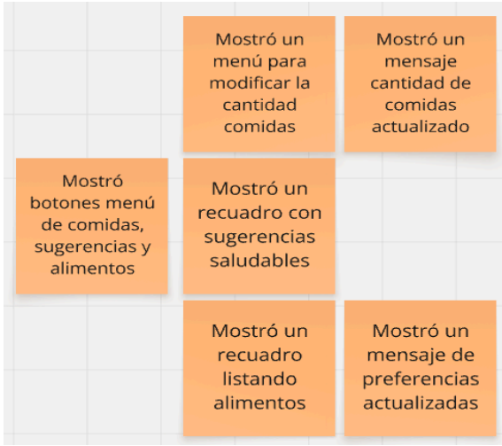

---

Este flujo de eventos describe cómo el sistema gestiona la rutina alimentaria del usuario de manera completamente automática mediante dispositivos IoT, como la balanza y el bebedero inteligente. A partir de la captura de datos en tiempo real, el sistema registra el peso del alimento consumido y detecta automáticamente el tipo de alimento.

Con esta información, se procesa y calcula la información nutricional correspondiente, incluyendo calorías y macronutrientes, permitiendo actualizar la rutina alimentaria del usuario de forma continua y precisa. El flujo contempla la sincronización en tiempo real y la generación de confirmaciones sobre los datos registrados, así como la gestión de posibles errores en la lectura o recepción de información, ofreciendo opciones de corrección cuando sea necesario.

Finalmente, el usuario puede visualizar su rutina alimentaria actualizada junto con los datos registrados automáticamente, asegurando un seguimiento eficiente y sin intervención manual.

---

Este flujo representa una secuencia lógica y centrada en el nutricionista, para la gestión de su
perfil profesional, con énfasis en la edición de sus datos profesionales y la interacción con
mensajes de confirmación.

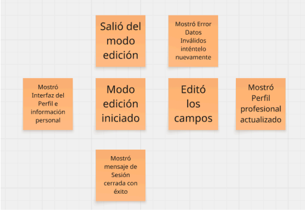

---

Este flujo de eventos está diseñado para guiar al profesional de nutrición en la creación,
categorización, asignación y publicación de planes alimenticios, de manera ordenada y
eficiente.

---

Este flujo de eventos describe cómo el nutricionista puede gestionar y dar seguimiento a sus pacientes, accediendo a información relevante como la lista de usuarios asignados, el perfil de cada paciente y sus métricas de progreso nutricional. Además, el sistema permite la incorporación de nuevos pacientes mediante el envío y aceptación de solicitudes, facilitando una gestión organizada y una comunicación directa.

De manera complementaria, el flujo integra un sistema de monitoreo inteligente que analiza en tiempo real la información nutricional del paciente, generando actualizaciones del progreso, niveles de hidratación y alertas automáticas ante situaciones como exceso o déficit calórico o bajo consumo de agua. Estas evaluaciones permiten enviar notificaciones y recordatorios automáticos al usuario, fortaleciendo el seguimiento continuo y personalizado de su estado de salud.

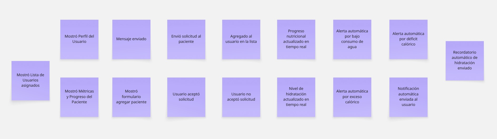

#### **Pivotal Points**

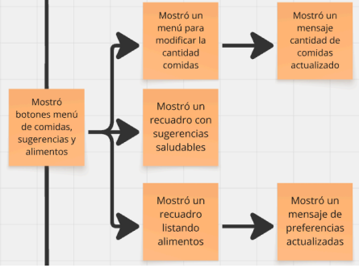

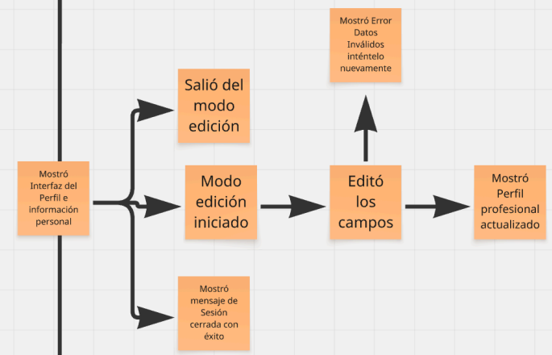

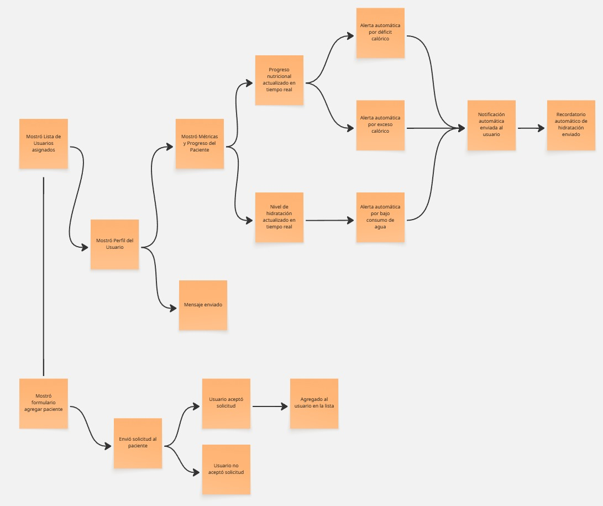

#### **Commands**

En esta etapa se establecen los comandos que representan las acciones que los usuarios
pueden realizar dentro del sistema. Estos comandos son esenciales para provocar eventos y
alterar el estado del sistema, y deben estar coherentemente relacionados con los eventos
definidos previamente. A continuación, se presentan los comandos relevantes para nuestro
dominio.

---

El diagrama muestra un sistema que guía al usuario en tres procesos: registro de cuenta con
definición de objetivos nutricionales, inicio de sesión con verificación de credenciales y
opción de recuperación ante fallos, y recuperación de contraseña mediante el envío de un
correo para restablecerla.

---

El diagrama muestra el flujo donde el usuario, al acceder a su ícono, puede editar su perfil
—visualizando y modificando correo y contraseña con confirmación de cambios— o cerrar
sesión, siendo redirigido al menú de inicio de sesión.

---

El diagrama muestra cómo el usuario, desde su menú de objetivos, puede configurar su peso
y calorías o ajustar su tipo de dieta y macros, recibiendo en ambos casos una confirmación al
guardar los cambios.

---

El diagrama muestra cómo el usuario, desde su plan de comidas, puede modificar el número
de comidas, ver sugerencias saludables o ajustar sus preferencias de alimentos, recibiendo
confirmación al guardar los cambios.

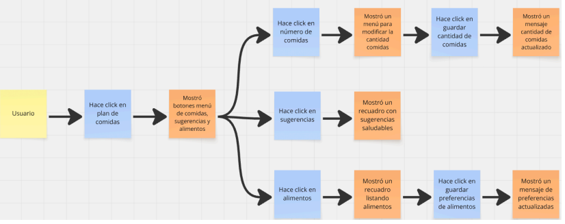

---

El diagrama muestra cómo el sistema registra automáticamente los alimentos consumidos por el usuario mediante la interacción con un dispositivo IoT, el cual captura datos como el peso del alimento y los envía para su procesamiento. A partir de esta información, el sistema identifica el tipo de alimento y genera eventos como alimento detectado y peso registrado.

El flujo contempla el cálculo automático de la información nutricional, incluyendo calorías y macronutrientes, lo que permite actualizar la rutina alimentaria del usuario en tiempo real. Finalmente, estos datos son mostrados en la aplicación, brindando al usuario una visualización clara y actualizada de su consumo alimenticio.

---

El diagrama muestra cómo el nutricionista puede monitorear el estado nutricional de sus pacientes, accediendo a información clave como métricas, progreso y alertas generadas automáticamente por el sistema. Este proceso es apoyado por un análisis inteligente que evalúa datos como calorías, macronutrientes y nivel de hidratación en tiempo real.

El flujo contempla la visualización continua del progreso nutricional, permitiendo identificar situaciones como exceso o déficit calórico, así como cambios en el nivel de hidratación. Tanto el nutricionista como el usuario reciben notificaciones y actualizaciones que facilitan un seguimiento constante y personalizado del estado de salud del paciente.

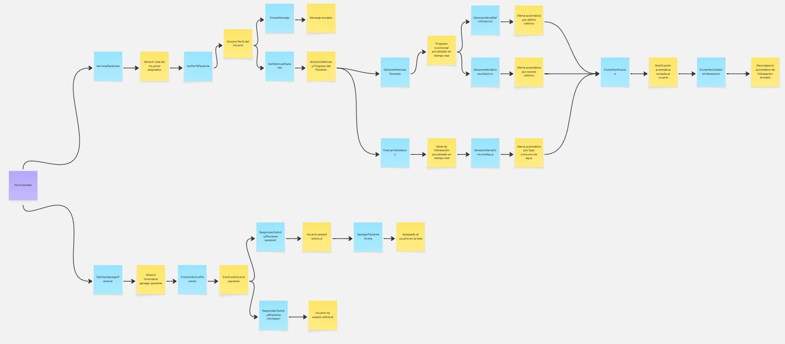

---

El diagrama muestra cómo el nutricionista, desde su panel de gestión, puede crear nuevos
planes alimenticios, organizarlos por categorías, asignarlos a usuarios y publicarlos, todo
dentro de un flujo claro y estructurado. El proceso incluye opciones para cancelar o regresar
en cualquier momento, y se refuerza con actualizaciones y confirmaciones inmediatas que
aseguran una experiencia profesional eficiente.

---

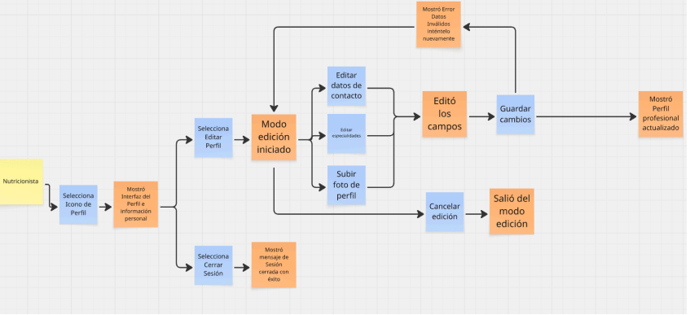

El diagrama muestra cómo el nutricionista puede gestionar su perfil profesional, accediendo a
su información personal, editando datos clave como especialidades y contacto, y actualizando
su foto de perfil. El flujo contempla acciones de edición, cancelación, cierre de sesión y
validación de datos, con mensajes de confirmación o error que refuerzan la experiencia de
uso.

#### **Bounded Contexts**

Finalmente, agrupamos los eventos dentro de bounded contexts coherentes para definir
límites claros entre módulos y facilitar su desarrollo independiente. Esto permitirá que cada
contexto evolucione de forma desacoplada y con responsabilidades bien definidas.

#### **Bounded Context: Inicio y Registro de sesión**

#### **Bounded Context: Perfil del Usuario**

#### **Bounded Context: Gestión de Objetivos**

#### **Bounded Context: Preferencias de Alimentación**

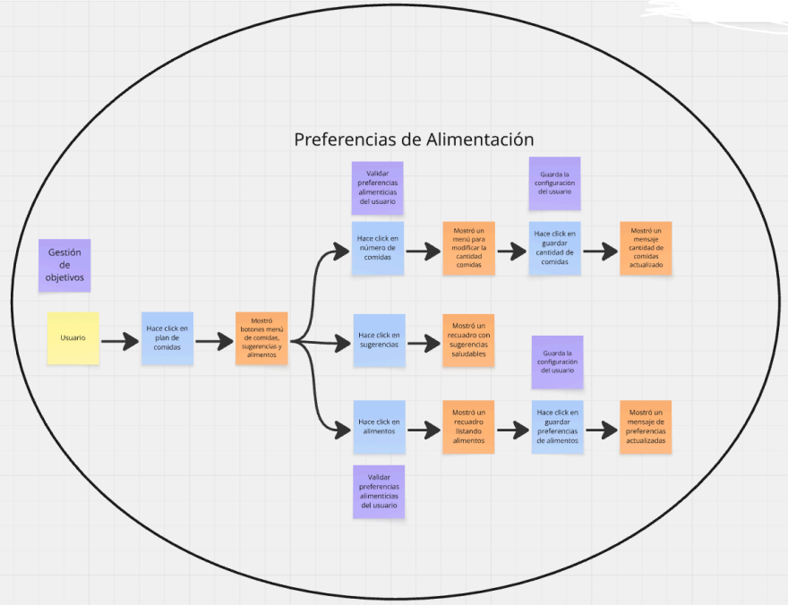

#### **Bounded Context: Rutina Alimentaria**

#### **Bounded Context: Perfil Nutricionista**

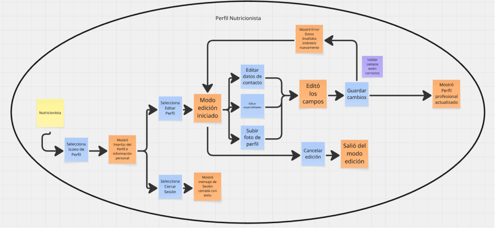

#### **Bounded Context: Creación y Gestión de Planes Alimenticios**

#### **Bounded Context: Comunicación y Seguimiento**

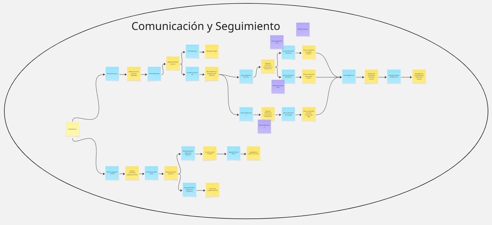

##### 4.1.1.2 Domain Message Flows Modeling.

El Modelado de Flujos de Mensajes de Dominio es una técnica fundamental para el análisis y diseño de sistemas complejos, ya que permite visualizar la transferencia de información y la orquestación entre componentes mediante el intercambio de mensajes. Este enfoque se centra en especificar las interacciones entre los diversos actores y componentes del sistema, facilitando la comprensión de sus dependencias y relaciones dinámicas.

La implementación de esta metodología proporciona una visión clara de las vías de comunicación, lo que resulta crucial para identificar cuellos de botella o posibles fallos en el diseño de manera temprana. A continuación, se presentan los diagramas de flujo de mensajes que ilustran cómo los Bounded Contexts cooperan entre sí para resolver los diferentes escenarios de negocio planteados en nuestra arquitectura.

### **Registro e inicio de sesión**

Este es un escenario donde el usuario desea registrarse o iniciar sesión en el sistema para acceder a su perfil nutricional.

El usuario envía el comando Registrar Cuenta o Iniciar Sesión al bounded context Inicio y Registro de Sesión, proporcionando datos como correo electrónico, contraseña, usuario, objetivo nutricional y nivel de actividad física.

Al confirmarse la operación, se emiten los eventos Cuenta Registrada o Sesión Iniciada, los cuales son recibidos por el bounded context Perfil del Usuario, donde se gestiona la información del usuario.

Finalmente, el sistema muestra el perfil del usuario en la aplicación móvil, permitiendo el acceso a sus funcionalidades personalizadas.

### **Registro automático de alimentos (IoT)**

Este es un escenario donde el sistema registra automáticamente el consumo alimentario del usuario mediante el uso de un dispositivo IoT.

El dispositivo IoT envía el comando Registrar Datos IoT al bounded context Rutina Alimentaria Inteligente, donde se procesan datos como el peso del alimento y se detecta automáticamente el tipo de alimento consumido.

Como resultado, se generan eventos como Alimento Detectado y Peso Registrado, los cuales permiten calcular la información nutricional del alimento consumido.

Finalmente, se emite el evento Rutina Alimentaria Actualizada, actualizando automáticamente el registro diario del usuario en el sistema.

### **Análisis nutricional y generación de alertas**

Este es un escenario donde el sistema analiza la información nutricional del usuario para monitorear su progreso y generar alertas.

El bounded context Rutina Alimentaria Inteligente envía los datos procesados, como la Información Nutricional Calculada, al bounded context Comunicación y seguimiento.

A partir de esta información, el sistema evalúa el progreso del usuario y genera eventos como Progreso Nutricional Actualizado, Alerta de Exceso Calórico, Alerta de Déficit Calórico o Nivel de Hidratación Actualizado.

Finalmente, estas alertas son enviadas al usuario mediante notificaciones, permitiendo un seguimiento continuo y personalizado de su estado nutricional.

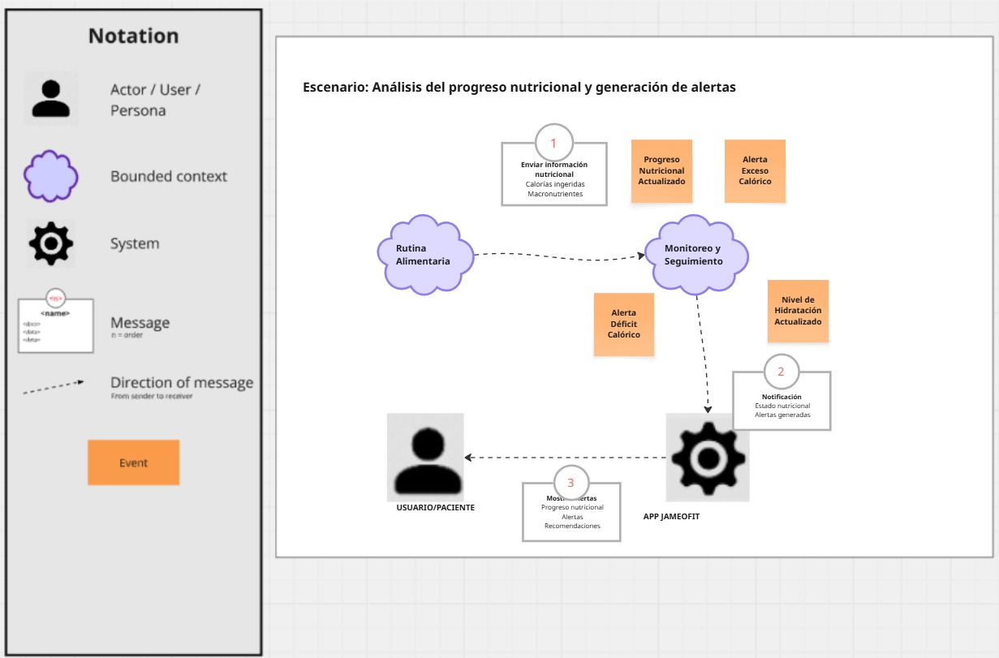

##### 4.1.1.3 Bounded Context Canvases.

El Bounded Context Canvas es un recurso gráfico dentro del enfoque Domain-Driven Design
(DDD) que facilita la definición, comprensión y comunicación precisa de los límites,
funciones y componentes esenciales de un Bounded Context. Su uso permite al equipo
mantener una visión común del dominio, reconociendo entidades, eventos, comandos y
conexiones con otros contextos. Asimismo, gracias a las convenciones que establece,
posibilita construir un diseño modular y coherente del sistema.

##  **Bounded Context –  INICIO Y REGISTRO DE SESION**

### **Description**

En este bounded context se gestionan los procesos de creación de cuentas de usuario,
validación de credenciales durante el inicio de sesión y recuperación de contraseñas mediante
correo electrónico.

### **Strategic Classification**

Su clasificación estratégica se divide en:

**● Generic:**  
Este bounded context es genérico porque, aunque no aporta directamente a
la nutrición, es esencial como capa base de acceso a todos los demás contextos.

**● Engagement:**  
Su modelo de negocio está enfocado en garantizar la continuidad y
acceso fluido del usuario al sistema.

**● Genesis:**  
Se considera genesis porque representa el punto inicial sobre el cual se
construyen y habilitan los demás contextos.

### **Domain Role**

Asume el rol de execution context, validando credenciales y gestionando el registro, y de
gateway context, al controlar el acceso al ecosistema de la aplicación.

### **Inbound Communication**

● El usuario puede registrar una cuenta, iniciar sesión o recuperar contraseña.

**Outbound Communication**

● Una CuentaRegistrada habilita la creación del perfil del usuario.

● Un UsuarioAutenticado habilita el acceso a otros bounded contexts como Perfil del
Usuario o Rutina Alimentaria.

### **Capability Analysis**

● Registro de cuenta: permite almacenar la identidad del usuario en el sistema.

● Validación de credenciales: garantiza la seguridad y continuidad del acceso.

● Recuperación de contraseña: facilita que el usuario recupere su sesión en caso de
pérdida de acceso.

● Integración con Perfil del Usuario: permite encadenar el registro de cuenta con la
configuración inicial del perfil.

##  **Bounded Context –  PERFIL DE USUARIO**

### **Description**

En este bounded context se gestiona la información personal del usuario, como correo
electrónico y contraseña, y se administra la acción de cerrar sesión.

### **Strategic Classification**

Su clasificación estratégica se divide en:

**● Supporting:**  
Es un contexto de soporte que facilita la personalización y continuidad
de la experiencia.

**● Engagement:**
Favorece la interacción al permitir al usuario editar sus datos básicos.

**● Product:** 
Se considera un producto establecido que da valor al ecosistema al mantener
la información actualizada.

### **Domain Role**

Asume el rol de execution context, pues ejecuta la gestión directa del perfil y los procesos de
cierre de sesión.

**Inbound Communication**

● El usuario puede editar su perfil.

● El usuario puede cerrar sesión.

### **Outbound Communication**

● PerfilActualizado → enviado al bounded context de comunicación y seguimiento del
nutricionista (u otros contextos interesados en datos del usuario).

**Capability Analysis**

● Edición de datos básicos: correo y contraseña.

● Validación de cambios críticos (ej. correos únicos).

● Cierre de sesión con redirección al login.

● Sincronización con otros bounded contexts que dependan del perfil actualizado del
usuario.

## **Bounded Context -  GESTION DE OBJETIVOS**

### **Description**
Este *bounded context* permite configurar y administrar las **metas nutricionales** del usuario, incluyendo el peso objetivo, las calorías y la velocidad de progreso, asegurando su persistencia y confirmación dentro del sistema.

### **Strategic Classification**
La clasificación estratégica de este contexto se divide en tres pilares fundamentales:

● **Core:** Es un contexto central, ya que define el eje de personalización nutricional del usuario.
● **Engagement:** Fomenta la adherencia del usuario al permitirle establecer y seguir objetivos claros.
*● **Custom Built:** Su evolución es a medida, debido a que cada usuario configura objetivos distintos que requieren una lógica personalizada.

### **Domain Role**
Asume el rol de **Execution Context**, ya que es el encargado de administrar y procesar directamente los datos de los objetivos nutricionales.

### **Communication Flow**

#### **Inbound Communication**
● **Usuario:** El usuario puede configurar parámetros críticos como peso, calorías y macronutrientes.

#### **Outbound Communication**
● **ObjetivosActualizados:** Eventos enviados hacia el contexto de **Rutina Alimentaria** para ajustar dinámicamente las sugerencias y los cálculos de ingesta.

### **Capability Analysis**
● **Configuración inicial:** Establecimiento de metas nutricionales tras el registro del usuario.
● **Ajuste dinámico:** Actualización de metas cuando ocurren cambios en el perfil del usuario.
● **Reglas de cálculo:** Implementación de lógica para determinar calorías y macros de forma personalizada.
● **Sincronización:** Asegurar la consistencia de los cambios mediante la comunicación con el contexto de Rutina Alimentaria.

## **Bounded Context - PREFERENCIAS DE ALIMENTACION**

### **Description**
Este *bounded context* gestiona las preferencias del usuario relacionadas con su alimentación, tales como la cantidad de comidas diarias y las restricciones de alimentos (alergias o intolerancias). Además, actúa como un motor de recomendaciones al proveer sugerencias saludables basadas en los gustos del usuario.

### **Strategic Classification**
La clasificación estratégica de este contexto se define bajo los siguientes criterios:

● **Supporting:** Actúa como un dominio de soporte que complementa la lógica principal de los contextos de Objetivos y Rutina.
● **Engagement:** Incrementa la retención y satisfacción al permitir que la dieta se adapte a los gustos específicos o necesidades médicas del usuario.
● **Product:** Se considera una funcionalidad madura que evoluciona para refinar y mejorar continuamente la experiencia de personalización.

### **Domain Role**
Asume el rol de **Execution Context**, ya que es el responsable directo de la gestión, validación y persistencia de las preferencias alimenticias del usuario.

### **Communication Flow**

#### **Inbound Communication**
● **Usuario:** Actualización de parámetros personales como el número de ingestas deseadas, restricciones específicas y tipos de sugerencias.

#### **Outbound Communication**
● **PreferenciasActualizadas:** Evento publicado hacia el contexto de **Rutina Alimentaria** para que este pueda recalcular y ajustar el plan diario de comidas según los nuevos filtros.

### **Capability Analysis**
● **Gestión de estructura diaria:** Definición del número de comidas por jornada.
● **Control de restricciones:** Administración de listas de alimentos prohibidos o restringidos (ej. gluten, lactosa, mariscos).
● **Curación de sugerencias:** Motor de recomendaciones de alimentos saludables alineados al perfil.
● **Personalización de flujo:** Impacto directo en la lógica de generación de la rutina alimentaria para garantizar la adherencia del usuario.

##  **Bounded Context – Rutina Alimentaria**

### **Description**

Este bounded context permite gestionar de forma automatizada la rutina alimentaria del usuario mediante la integración con dispositivos IoT, registrando alimentos, detectando su tipo, calculando información nutricional y actualizando la rutina en tiempo real sin intervención manual.  

### **Strategic Classification**

Su clasificación estratégica se divide en:  
● **Core:** Es central porque automatiza el registro y control de la alimentación mediante datos reales.  
● **Engagement:** Fomenta la interacción continua del usuario a través de retroalimentación automática y visualización en tiempo real.  
● **Custom Built:** Es evolutivo y adaptable según los hábitos del usuario y los datos capturados por dispositivos IoT.  

### **Domain Role**

Asume el rol de **execution context**, al ejecutar automáticamente el registro de alimentos, y de **analysis context**, al procesar datos y calcular información nutricional en tiempo real.

### **Inbound Communication**

● El sistema recibe datos desde dispositivos IoT.  
● El sistema procesa datos nutricionales automáticamente.  
● El sistema detecta alimentos de forma automática.  
● El sistema registra el peso del alimento automáticamente.  
● El usuario puede corregir alimentos detectados.  
● El sistema gestiona errores en la recepción de datos IoT.  

### **Outbound Communication**

● DatosProcesados, AlimentoDetectado, PesoRegistrado → enviados al contexto de monitoreo nutricional.  
● InformacionNutricionalCalculada → enviada para análisis y visualización.  
● RutinaAlimentariaActualizada → enviada a la aplicación para visualización del usuario.  
● ErroresIoTDetectados → enviados a sistemas de monitoreo y soporte.  

### **Capability Analysis**

● Registro automático de alimentos mediante dispositivos IoT.  
● Detección inteligente de alimentos y cálculo nutricional en tiempo real.  
● Sincronización de datos en tiempo real con la aplicación.  
● Manejo de errores en la captura de datos físicos.  
● Reducción de intervención manual del usuario.  

##  **Bounded Context – Comunicación y seguimiento**

### **Description**

Este bounded context permite al nutricionista supervisar el estado nutricional de sus pacientes, analizar métricas en tiempo real, generar alertas automáticas y mantener comunicación directa para un seguimiento continuo y personalizado.

### **Strategic Classification**

Su clasificación estratégica se divide en:  
● **Core:** Es central porque permite el análisis y control del estado nutricional de los pacientes.  
● **Engagement:** Fomenta la interacción entre nutricionista y paciente mediante alertas, métricas y comunicación directa.  
● **Custom Built:** Es evolutivo y se adapta a las necesidades de seguimiento de cada paciente.  

### **Domain Role**

Asume el rol de **analysis context**, al procesar métricas y generar alertas, y de **execution context**, al gestionar la comunicación y acciones del nutricionista sobre los pacientes.

### **Inbound Communication**

● El nutricionista puede visualizar lista de pacientes.  
● El nutricionista puede ver perfiles y métricas de pacientes.  
● El sistema genera métricas nutricionales automáticamente.  
● El sistema evalúa niveles de hidratación.  
● El sistema detecta condiciones críticas (exceso, déficit, hidratación).  
● El nutricionista puede enviar mensajes y solicitudes a pacientes.  
● El paciente puede aceptar o rechazar solicitudes.  

### **Outbound Communication**

● ProgresoNutricionalActualizado, NivelHidratacionActualizado → enviados para visualización.  
● AlertasNutricionales (exceso, déficit, hidratación) → enviadas al sistema de notificaciones.  
● NotificacionEnviada, RecordatorioHidratacion → enviados al usuario final.  
● PacienteAgregado → actualizado en el sistema de gestión de usuarios. 

### **Capability Analysis**

● Monitoreo en tiempo real del progreso nutricional del paciente.  
● Generación automática de alertas basadas en datos.  
● Evaluación continua de hidratación y consumo.  
● Comunicación directa nutricionista–paciente.  
● Gestión de relaciones entre nutricionistas y pacientes.  
● Soporte para toma de decisiones basadas en datos.

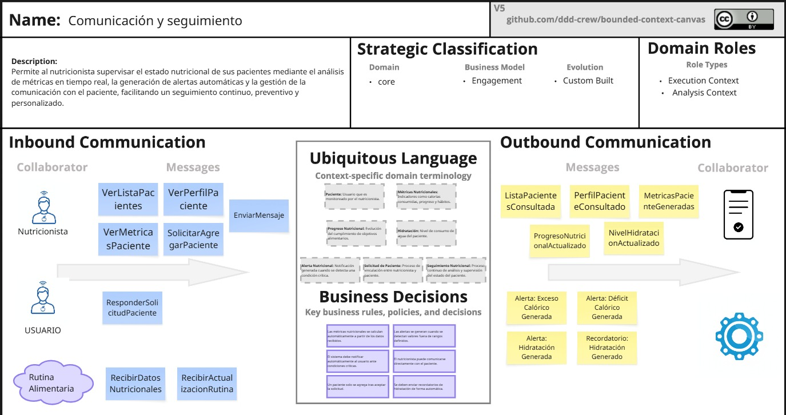

#### 4.1.2. Context Mapping.

El *Context Mapping* es una técnica fundamental dentro del enfoque **Domain-Driven Design (DDD)** que permite identificar, analizar y representar las relaciones e interacciones entre los distintos *bounded contexts* del sistema. A través de este proceso, se logra visualizar cómo fluye la información, qué contextos dependen de otros y qué tipo de relación existe entre ellos, facilitando así el diseño de una arquitectura clara, modular y escalable.

En el caso de nuestro sistema de **gestión nutricional inteligente**, el Context Mapping permite comprender cómo los distintos dominios —desde la autenticación hasta el monitoreo nutricional— colaboran para ofrecer una experiencia integrada tanto para usuarios como para nutricionistas. Esta representación también ayuda a identificar responsabilidades, dependencias y posibles puntos de mejora en la comunicación entre contextos.

Se identificaron los siguientes *bounded contexts* en el sistema:

### **Bounded Contexts Identificados**

**Inicio y Registro de Sesión (IAM)**
Gestiona la autenticación, registro de usuarios y recuperación de contraseñas, actuando como punto de entrada al sistema.

**Perfil del Usuario**
Administra la información personal del usuario y permite la edición de sus datos y cierre de sesión.

**Gestión de Objetivos**
Permite definir metas nutricionales como peso objetivo, calorías y macronutrientes.

**Preferencias de Alimentación**
Gestiona restricciones alimenticias, alergias, tipo de dieta y número de comidas.

**Rutina Alimentaria Inteligente (IoT)**
Automatiza el registro de alimentos y cálculo nutricional mediante dispositivos IoT, actualizando la rutina en tiempo real.

**Perfil Nutricionista**
Administra la información profesional del nutricionista, incluyendo especialidades y disponibilidad.

**Creación y Gestión de Planes Alimenticios**
Permite a los nutricionistas diseñar, organizar y asignar planes alimenticios personalizados.

**Comunicación y Seguimiento Nutricional**
Facilita la interacción entre nutricionista y paciente, además del monitoreo del progreso nutricional.

### **Relaciones entre Bounded Contexts**

| **Destino (Downstream)**        | **Origen (Upstream)**           | **Tipo de Relación** | **Comentario**                                                                                               |
| ------------------------------- | ------------------------------- | -------------------- | ------------------------------------------------------------------------------------------------------------ |
| Perfil del Usuario              | Inicio y Registro de Sesión     | Customer/Supplier    | El contexto IAM provee los datos de autenticación necesarios para gestionar el perfil del usuario.           |
| Gestión de Objetivos            | Perfil del Usuario              | Customer/Supplier    | Los datos del perfil alimentan la configuración inicial de objetivos nutricionales.                          |
| Preferencias de Alimentación    | Perfil del Usuario              | Customer/Supplier    | Las preferencias dependen de la información básica del usuario para personalizar la dieta.                   |
| Rutina Alimentaria              | Gestión de Objetivos            | Customer/Supplier    | La rutina se ajusta dinámicamente según las metas nutricionales definidas.                                   |
| Rutina Alimentaria              | Preferencias de Alimentación    | Customer/Supplier    | Se utilizan las restricciones y gustos del usuario para generar una rutina adecuada.                         |
| Comunicación y Seguimiento      | Rutina Alimentaria              | Customer/Supplier    | El progreso alimentario registrado se utiliza para monitoreo y análisis por parte del nutricionista.         |
| Comunicación y Seguimiento      | Gestión de Objetivos            | Customer/Supplier    | Las metas nutricionales sirven como referencia para evaluar el progreso del usuario.                         |
| Creación de Planes Alimenticios | Perfil Nutricionista            | Customer/Supplier    | El nutricionista provee la información necesaria para la creación de planes.                                 |
| Rutina Alimentaria              | Creación de Planes Alimenticios | Customer/Supplier    | Los planes alimenticios definidos influyen en la rutina diaria del usuario.                                  |
| Comunicación y Seguimiento      | Creación de Planes Alimenticios | Customer/Supplier    | Permite evaluar la efectividad de los planes asignados a los pacientes.                                      |
| Gestión de Objetivos            | Comunicación y Seguimiento      | Partnership          | Ambos contextos colaboran para ajustar metas según el progreso del usuario.                                  |
| Rutina Alimentaria              | Comunicación y Seguimiento      | Partnership          | Existe una relación bidireccional para monitoreo y ajuste continuo.                                          |
| Todos los Contextos             | Inicio y Registro de Sesión     | Shared Kernel        | La autenticación y gestión de usuarios es compartida por todos los contextos para garantizar acceso seguro.  |
| Sistemas IoT Externos           | Rutina Alimentaria              | Anticorruption Layer | Se utiliza una capa de anticorrupción para integrar datos de dispositivos IoT sin afectar el modelo interno. |

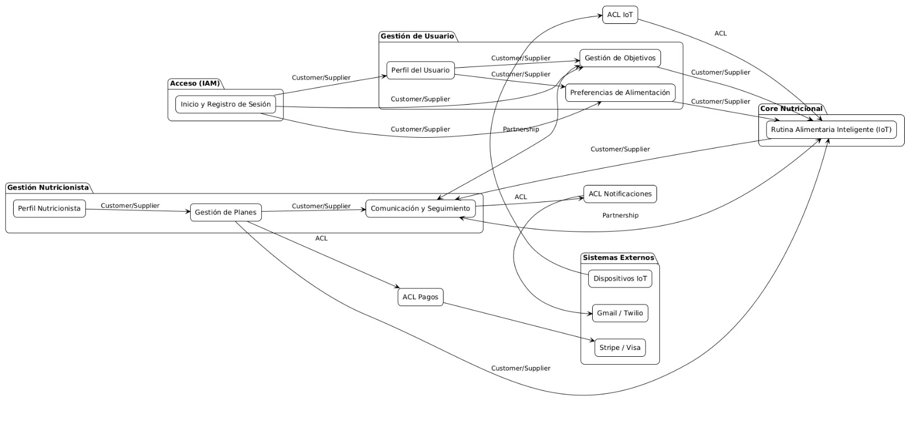

#### 4.1.3. Software Architecture.

En esta sección se presenta la arquitectura de software del sistema JameoFit, una solución integral orientada al seguimiento nutricional inteligente mediante el uso de tecnologías como IoT, procesamiento de datos en tiempo real e integración con servicios externos.

Para su representación, se utiliza el modelo C4 (Context, Container, Component y Code), el cual permite describir la arquitectura del sistema en diferentes niveles de abstracción, facilitando la comprensión tanto técnica como funcional. A través de estos diagramas, se muestra cómo los distintos actores interactúan con el sistema, cómo se organizan los contenedores principales y cómo se estructuran los componentes internos.

Asimismo, esta arquitectura refleja la evolución del sistema hacia un enfoque moderno basado en eventos, integración con dispositivos físicos y procesamiento automatizado de información nutricional, permitiendo ofrecer una experiencia más precisa, escalable y centrada en el usuario.

El objetivo de esta sección es proporcionar una visión clara de cómo el sistema está diseñado, cómo fluye la información entre sus partes y cómo se soportan los requerimientos funcionales y no funcionales del proyecto.

##### 4.1.3.1. Software Architecture System Landscape Diagram.

Este diagrama muestra que JameoFit opera en un ecosistema donde interactúan distintos actores como el Usuario/Paciente, el Nutricionista, el Owner/Admin y el IT Support, quienes utilizan el sistema para el seguimiento, supervisión y gestión de la plataforma.

El sistema principal, JameoFit Core, centraliza la lógica de negocio y procesa datos provenientes de dispositivos IoT, permitiendo automatizar el registro y análisis nutricional.

Además, se integra con servicios externos como Stripe API para pagos, un Servicio de Notificaciones para alertas en tiempo real y Bases de Datos Nutricionales para validar la información alimentaria.

Este diagrama refleja cómo el sistema combina interacción de usuarios, dispositivos físicos y servicios externos para brindar una solución eficiente y automatizada.

##### 4.1.3.2. Software Architecture Context Level Diagrams.

Este diagrama muestra que JameoFit interactúa con distintos actores como el Usuario/Paciente, quien utiliza la aplicación y dispositivos IoT para el seguimiento nutricional; el Nutricionista, quien supervisa y valida la información; el Owner/Admin, encargado de la gestión del negocio; y el IT Support, responsable del mantenimiento técnico.

El sistema también se integra con un Dispositivo IoT (sensores) que permite capturar datos en tiempo real sobre el consumo del usuario, automatizando el registro alimentario.

Asimismo, se conecta con servicios externos como Stripe API para la gestión de pagos, el Servicio de Notificaciones para el envío de alertas en tiempo real y las Bases de Datos Nutricionales para validar la información alimentaria.

Este diagrama proporciona una visión general del sistema, mostrando cómo JameoFit se integra con actores, dispositivos físicos y servicios externos.

##### 4.1.3.2. Software Architecture Container Level Diagrams.

El Diagrama de Contenedores de JameoFit App muestra la descomposición del sistema en sus principales contenedores de software, así como la interacción entre estos, los actores del sistema y los servicios externos.

En este nivel, se identifican:

● Landing Page: Portal web que permite el acceso al sistema, registro, autenticación y gestión de suscripciones por parte de los usuarios y nutricionistas.

● Mobile Application: Aplicación móvil que permite al usuario visualizar su rutina alimentaria, métricas nutricionales y recibir notificaciones en tiempo real.

● JameoFit Core: Backend central desarrollado en Spring Boot que procesa la lógica de negocio, gestiona APIs, integra procesamiento inteligente (IA) y orquesta la comunicación entre los diferentes componentes del sistema.

● Database: Almacena información de usuarios, pacientes, métricas nutricionales, rutinas alimentarias y planes.

● Módulos internos del backend:  
○ Módulo de Seguimiento: Procesa métricas nutricionales y datos en tiempo real.  
○ Módulo de Planes y Dietas: Gestiona la creación y asignación de planes personalizados.  
○ Módulo de Usuarios: Administra autenticación, perfiles y roles.  
○ Módulo de Logros: Gestiona metas, progreso e incentivos del usuario.  

● Sistemas externos:  
○ Dispositivo IoT: Captura datos físicos del usuario y los envía al sistema en tiempo real.  
○ Stripe API: Gestiona pagos, suscripciones y facturación.  
○ Servicio de Notificaciones: Envía alertas y recordatorios en tiempo real.  
○ Bases de Datos Nutricionales: Proveen información externa para validar y enriquecer los datos alimentarios.  

Este diagrama proporciona una visión técnica detallada del sistema, mostrando cómo los diferentes contenedores, dispositivos y servicios externos colaboran para cumplir los objetivos funcionales y no funcionales de la aplicación, destacando la integración con IoT y el procesamiento automatizado de información.

##### 4.1.3.3. Software Architecture Deployment Diagrams.

Los Deployment Diagrams (diagramas de despliegue) forman parte de la arquitectura de
software y son esenciales para representar cómo los componentes del sistema se distribuyen
físicamente en el entorno de ejecución. Estos diagramas muestran la disposición de hardware
(nodos) y la manera en que los artefactos de software se instalan en ellos, permitiendo
visualizar la infraestructura que soporta la aplicación. Su propósito principal es ilustrar la
relación entre el software y el hardware, detallando aspectos como servidores, dispositivos de
red, bases de datos, y cómo interactúan entre sí.

### 4.2. Tactical-Level Domain-Driven Design

#### 4.2.1. Bounded Context: Inicio y Registro de Sesión

##### 4.2.1.1. Domain Layer.

##### 4.2.1.2. Interface Layer.

##### 4.2.1.3. Application Layer.

##### 4.2.1.4. Infrastructure Layer.

##### 4.2.1.5. Bounded Context Software Architecture Component Level Diagrams.

##### 4.2.1.6. Bounded Context Software Architecture Code Level Diagrams.

###### 4.2.1.6.1. Bounded Context Domain Layer Class Diagrams.

###### 4.2.1.6.2. Bounded Context Database Design Diagram.

#### 4.2.2. Bounded Context: Perfil de Usuario

##### 4.2.2.1. Domain Layer.

##### 4.2.2.2. Interface Layer.

##### 4.2.2.3. Application Layer.

##### 4.2.2.4. Infrastructure Layer.

##### 4.2.2.5. Bounded Context Software Architecture Component Level Diagrams.

##### 4.2.2.6. Bounded Context Software Architecture Code Level Diagrams.

###### 4.2.2.6.1. Bounded Context Domain Layer Class Diagrams.

###### 4.2.2.6.2. Bounded Context Database Design Diagram.

#### 4.2.3. Bounded Context: Gestión de Objetivos

##### 4.2.3.1. Domain Layer.

##### 4.2.3.2. Interface Layer.

##### 4.2.3.3. Application Layer.

##### 4.2.3.4. Infrastructure Layer.

##### 4.2.3.5. Bounded Context Software Architecture Component Level Diagrams.

##### 4.2.3.6. Bounded Context Software Architecture Code Level Diagrams.

###### 4.2.3.6.1. Bounded Context Domain Layer Class Diagrams.

###### 4.2.3.6.2. Bounded Context Database Design Diagram.

#### 4.2.4. Bounded Context: Rutina Alimentaria

##### 4.2.4.1. Domain Layer.

##### 4.2.4.2. Interface Layer.

##### 4.2.4.3. Application Layer.

##### 4.2.4.4. Infrastructure Layer.

##### 4.2.4.5. Bounded Context Software Architecture Component Level Diagrams.

##### 4.2.4.6. Bounded Context Software Architecture Code Level Diagrams.

###### 4.2.4.6.1. Bounded Context Domain Layer Class Diagrams.

###### 4.2.4.6.2. Bounded Context Database Design Diagram.

#### 4.2.5. Bounded Context: Nutricionista

##### 4.2.5.1. Domain Layer.

##### 4.2.5.2. Interface Layer.

##### 4.2.5.3. Application Layer.

##### 4.2.5.4. Infrastructure Layer.

##### 4.2.5.5. Bounded Context Software Architecture Component Level Diagrams.

##### 4.2.5.6. Bounded Context Software Architecture Code Level Diagrams.

###### 4.2.5.6.1. Bounded Context Domain Layer Class Diagrams.

###### 4.2.5.6.2. Bounded Context Database Design Diagram.

#### 4.2.6. Bounded Context: Gestión de Planes Alimenticios

##### 4.2.6.1. Domain Layer.

##### 4.2.6.2. Interface Layer.

##### 4.2.6.3. Application Layer.

##### 4.2.6.4. Infrastructure Layer.

##### 4.2.6.5. Bounded Context Software Architecture Component Level Diagrams.

##### 4.2.6.6. Bounded Context Software Architecture Code Level Diagrams.

###### 4.2.6.6.1. Bounded Context Domain Layer Class Diagrams.

###### 4.2.6.6.2. Bounded Context Database Design Diagram.

#### 4.2.7. Bounded Context: Comunicación y Seguimiento

##### 4.2.7.1. Domain Layer.

##### 4.2.7.2. Interface Layer.

##### 4.2.7.3. Application Layer.

##### 4.2.7.4. Infrastructure Layer.

##### 4.2.7.5. Bounded Context Software Architecture Component Level Diagrams.

##### 4.2.7.6. Bounded Context Software Architecture Code Level Diagrams.

###### 4.2.7.6.1. Bounded Context Domain Layer Class Diagrams.

###### 4.2.7.6.2. Bounded Context Database Design Diagram.

#### 4.2.8. Bounded Context: Pagos

##### 4.2.8.1. Domain Layer.

##### 4.2.8.2. Interface Layer.

##### 4.2.8.3. Application Layer.

##### 4.2.8.4. Infrastructure Layer.

##### 4.2.8.5. Bounded Context Software Architecture Component Level Diagrams.

##### 4.2.8.6. Bounded Context Software Architecture Code Level Diagrams.

###### 4.2.8.6.1. Bounded Context Domain Layer Class Diagrams.

###### 4.2.8.6.2. Bounded Context Database Design Diagram.

### 4.3 Referencias Bibliográficas

Organización Mundial de la Salud. (2025). Noncommunicable diseases.  
https://www.who.int/news-room/fact-sheets/detail/noncommunicable-diseases  

Arefeen, A., et al. (2025). MealMeter: Using multimodal sensing and machine learning for automatically estimating nutrition intake.  
https://arxiv.org/abs/2503.11683  

Gioia, S., et al. (2023). Mobile apps for dietary and food timing assessment.  
https://www.ncbi.nlm.nih.gov/pmc/articles/PMC10337248/ 

Instituto Nacional de Estadística e Informática (INEI). (2023).  
Las Tecnologías de Información y Comunicación en los Hogares: Oct-Nov-Dic 2023.  
https://www.gob.pe/institucion/inei/informes-publicaciones/5408920-las-tecnologias-de 
