

  <strong>UNIVERSIDAD PERUANA DE CIENCIAS APLICADAS</strong>

  

  Ingeniería de Software  
  2026-10  
  1ASI0572 Desarrollo de Soluciones IOT  
  NRC: 17756    
  Profesor: David Carlos Vera Olivera   
  "Informe de Trabajo Final"  
  Startup:  - Producto: 

 

<strong>Relación de integrantes:</strong>

<table align="center">
  <thead>
    <tr>
      <th>Integrante</th>
      <th>Código</th>
    </tr>
  </thead>
  <tbody>
    <tr>
      <td>Mathias Eduardo Bueno Perales</td>
      <td>U202313433</td>
    </tr>
    <tr>
      <td>Jhon Alexander Galvez Chambi</td>
      <td>U202323270</td>
    </tr>
    <tr>
      <td>Pablo Antonio Geronimo Quispe</td>
      <td>U202314304</td>
    </tr>
    <tr>
      <td>Ramiro Alexander Guzmán Chávez</td>
      <td>U202217062</td>
    </tr>
    <tr>
      <td>Omar Luquillas Asto</td>
      <td>U20211G641</td>
    </tr>
    <tr>
      <td>Fabrizio Alberto Paredes Santos</td>
      <td>U202310914</td>
    </tr>
    <tr>
      <td>Valentino Sandoval Paiva</td>
      <td>U20211A962</td>
    </tr>
  </tbody>
</table>

  

  <strong>Abril, 2026</strong>  
  <strong>URL del proyecto:</strong>
  <a href="https://github.com/G3-Soluciones-IOT">
    https://github.com/G3-Soluciones-IOT
  </a>

---

## Registro de Versiones del Informe

| Versión | Fecha      | Autor                         | Descripción                                                                  |
|---------|------------|-------------------------------|------------------------------------------------------------------------------|
| AV1     | 05/04/2026 | Jhon Alexander Galvez Chambi  | Desarrollo de la carátula, tabla de contenidos y estructura general del informe. |
| AV1     | 15/04/2026   |   Valentino Sandoval Paiva                            | Para esta entrega, lideré el diseño estratégico mediante EventStorming, el descubrimiento de contextos y la elaboración de los Bounded Context Canvases y el Context Mapping. Asimismo, definí la arquitectura de software a través de los diagramas de Landscape, Context, Container y Deployment, complementándolo con el análisis competitivo, las historias de usuario y el desarrollo integral de las capas del Bounded Context IAM.                                                                             |
| AV1     | /04/2025   |                               |                                                                              |
| AV1     | /04/2025   |                               |                                                                              |
| AV1     | /04/2025   |                               |                                                                              |

## Project Report Collaboration Insights

|  URL del repositorio del reporte  |
| :-----------------------------------: |
| [https://github.com/G3-Soluciones-IOT/docs.git](https://github.com/G3-Soluciones-IOT/docs.git) |

**TB1:**

**REPORT:** 

## Contenido

### Tabla de contenidos

- [Registro de Versiones del Informe](#registro-de-versiones-del-informe)
- [Project Report Collaboration Insights](#project-report-collaboration-insights)
- [Contenido](#contenido)
- [Tabla de contenidos](#tabla-de-contenidos)
- [Student Outcome](#student-outcome)
- [Capítulo I: Introducción](#capítulo-i-introducción)
  - [1.1. Startup Profile](#11-startup-profile)
    - [1.1.1. Descripción de la Startup](#111-descripción-de-la-startup)
    - [1.1.2. Perfiles de integrantes del equipo](#112-perfiles-de-integrantes-del-equipo)
  - [1.2. Solution Profile](#12-solution-profile)
    - [1.2.1 Antecedentes y problemática](#121-antecedentes-y-problemática)
    - [1.2.2 Lean UX Process.](#122-lean-ux-process)
        - [1.2.2.1. Lean UX Problem Statements.](#1221-lean-ux-problem-statements)
        - [1.2.2.2. Lean UX Assumptions.](#1222-lean-ux-assumptions)
        - [1.2.2.3. Lean UX Hypothesis Statements.](#1223-lean-ux-hypothesis-statements)
        - [1.2.2.4. Lean UX Canvas.](#1224-lean-ux-canvas)
  - [1.3. Segmentos objetivo.](#13-segmentos-objetivo)
- [Capítulo II: Requirements Elicitation & Analysis](#capítulo-ii-requirements-elicitation--analysis)
  - [2.1. Competidores.](#21-competidores)
    - [2.1.1. Análisis competitivo.](#211-análisis-competitivo)
    - [2.1.2. Estrategias y tácticas frente a competidores.](#212-estrategias-y-tácticas-frente-a-competidores)
  - [2.2. Entrevistas.](#22-entrevistas)
    - [2.2.1. Diseño de entrevistas.](#221-diseño-de-entrevistas)
    - [2.2.2. Registro de entrevistas.](#222-registro-de-entrevistas)
    - [2.2.3. Análisis de entrevistas.](#223-análisis-de-entrevistas)
  - [2.3. Needfinding.](#23-needfinding)
    - [2.3.1. User Personas.](#231-user-personas)
    - [2.3.2. User Task Matrix.](#232-user-task-matrix)
    - [2.3.3. User Journey Mapping.](#233-user-journey-mapping)
    - [2.3.4. Empathy Mapping.](#234-empathy-mapping)
  - [2.4. Big Picture EventStorming.](#24-big-picture-eventstorming)
  - [2.5. Ubiquitous Language.](#25-ubiquitous-language)
- [Capítulo III: Requirements Specification](#capítulo-iii-requirements-specification)
  - [3.1. User Stories.](#31-user-stories)
  - [3.2. Impact Mapping.](#32-impact-mapping)
  - [3.3. Product Backlog.](#33-product-backlog)
- [Capítulo IV: Solution Software Design](#capítulo-iv-solution-software-design)
  - [4.1. Strategic-Level Domain-Driven Design.](#41-strategic-level-domain-driven-design)
    - [4.1.1. Design-Level EventStorming.](#411-design-level-eventstorming)
        - [4.1.1.1 Candidate Context Discovery.](#4111-candidate-context-discovery)
        - [4.1.1.2 Domain Message Flows Modeling.](#4112-domain-message-flows-modeling)
        - [4.1.1.3 Bounded Context Canvases.](#4113-bounded-context-canvases)
    - [4.1.2. Context Mapping.](#412-context-mapping)
    - [4.1.3. Software Architecture.](#413-software-architecture)
        - [4.1.3.1. Software Architecture System Landscape Diagram.](#4131-software-architecture-system-landscape-diagram)
        - [4.1.3.2. Software Architecture Context Level Diagrams.](#4132-software-architecture-context-level-diagrams)
        - [4.1.3.3. Software Architecture Container Level Diagrams.](#4133-software-architecture-container-level-diagrams)
        - [4.1.3.4. Software Architecture Deployment Diagrams.](#4134-software-architecture-deployment-diagrams)
  - [4.2. Tactical-Level Domain-Driven Design](#42-tactical-level-domain-driven-design)
    - [4.2.1. Bounded Context: Inicio y Registro de Sesión](#421-bounded-context-inicio-y-registro-de-sesión)
        - [4.2.1.1. Domain Layer.](#4211-domain-layer)
        - [4.2.1.2. Interface Layer.](#4212-interface-layer)
        - [4.2.1.3. Application Layer.](#4213-application-layer)
        - [4.2.1.4. Infrastructure Layer.](#4214-infrastructure-layer)
        - [4.2.1.5. Bounded Context Software Architecture Component Level Diagrams.](#4215-bounded-context-software-architecture-component-level-diagrams)
        - [4.2.1.6. Bounded Context Software Architecture Code Level Diagrams.](#4216-bounded-context-software-architecture-code-level-diagrams)
            - [4.2.1.6.1. Bounded Context Domain Layer Class Diagrams.](#42161-bounded-context-domain-layer-class-diagrams)
            - [4.2.1.6.2. Bounded Context Database Design Diagram.](#42162-bounded-context-database-design-diagram)
    - [4.2.2. Bounded Context: Perfil de Usuario](#422-bounded-context-perfil-de-usuario)
        - [4.2.2.1. Domain Layer.](#4221-domain-layer)
        - [4.2.2.2. Interface Layer.](#4222-interface-layer)
        - [4.2.2.3. Application Layer.](#4223-application-layer)
        - [4.2.2.4. Infrastructure Layer.](#4224-infrastructure-layer)
        - [4.2.2.5. Bounded Context Software Architecture Component Level Diagrams.](#4225-bounded-context-software-architecture-component-level-diagrams)
        - [4.2.2.6. Bounded Context Software Architecture Code Level Diagrams.](#4226-bounded-context-software-architecture-code-level-diagrams)
            - [4.2.2.6.1. Bounded Context Domain Layer Class Diagrams.](#42261-bounded-context-domain-layer-class-diagrams)
            - [4.2.2.6.2. Bounded Context Database Design Diagram.](#42262-bounded-context-database-design-diagram)
    - [4.2.3. Bounded Context: Gestión de Objetivos](#423-bounded-context-gestión-de-objetivos)
        - [4.2.3.1. Domain Layer.](#4231-domain-layer)
        - [4.2.3.2. Interface Layer.](#4232-interface-layer)
        - [4.2.3.3. Application Layer.](#4233-application-layer)
        - [4.2.3.4. Infrastructure Layer.](#4234-infrastructure-layer)
        - [4.2.3.5. Bounded Context Software Architecture Component Level Diagrams.](#4235-bounded-context-software-architecture-component-level-diagrams)
        - [4.2.3.6. Bounded Context Software Architecture Code Level Diagrams.](#4236-bounded-context-software-architecture-code-level-diagrams)
            - [4.2.3.6.1. Bounded Context Domain Layer Class Diagrams.](#42361-bounded-context-domain-layer-class-diagrams)
            - [4.2.3.6.2. Bounded Context Database Design Diagram.](#42362-bounded-context-database-design-diagram)
    - [4.2.4. Bounded Context: Rutina Alimentaria](#424-bounded-context-rutina-alimentaria)
        - [4.2.4.1. Domain Layer.](#4241-domain-layer)
        - [4.2.4.2. Interface Layer.](#4242-interface-layer)
        - [4.2.4.3. Application Layer.](#4243-application-layer)
        - [4.2.4.4. Infrastructure Layer.](#4244-infrastructure-layer)
        - [4.2.4.5. Bounded Context Software Architecture Component Level Diagrams.](#4245-bounded-context-software-architecture-component-level-diagrams)
        - [4.2.4.6. Bounded Context Software Architecture Code Level Diagrams.](#4246-bounded-context-software-architecture-code-level-diagrams)
            - [4.2.4.6.1. Bounded Context Domain Layer Class Diagrams.](#42461-bounded-context-domain-layer-class-diagrams)
            - [4.2.4.6.2. Bounded Context Database Design Diagram.](#42462-bounded-context-database-design-diagram)
    - [4.2.5. Bounded Context: Nutricionista](#425-bounded-context-nutricionista)
        - [4.2.5.1. Domain Layer.](#4251-domain-layer)
        - [4.2.5.2. Interface Layer.](#4252-interface-layer)
        - [4.2.5.3. Application Layer.](#4253-application-layer)
        - [4.2.5.4. Infrastructure Layer.](#4254-infrastructure-layer)
        - [4.2.5.5. Bounded Context Software Architecture Component Level Diagrams.](#4255-bounded-context-software-architecture-component-level-diagrams)
        - [4.2.5.6. Bounded Context Software Architecture Code Level Diagrams.](#4256-bounded-context-software-architecture-code-level-diagrams)
            - [4.2.5.6.1. Bounded Context Domain Layer Class Diagrams.](#42561-bounded-context-domain-layer-class-diagrams)
            - [4.2.5.6.2. Bounded Context Database Design Diagram.](#42562-bounded-context-database-design-diagram)
    - [4.2.6. Bounded Context: Gestión de Planes Alimenticios](#426-bounded-context-gestión-de-planes-alimenticios)
        - [4.2.6.1. Domain Layer.](#4261-domain-layer)
        - [4.2.6.2. Interface Layer.](#4262-interface-layer)
        - [4.2.6.3. Application Layer.](#4263-application-layer)
        - [4.2.6.4. Infrastructure Layer.](#4264-infrastructure-layer)
        - [4.2.6.5. Bounded Context Software Architecture Component Level Diagrams.](#4265-bounded-context-software-architecture-component-level-diagrams)
        - [4.2.6.6. Bounded Context Software Architecture Code Level Diagrams.](#4266-bounded-context-software-architecture-code-level-diagrams)
            - [4.2.6.6.1. Bounded Context Domain Layer Class Diagrams.](#42661-bounded-context-domain-layer-class-diagrams)
            - [4.2.6.6.2. Bounded Context Database Design Diagram.](#42662-bounded-context-database-design-diagram)
    - [4.2.7. Bounded Context: Comunicación y Seguimiento](#427-bounded-context-comunicación-y-seguimiento)
        - [4.2.7.1. Domain Layer.](#4271-domain-layer)
        - [4.2.7.2. Interface Layer.](#4272-interface-layer)
        - [4.2.7.3. Application Layer.](#4273-application-layer)
        - [4.2.7.4. Infrastructure Layer.](#4274-infrastructure-layer)
        - [4.2.7.5. Bounded Context Software Architecture Component Level Diagrams.](#4275-bounded-context-software-architecture-component-level-diagrams)
        - [4.2.7.6. Bounded Context Software Architecture Code Level Diagrams.](#4276-bounded-context-software-architecture-code-level-diagrams)
            - [4.2.7.6.1. Bounded Context Domain Layer Class Diagrams.](#42761-bounded-context-domain-layer-class-diagrams)
            - [4.2.7.6.2. Bounded Context Database Design Diagram.](#42762-bounded-context-database-design-diagram)
    - [4.2.8. Bounded Context: Pagos](#428-bounded-context-pagos)
        - [4.2.8.1. Domain Layer.](#4281-domain-layer)
        - [4.2.8.2. Interface Layer.](#4282-interface-layer)
        - [4.2.8.3. Application Layer.](#4283-application-layer)
        - [4.2.8.4. Infrastructure Layer.](#4284-infrastructure-layer)
        - [4.2.8.5. Bounded Context Software Architecture Component Level Diagrams.](#4285-bounded-context-software-architecture-component-level-diagrams)
        - [4.2.8.6. Bounded Context Software Architecture Code Level Diagrams.](#4286-bounded-context-software-architecture-code-level-diagrams)
            - [4.2.8.6.1. Bounded Context Domain Layer Class Diagrams.](#42861-bounded-context-domain-layer-class-diagrams)
            - [4.2.8.6.2. Bounded Context Database Design Diagram.](#42862-bounded-context-database-design-diagram)

## Student Outcome

## Capítulo I: Introducción

### 1.1. Startup Profile

#### 1.1.1. Descripción de la Startup

JF Technologies es una startup de base tecnológica orientada al desarrollo de soluciones digitales innovadoras en el ámbito de la salud y el bienestar, con un enfoque en la integración de tecnologías emergentes y modelos escalables.

La empresa se posiciona como un actor en la intersección entre tecnología, data y salud, buscando transformar la manera en que las personas gestionan su información relacionada con hábitos y calidad de vida. Su enfoque estratégico se basa en el uso inteligente de datos para generar valor, mejorar la toma de decisiones y optimizar la experiencia del usuario.

La startup se proyecta como una organización capaz de diseñar, desarrollar y evolucionar productos digitales complejos, integrando equipos multidisciplinarios y aplicando metodologías modernas de ingeniería de software que permiten adaptarse a entornos dinámicos y altamente competitivos.

## Misión

Desarrollar soluciones tecnológicas innovadoras que integren datos y herramientas digitales para mejorar la gestión del bienestar, promoviendo experiencias eficientes, accesibles y centradas en el usuario mediante el uso de metodologías modernas de ingeniería y desarrollo ágil.

## Visión

Ser una startup referente en el desarrollo de productos digitales orientados a la salud y el bienestar, destacando por su capacidad de innovación, escalabilidad y aplicación de tecnologías emergentes para generar impacto sostenible en la calidad de vida de las personas.
#### 1.1.2. Perfiles de integrantes del equipo

| Foto | Miembros del equipo | Código de Estudiante | Descripción |
| :---: | :--- | :--- | :--- |
| | Mathias Bueno Perales  | u202313433 |Soy una persona optimista y responsable al cumplir mis labores para-con el grupo. Tengo experiencia respecto a proyectos previamente hechos en la rama de Ingenieria de Software y conocimientos en programacion como en HTML y CSS. Siempre procuro lo mejor para el equipo y ayudar en todo lo que este en mi alcance. |
| | Omar Luquillas Asto | U20211G641 | Soy Valentino Sandoval, tengo 20 años y soy estudiante de la carrera de Ingeniería de Software. Tengo conocimiento en lenguajes de programación como python y c++, y bases de datos como SQLServer y MongoDB. Desde pequeño me sentí atraído por la tecnología, por lo que me decidí a estudiar la carrera, además disfruto de jugar videojuegos con amigos en mi tiempo libre. |
| | Valentino Sandoval Paiva | U20211A962 |Soy Valentino Sandoval, tengo 22 años y soy estudiante de la carrera de Ingeniería de Software. Tengo conocimiento en lenguajes de programación como python y c++, y bases de datos como SQLServer y MongoDB. Desde pequeño me sentí atraído por la tecnología, por lo que me decidí a estudiar la carrera, además disfruto de jugar videojuegos con amigos en mi tiempo libre. |
| | Jhon Alexander Galvez Chambi | U202323270  |Soy una persona responsable y comprometida con la consecución de los mejores resultados en trabajo en equipo. Poseo experiencia en diversos lenguajes de programación, incluyendo Python, JavaScript y C++, así como en varios de los frameworks asociados a estos lenguajes. Además, tengo conocimientos en tecnologías emergentes como Cloud Computing e Internet de las Cosas (IoT), y estoy dispuesto a aportar mi experiencia en estas áreas para contribuir al éxito de los proyectos en los que participo. |
| | Fabrizio Alberto Paredes Santos | U202310914  |Profesional en formación con experiencia en desarrollo de aplicaciones web y móviles utilizando stacks modernos como Vue.js y .NET, Angular y Spring Boot, además de desarrollo móvil con Flutter y Kotlin. También he trabajado en la creación de páginas web con React, Next.js y Tailwind CSS, enfocadas en rendimiento y experiencia de usuario. Me caracterizo por ser proactivo, responsable y orientado a resultados, con capacidad para adaptarme a entornos dinámicos y contribuir eficazmente en equipos de desarrollo. |
| | Ramiro Alexander Guzmán Chávez | U202217062  |Mi perfil se basa en ser una persona responsable, disciplinada en todo aspecto y comprometida con las actividades que me puedan tocar. Considero que tengo una experiencia altamente capacitada para este tipo de tareas. Suelo desarrollarme de manera positiva en los trabajos grupales y tengo conocimientos en bases de datos, lo cual puede aportar de manera importante al equipo. Además, cuento con conocimientos en lenguajes de programación como Java y JavaScript, lo que me permite desarrollar soluciones tanto del lado del backend como del frontend, contribuyendo a proyectos de desarrollo de software de manera integral. |

### 1.2. Solution Profile

#### 1.2.1 Antecedentes y problemática

En los últimos años, los hábitos alimenticios inadecuados continúan siendo un factor determinante en el desarrollo de enfermedades no transmisibles, como la obesidad y la diabetes, las cuales representan una preocupación creciente en salud pública a nivel global (Organización Mundial de la Salud [OMS], 2025).

En respuesta a este contexto, el uso de aplicaciones digitales para el monitoreo nutricional ha crecido significativamente. Sin embargo, investigaciones recientes evidencian que muchas de estas herramientas aún dependen del registro manual de alimentos, lo que introduce limitaciones importantes en términos de precisión, usabilidad y sostenibilidad en el tiempo. Estudios actuales destacan que los métodos tradicionales de autoreporte son propensos a errores, sesgos y omisiones, afectando la confiabilidad de los datos recolectados (Arefeen et al., 2025).

Asimismo, se ha identificado que la experiencia de uso en aplicaciones de nutrición se ve afectada por la carga operativa que implica el registro constante de información, lo que reduce la adherencia del usuario y limita el impacto de estas soluciones en la mejora de hábitos alimenticios (Gioia et al., 2023).

En consecuencia, persiste la necesidad de replantear los enfoques actuales hacia modelos que permitan reducir la intervención manual del usuario, mejorar la calidad de los datos y facilitar un monitoreo nutricional más eficiente y sostenible.

Para comprender mejor el problema, se utiliza la técnica de las 5 W’s y 2 H’s:

What:  
El problema principal radica en la dificultad que tienen muchas personas para realizar un seguimiento preciso y constante de su ingesta nutricional. Las herramientas digitales actuales suelen depender del registro manual, lo que introduce errores y limita la precisión de los datos, además de generar fricción en la experiencia del usuario.

Who:  
La problemática afecta a dos segmentos principales. Por un lado, usuarios finales que buscan mejorar su alimentación, incluyendo personas interesadas en optimizar sus hábitos nutricionales, deportistas o individuos con rutinas laborales que requieren controlar su ingesta. Por otro lado, profesionales de la salud, como nutricionistas o entrenadores, que necesitan información confiable para realizar seguimiento y brindar recomendaciones a sus pacientes o clientes.

When:  
El problema se presenta de manera constante en la vida diaria, especialmente cada vez que el usuario consume alimentos y debe registrar dicha información. Su relevancia ha aumentado en los últimos años debido al mayor interés en el autocuidado y el uso de herramientas digitales para la gestión de la salud.

Where:  
La problemática ocurre en múltiples entornos cotidianos, como el hogar, el trabajo o espacios de consumo alimenticio, lo que evidencia que se trata de una necesidad transversal e independiente del contexto físico.

Why:  
La causa principal es la dependencia de procesos manuales y estimaciones subjetivas, sumada a la falta de herramientas automatizadas que faciliten el registro de información nutricional. Esto genera baja adherencia, errores en los datos y una experiencia poco sostenible en el tiempo.

How:  
El problema se manifiesta a través de registros incompletos, inconsistentes o abandonados, así como en la generación de datos poco confiables que dificultan el análisis y la toma de decisiones informadas sobre la alimentación.

How Much:  
El impacto de esta problemática es significativo. Estudios recientes evidencian que los métodos de autoreporte en nutrición presentan limitaciones importantes en términos de precisión y confiabilidad, afectando la calidad de los datos utilizados para el monitoreo y análisis (Arefeen et al., 2025). Asimismo, se ha identificado que la carga operativa en aplicaciones de salud influye directamente en la disminución de la adherencia del usuario a largo plazo (Gioia et al., 2023). A nivel global, las enfermedades asociadas a hábitos alimenticios inadecuados continúan siendo una de las principales causas de mortalidad (Organización Mundial de la Salud [OMS], 2025).

#### 1.2.2 Lean UX Process.
El Lean UX Process es un enfoque ágil centrado en el usuario que permite validar de manera iterativa las decisiones de diseño mediante la formulación de hipótesis y la experimentación continua. Este enfoque se basa en el ciclo construir–medir–aprender, permitiendo al equipo reducir la incertidumbre y asegurar que la solución propuesta responda a necesidades reales del usuario.
##### 1.2.2.1. Lean UX Problem Statements.
**Domain**  
Gestión del monitoreo nutricional y seguimiento de la ingesta alimentaria en contextos personales y profesionales de salud.

**Customer Segments**  
- Usuarios orientados a la mejora de su alimentación  
- Profesionales de la salud (nutricionistas, entrenadores)

**Problem / Pain Points**  
Se ha identificado que los usuarios presentan dificultades para registrar y monitorear su ingesta nutricional de manera precisa y constante, lo que genera:

- Baja precisión en los datos registrados  
- Abandono del uso de aplicaciones de nutrición  
- Falta de visibilidad clara sobre hábitos alimenticios  
- Dificultad para tomar decisiones informadas  
- Limitada capacidad de seguimiento por parte de profesionales de la salud  

**Gap**  
Existe una brecha entre la necesidad de contar con información nutricional precisa, continua y confiable, y la disponibilidad de herramientas digitales que reduzcan la carga manual del usuario y mejoren la calidad de los datos recolectados.

**Vision / Strategy**  
Desarrollar una solución digital que permita automatizar y optimizar el monitoreo de la ingesta nutricional, reduciendo la intervención manual del usuario y mejorando la precisión de los datos, facilitando la toma de decisiones y promoviendo hábitos alimenticios sostenibles tanto en usuarios finales como en profesionales de la salud.

**Initial Segment**  
Usuarios urbanos en Perú interesados en mejorar su alimentación y que utilizan dispositivos móviles como principal medio de acceso digital.

**Problem Statement**  
¿Cómo podríamos facilitar el monitoreo preciso y constante de la ingesta nutricional de los usuarios, al mismo tiempo que brindamos información confiable a los profesionales de la salud, reduciendo la carga manual y mejorando la calidad de los datos para apoyar la toma de decisiones?

##### 1.2.2.2. Lean UX Assumptions.
Las siguientes suposiciones han sido definidas en base al entendimiento preliminar del problema y serán validadas mediante el proceso iterativo del Lean UX.

**Business Assumptions**

- Se asume que existe una creciente demanda por soluciones digitales orientadas al monitoreo de la salud y la nutrición.  
- Se asume que los usuarios perciben valor en herramientas que reduzcan el esfuerzo requerido para registrar su alimentación.  
- Se asume que la automatización del registro nutricional puede mejorar la retención de usuarios.  
- Se asume que los profesionales de la salud requieren herramientas más precisas para el seguimiento de sus pacientes.  
- Se asume que los profesionales están dispuestos a adoptar herramientas digitales que mejoren la calidad del seguimiento nutricional.  
- Se asume que el mercado peruano presenta oportunidades para soluciones digitales en el ámbito de la salud y bienestar.  
- Se asume que una solución basada en datos puede generar valor tanto para usuarios finales como para profesionales.  

**User Assumptions**

- Se asume que los usuarios experimentan frustración al tener que registrar manualmente su alimentación.  
- Se asume que los usuarios valoran la facilidad de uso y la rapidez en el registro de información.  
- Se asume que los usuarios están dispuestos a adoptar herramientas digitales si estas son intuitivas.  
- Se asume que los usuarios desean mejorar sus hábitos alimenticios pero carecen de herramientas eficientes.  
- Se asume que los profesionales de la salud necesitan datos confiables para brindar recomendaciones adecuadas.  
- Se asume que los profesionales valoran herramientas que optimicen su tiempo y mejoren el seguimiento de pacientes.  
- Se asume que los usuarios prefieren soluciones que reduzcan el esfuerzo requerido para el monitoreo nutricional.  

##### 1.2.2.3. Lean UX Hypothesis Statements.
Creemos que los usuarios orientados a la mejora de su alimentación podrán realizar un seguimiento más constante y preciso de su ingesta nutricional si se reduce la necesidad de registro manual, lo que mejorará su adherencia al uso de la herramienta.

Sabremos que esto es cierto cuando al menos el 70% de los usuarios registre su alimentación de manera continua durante una semana.

Creemos que los usuarios podrán tomar mejores decisiones sobre su alimentación si cuentan con información clara, precisa y accesible, lo que permitirá mejorar sus hábitos alimenticios.

Sabremos que esto es cierto cuando más del 60% de los usuarios indique que comprende mejor su alimentación y realiza cambios en sus hábitos.

Creemos que los profesionales de la salud podrán mejorar la calidad de sus recomendaciones si cuentan con datos más precisos y actualizados sobre la ingesta nutricional de sus pacientes, lo que permitirá un seguimiento más efectivo.

Sabremos que esto es cierto cuando al menos el 70% de los profesionales indique que la herramienta mejora su capacidad de análisis y toma de decisiones.

Creemos que los usuarios adoptarán la solución si esta ofrece una experiencia simple, rápida y accesible desde dispositivos móviles, lo que permitirá su uso continuo.

Sabremos que esto es cierto cuando la tasa de retención supere el 60% después de la primera semana.
##### 1.2.2.4. Lean UX Canvas.

    

Link: https://canva.link/55j2m2akga2iwr8
### 1.3. Segmentos objetivo.

Los siguientes segmentos han sido definidos a partir del análisis del dominio del problema y del contexto actual en el Perú, considerando tendencias en el uso de tecnologías digitales, hábitos de salud y necesidades de monitoreo nutricional. La selección de estos segmentos busca maximizar el impacto de la solución, abordando tanto la demanda de los usuarios finales como las necesidades de los profesionales del sector salud.

### Segmento objetivo 1: Usuarios orientados a la mejora de su alimentación

| Aspectos demográficos | Aspectos geográficos | Aspectos psicográficos |
|----------------------|--------------------|------------------------|
| Sexo: Masculino y Femenino | Nacionalidad: Peruana | Motivaciones: Mejorar hábitos alimenticios, controlar peso, optimizar rendimiento físico y realizar seguimiento de su ingesta nutricional como apoyo en el manejo de condiciones de salud. |
| Edades: 18 – 55 años | Ubicación: Principalmente zonas urbanas (Lima Metropolitana, Arequipa, Trujillo) | Estilo de vida: Activo, semi-activo, sedentario, con interés en el bienestar personal |
| Nivel socioeconómico: A, B y C | Acceso a tecnología: Alto acceso a smartphones e internet móvil | Preocupaciones: Falta de control preciso sobre su alimentación y dificultad para mantener hábitos constantes |
| Ocupación: Estudiantes, profesionales, trabajadores dependientes e independientes | | Adaptación a la tecnología: Alta, familiarizados con aplicaciones móviles |
| Ingresos: Variables, con predominancia de ingresos estables en zonas urbanas | | Interés por la personalización: Alto interés en soluciones que se adapten a sus objetivos de salud |

**Sustento:**  
En el Perú, el acceso a tecnologías digitales ha crecido de manera significativa en los últimos años. Según el Instituto Nacional de Estadística e Informática (INEI, 2023), más del 70% de la población utiliza internet, siendo el teléfono móvil el principal medio de acceso. Este contexto favorece la adopción de aplicaciones móviles orientadas a la salud, especialmente en población joven y adulta en zonas urbanas.

### Segmento objetivo 2: Profesionales de la salud (nutrición y bienestar)

| Aspectos demográficos | Aspectos geográficos | Aspectos psicográficos |
|----------------------|--------------------|------------------------|
| Sexo: Masculino y Femenino | Nacionalidad: Peruana | Motivaciones: Mejorar la calidad de atención y seguimiento de sus pacientes |
| Edades: 25 – 60 años | Ubicación: Zonas urbanas con presencia de clínicas y consultorios (Lima, Arequipa, Trujillo) | Estilo de vida: Profesional orientado al servicio y bienestar de terceros |
| Nivel socioeconómico: B y C | Acceso a tecnología: Alto acceso a herramientas digitales e internet | Preocupaciones: Falta de datos confiables y herramientas eficientes para el monitoreo de pacientes |
| Ocupación: Nutricionistas, médicos generales, entrenadores, profesionales de salud | | Adaptación a la tecnología: Media-alta, con interés en herramientas que optimicen su trabajo |
| Educación: Formación técnica o universitaria en salud o bienestar | | Interés por la personalización: Alto interés en soluciones que permitan seguimiento individualizado |

**Sustento:**  
El sector salud en el Perú viene experimentando un proceso de digitalización progresiva, impulsado por la necesidad de mejorar la eficiencia en la atención y el seguimiento de pacientes. En este contexto, los profesionales de la salud muestran una creciente apertura hacia el uso de herramientas tecnológicas que les permitan optimizar su práctica, especialmente en entornos urbanos con mayor acceso a infraestructura digital (INEI, 2023; OMS, 2025).

## Capítulo II: Requirements Elicitation & Analysis

### 2.1. Competidores.

# Competitive analysis landscape

**¿Cuál es el análisis de las ventajas y desventajas de las empresas que compiten con nosotros? ¿Cómo nos comparamos en términos de fortalezas y debilidades respecto a ellos? ¿Se vislumbran oportunidades para destacarnos de la competencia y de qué manera podríamos sacar provecho de ellas?**  

El propósito de este análisis competitivo es evaluar las ventajas y desventajas de la startup y nuestro producto en comparación con los competidores, con el fin de crear estrategias y diseños que nos permitan competir de manera efectiva en el mercado.

#### 2.1.1. Análisis competitivo.

|                           |  |  |  |  |
|---------------------------|------------|--------------|--------------|--------------|
| **Perfil**                |    JF Technologies        |     Fitia         |   MyFitnessPal           |       Nutrium       |
| Overview                  |  Startup tecnológica que automatiza el monitoreo nutricional mediante IA y modelos de datos, reduciendo la carga operativa para usuarios y profesionales de la salud.        | App peruana de nutrición líder en LATAM. Utiliza algoritmos para crear planes de alimentación personalizados y facilitar el conteo de calorías.          | La plataforma global más grande de registro de alimentos y ejercicio, basada en una base de datos masiva de productos. |    Software de nutrición centrado en el profesional, que conecta a nutricionistas con pacientes para seguimiento clínico.       |
| Ventaja competitiva   ¿Qué valor ofrece a los clientes? | **Automatización del registro:** Enfoque en reducir la fricción manual mediante tecnologías emergentes (IA/Visión), mejorando la fidelidad de los datos. | **Localización extrema:** Base de datos de productos peruanos/LATAM y recetas locales altamente optimizadas. | **Efecto de red:** Base de datos de alimentos alimentada por usuarios más grande del mundo y comunidad global.  | **Gestión clínica:** Herramientas de análisis antropométrico y planes de alimentación médicos de alta precisión.  |
| **Perfil de Marketing**   |            |              |              |              |
| Mercado objetivo          | - Usuarios urbanos en Perú (18-35 años) pro-tecnología.   - Nutricionistas que buscan datos precisos y automáticos.     |  Personas en LATAM que buscan bajar de peso o ganar masa muscular de forma autónoma.         |  Usuarios globales enfocados en el conteo de calorías y control de peso general.        | Clínicas de nutrición, consultorios privados y sus pacientes que requieren dieta estricta. |
| Estrategias de marketing  |   - Alianzas con centros de salud y gimnasios.   - Marketing de contenido sobre "bienestar sin esfuerzo" y eficiencia.        |   - Fuerte presencia en redes sociales (TikTok/IG) con influencers fitness.   - Modelo Freemium agresivo.        |   - SEO global masivo.   - Integración nativa con dispositivos wearables (Apple Health, Garmin, etc.).      |    - Marketing B2B dirigido a congresos de nutrición y salud.   - Certificaciones profesionales.         |
| **Perfil de Producto**    |            |              |              |              |
| Productos & Servicios     | Registro automático de ingesta, dashboard para profesionales, alertas de hábitos, integración de datos biométricos.          |   Planes de comidas, lista de compras, contador de macros, seguimiento de peso.          |    Diario de alimentos, contador de pasos, comunidad, planes de entrenamiento premium.         |  Software de gestión de consultas, app para el paciente con chat directo y recordatorios de comidas.          |
| Precios & Costos          |  - Plan Usuario: Freemium / Premium (estimado S/. 45/mes).   - Plan Pro: Suscripción por volumen de pacientes.       |  - Gratuito con anuncios.   - Premium: aprox. S/. 20 - S/. 30 al mes.            | - Gratuito limitado.   - Premium: USD 19.99/mes (aprox. S/. 75).            |   Planes para profesionales desde USD 30/mes hasta USD 100/mes según el número de pacientes.      |
| Canales de distribución   (Web y/o Móvil) | App móvil (iOS/Android) y Dashboard Web para profesionales de la salud. | Principalmente App Móvil (iOS/Android). | App Móvil, Web y dispositivos integrados (Smartwatches). | Plataforma Web para el profesional y App Móvil para el paciente. |
| **Análisis SWOT**         |            |              |              |              |
| Fortalezas                | - Soluciona la fricción del registro manual.   - Enfoque dual (B2C y B2B).   - Datos de alta confiabilidad.       | - Producto local nacido en Perú.   - UX/UI muy intuitiva y motivadora.   - Gran penetración en el mercado hispano.       |  - Reconocimiento de marca mundial.   - Base de datos imbatible (más de 14 millones de alimentos).      | - Alta fidelidad clínica.   - Mejora la retención de pacientes para el profesional.        |
| Debilidades               | - Costo tecnológico de implementar automatización (IA).   - Marca aún no posicionada frente a gigantes.       |  - Depende todavía de mucho registro manual por parte del usuario.   - Enfoque limitado al fitness, menos clínico.      | - Interfaz saturada de anuncios en versión gratuita.   - Muchos datos de alimentos son erróneos (cargados por usuarios).       | - Curva de aprendizaje alta para el profesional.   - Menos enfoque en la "experiencia diaria" del usuario común.        |
| Oportunidades             |  - Integración con Vision AI para reconocimiento de platos mediante fotos.   - Alianzas con seguros de salud (EPS).      |  - Expansión a mercados fuera de habla hispana.   - Incorporación de venta de suplementos.      |   - Uso de IA generativa para coaching nutricional personalizado.     |  - Telemedicina integrada y monitoreo de biomarcadores en tiempo real.       |
| Amenazas                  |   - Fitia dominando el mercado local antes de que JF escale.   - Resistencia al cambio de profesionales tradicionales.     |   - Apps globales mejorando su base de datos local   - Competidores con mayor automatización (como JF).     | - Regulación de privacidad de datos de salud cada vez más estricta.   - Fatiga del usuario por registro manual.       |  - Aplicaciones gratuitas que empiezan a incluir herramientas para profesionales.     |

#### 2.1.2. Estrategias y tácticas frente a competidores.

Para que JF Technologies se posicione con éxito frente a gigantes establecidos como Fitia o MyFitnessPal, la estrategia no debe ser "hacer lo mismo pero mejor", sino atacar los puntos donde ellos son lentos o burocráticos.

Mientras MyFitnessPal y Fitia obligan al usuario a buscar y anotar cada gramo, JF automatiza el proceso. Tu fortaleza es el tiempo ahorrado del usuario.

Respecto a las debilidades,  MyFitnessPal tiene 15 años de datos. JF empieza de cero. La debilidad es la precisión inicial de la base de datos de alimentos comparada con los catálogos globales.

Ahora, las oportunidades que presenta nuestro producto, si bien Nutrium es bueno para el nutricionista es aburrido para un usuario; Fitia es bueno para el usuario pero ignorado por el médico. JF puede ser el puente de datos en tiempo real.

Finalmente factores que representan amenazas, si Fitia implementa una función de "foto-reconocimiento" mañana, la ventaja tecnológica de JF se reduce. La amenaza es la velocidad de copia de los incumbentes con más capital.

### 2.2. Entrevistas.

La sección abarca el proceso de investigación de nuestros segmentos objetivos mediante la recolección de información en base a entrevistas.

#### 2.2.1. Diseño de entrevistas.

#### 2.2.2. Registro de entrevistas.

#### 2.2.3. Análisis de entrevistas.

### 2.3. Needfinding.

#### 2.3.1. User Personas.

#### 2.3.2. User Task Matrix.

#### 2.3.3. User Journey Mapping.

#### 2.3.4. Empathy Mapping.

### 2.4. Big Picture EventStorming.

### 2.5. Ubiquitous Language.

## Capítulo III: Requirements Specification

### 3.1. User Stories.
En esta sección se detallan todas las **User Stories** identificadas para la aplicación JameoFit. Incluyen:  

- Funcionalidades básicas de la app  
- Integración con dispositivos IoT: bebedor inteligente y báscula inteligente  
- IA tipo coach nutricional para recomendaciones guiadas  

Cada historia está estructurada para facilitar desarrollo ágil y validación iterativa.

---

| Epic / Story ID | Título | Descripción | Criterios de Aceptación | Relacionado con (Epic ID) |
|-----------------|--------|-------------|------------------------|---------------------------|
| US-01 | Registro de Usuario | Como visitante, quiero registrarme en la aplicación para empezar a gestionar mis necesidades alimenticias. | Escenario 01: Dado que soy un nuevo usuario, al completar registro, la app muestra sugerencias iniciales.   Escenario 02: Dado que completé datos después, la app actualiza las sugerencias automáticamente. | EP-01 |
| US-02 | Recuperación de Contraseña | Como usuario, quiero recuperar mi contraseña en caso de olvidarla. | Escenario 01: La app envía correo con instrucciones.   Escenario 02: Permite reenviar correo si no se recibió. | EP-01 |
| US-03 | Personalización de Perfil | Como usuario registrado, quiero completar y editar mis preferencias alimenticias. | Escenario 01: Al ingresar alergias o restricciones, se excluyen alimentos del plan.   Escenario 02: Al cambiar objetivo de salud, se ajusta plan automáticamente. | EP-01 |
| US-04 | Plan Alimenticio Personalizado | Como usuario, quiero recibir un plan alimenticio personalizado. | Escenario 01: Genera plan adaptado al perfil del usuario.   Escenario 02: Al cambiar nivel de actividad, se genera nueva propuesta. | EP-02 |
| US-05 | Edición de Plan Alimenticio | Como usuario, quiero modificar o sustituir comidas del plan. | Escenario 01: Sustituir comida no deseada con alternativas saludables.   Escenario 02: Actualizar plan tras registrar nuevas restricciones. | EP-02 |
| US-06 | Registro Diario de Alimentos | Como usuario, quiero registrar lo que como diariamente. | Escenario 01: Guardar y analizar los registros diarios.   Escenario 02: Permitir editar registros pasados. | EP-03 |
| US-07 | Recordatorios de Comidas | Como usuario, quiero recibir recordatorios de registro de comidas. | Escenario 01: Notificaciones según horarios seleccionados.   Escenario 02: Advertencias por registros faltantes. | EP-03 |
| US-08 | Visualización del Progreso | Como usuario, quiero visualizar mi progreso nutricional. | Escenario 01: Mostrar estadísticas y tendencias.   Escenario 02: Indicar días sin registro. | EP-03 |
| US-09 | Feedback Diario | Como usuario, quiero recibir comentarios diarios sobre alimentación. | Escenario 01: Mostrar resumen nutricional al final del día.   Escenario 02: Recomendar ajustes si se supera meta calórica. | EP-03 |
| US-10 | Registro de Logros | Como usuario, quiero ver mis avances y logros. | Escenario 01: Mostrar insignias al cumplir objetivos.   Escenario 02: Resaltar progresos mensuales con mensajes motivacionales. | EP-04 |
| US-11 | Alertas de Objetivos no Alcanzados | Como usuario, quiero recibir alertas de metas no cumplidas. | Escenario 01: Sincronización con dispositivos IoT.   Escenario 02: Al desvincular IoT, dejar de recibir datos. | EP-03 |
| US-12 | Panel de Pacientes | Como nutricionista, quiero ver panel con estado de pacientes. | Escenario 01: Mostrar progreso incluyendo datos de IoT.   Escenario 02: Generar alertas ante cambios significativos. | EP-05 |
| US-13 | Envío de Sugerencias | Como nutricionista, quiero enviar recomendaciones a usuarios. | Escenario 01: Enviar mensajes en tiempo real.   Escenario 02: Dejar mensaje si usuario no está disponible. | EP-05 |
| US-14 | Personalización de Metas | Como usuario, quiero definir metas específicas. | Escenario 01: Confirmar ajustes de metas.   Escenario 02: Notificar cancelaciones y actualizar plan. | EP-02 |
| US-15 | Visualización de Logros | Como usuario, quiero ver mis logros completados. | Escenario 01: Registrar nuevas metas y progreso.   Escenario 02: Felicitaciones al alcanzar objetivos. | EP-04 |
| US-16 | Notificaciones de Actividad | Como usuario, quiero recibir notificaciones sobre novedades de la app y dispositivos IoT. | Escenario 01: Importar datos relevantes de IoT.   Escenario 02: Revocar acceso elimina datos sincronizados. | EP-05 |
| US-17 | Soporte en Tiempo Real | Como usuario, quiero chatear con soporte técnico. | Escenario 01: Mostrar advertencias de exceso calórico/metas no cumplidas.   Escenario 02: Recomendar ajustes basados en datos de IoT. | EP-05 |
| US-18 | Conocer la propuesta de valor | Como visitante, quiero entender cómo me beneficia la app. | Escenario 01: Mostrar resumen de estadísticas y sugerencias al abrir la app. | EP-06 |
| US-19 | Acceder al registro o inicio de sesión | Como visitante, quiero iniciar sesión o registrarme desde la barra superior. | Escenario 01: Aplicar cambios de configuración inmediatamente. | EP-06 |
| US-20 | Navegar entre secciones desde la barra | Como visitante, quiero usar la barra superior para explorar secciones. | Escenario 01: Mensajes y publicaciones visibles en secciones correspondientes. | EP-06 |
| US-21 | Ver resumen de beneficios | Como visitante, quiero ver los beneficios que ofrece la app. | Escenario 01: Mostrar opciones de contacto y ayuda. | EP-06 |
| US-22 | Navegar por los beneficios principales | Como visitante, quiero navegar por la sección de beneficios. | Escenario 01: Mostrar detalles de planes, beneficios y suscripciones. | EP-06 |
| US-23 | Visualizar testimonios | Como visitante, quiero leer testimonios de usuarios. | Escenario 01: Mostrar testimonios verificados. | EP-06 |
| US-24 | Navegar desde el footer | Como visitante, quiero que enlaces del footer funcionen correctamente. | Escenario 01: Mostrar información y transacciones correctamente. | EP-06 |
| US-25 | Acceder desde distintos dispositivos | Como visitante, quiero que la landing page funcione en cualquier dispositivo. | Escenario 01: Datos sensibles guardados cifrados.   Escenario 02: Mostrar términos de privacidad actualizados. | EP-06 |
| US-26 | Ver recetas preestablecidas | Como usuario, quiero ver recetas ya creadas para guardar las que me interesen. | Escenario 01: Sesión cierra por inactividad automáticamente.   Escenario 02: Solicita inicio de sesión para funciones protegidas. | EP-07 |
| US-27 | Hacer tracking del plan | Como usuario, quiero saber si la app sigue mi plan. | Escenario 01: Datos locales offline disponibles.   Escenario 02: Sincronización automática al reconectar. | EP-07 |
| US-28 | Ver recomendaciones | Como usuario, quiero que la app muestre recomendaciones durante el día. | Escenario 01: Encuesta semanal permite calificar experiencia. | EP-07 |
| US-29 | Registro de Nutricionista | Como nutricionista, quiero registrarme con credenciales profesionales. | Escenario 01: Registro completo y seguro. | EP-08 |
| US-30 | Perfil Detallado de Nutricionista | Como nutricionista, quiero gestionar mi perfil profesional detallado. | Escenario 01: Visualizar y actualizar información profesional. | EP-08 |
| US-31 | Publicación de Consejos de Nutrición | Como nutricionista, quiero publicar artículos y consejos. | Escenario 01: Publicación visible para usuarios. | EP-09 |
| US-32 | Gestión de Contenido Educativo | Como nutricionista, quiero organizar artículos por categorías y temáticas. | Escenario 01: Sincronización entre dispositivos y preservación de progreso. | EP-09 |
| US-33 | Chat Directo con Usuarios | Como nutricionista, quiero chatear con usuarios. | Escenario 01: Mostrar solo recetas compatibles con preferencias.   Escenario 02: Actualizar sugerencias automáticamente. | EP-10 |
| US-34 | Gestión de Consultas | Como nutricionista, quiero organizar consultas y conversaciones. | Escenario 01: Configurar recordatorios de agua/consumo IoT para pacientes. | EP-10 |
| US-35 | Configuración de Suscripciones | Como nutricionista, quiero configurar suscripciones a mi contenido. | Escenario 01: Calcular métricas automáticamente según registros IoT. | EP-11 |
| US-36 | Panel de Suscriptores | Como nutricionista, quiero ver un panel de mis suscriptores. | Escenario 01: Compartir o guardar logros de suscriptores. | EP-11 |
| US-37 | Notificaciones de Actividad Profesional | Como nutricionista, quiero recibir notificaciones sobre actividad en mi perfil. | Escenario 01: Mantener idioma configurado tras reinicio. | EP-08 |
| US-38 | Herramientas de Seguimiento de Pacientes | Como nutricionista, quiero herramientas para monitorear progreso de usuarios, incluyendo IoT. | Escenario 01: Mostrar historial mensual, semanal y datos de IoT. | EP-10 |
| US-39 | Biblioteca de Recursos Profesionales | Como nutricionista, quiero acceder a recursos científicos actualizados. | Escenario 01: Mostrar artículos relacionados y contenido complementario. | EP-09 |
| US-40 | Estadísticas y Analytics | Como nutricionista, quiero ver estadísticas detalladas de mi actividad en la plataforma. | Escenario 01: Sugerir metas progresivas según registros IoT y metas. | EP-11 |
| US-41 | Registro de Hidratación por Bebedor Inteligente | Como usuario, quiero que el bebedor inteligente registre mi consumo de agua automáticamente. | Escenario 01: Sincronización automática con la app al beber agua.   Escenario 02: Mostrar alertas si consumo bajo o sobrepasa meta. | EP-12 |
| US-42 | Registro de Peso por Balanza Inteligente | Como usuario, quiero que la balanza inteligente sincronice mi peso automáticamente. | Escenario 01: Sincronización automática al pesarse.   Escenario 02: Mostrar evolución semanal y mensual. | EP-12 |
| US-43 | Recomendaciones automáticas de alimentación (IA) | Como usuario, quiero recibir recomendaciones automáticas basadas en mis registros diarios. | Escenario 01: La IA analiza historial y sugiere ajustes diarios.   Escenario 02: Las sugerencias se muestran resumidas. | EP-12 |
| US-44 | Interacción con coach virtual | Como usuario, quiero interactuar con un coach virtual para obtener sugerencias guiadas. | Escenario 01: Responde solo dentro de opciones predefinidas.   Escenario 02: Máximo 1–2 interacciones/día. | EP-12 |
| US-45 | Entrenamiento supervisado por nutricionista | Como nutricionista, quiero entrenar la IA con ejemplos de mis pacientes. | Escenario 01: IA ajusta recomendaciones con datasets supervisados.   Escenario 02: Aplicación incremental y controlada de mejoras. | EP-12 |
| US-46 | Limitar interacción IA | Como usuario, quiero que la IA me envíe solo sugerencias resumidas y limitadas. | Escenario 01: Prioriza recomendaciones importantes.   Escenario 02: Máximo 1–2 alertas/día. | EP-12 |

---

## Épicas

- **EP-01: Registro y Gestión de Cuenta** – US-01 a US-03  
- **EP-02: Personalización y Generación de Planes** – US-04, US-05, US-14  
- **EP-03: Registro y Seguimiento** – US-06, US-07, US-08, US-09, US-11  
- **EP-04: Comunidad y Motivación** – US-10, US-15  
- **EP-05: Soporte y Experiencia del Usuario** – US-12, US-13, US-16, US-17  
- **EP-06: Landing Page** – US-18 a US-25  
- **EP-07: Visualización Detallada** – US-26 a US-28  
- **EP-08: Registro y Gestión Profesional** – US-29, US-30, US-37  
- **EP-09: Creación y Gestión de Contenido Educativo** – US-31, US-32, US-39  
- **EP-10: Comunicación y Seguimiento de Usuarios** – US-33, US-34, US-38  
- **EP-11: Monetización y Analytics** – US-35, US-36, US-40  
- **EP-12: IA Coach Nutricional e IoT Integrado** – US-41 a US-46

### 3.2. Impact Mapping.
El **Impact Map** es una herramienta visual que permite relacionar los objetivos de negocio con las personas involucradas, los impactos esperados, los entregables y las historias de usuario asociadas.  
Su objetivo es **visualizar de manera clara y estructurada cómo cada acción contribuye a los objetivos de la plataforma**, facilitando la planificación de funcionalidades y la alineación del equipo.

A continuación se presenta el Impact Map de **JameoFit**:

### 3.3. Product Backlog.

El **Product Backlog** es la lista priorizada de todas las funcionalidades, mejoras, correcciones y características previstas para la aplicación **JameoFit**, incluyendo integración con dispositivos IoT (bebedor y báscula inteligentes) y el módulo de IA tipo coach nutricional.  

Este backlog permite al equipo de desarrollo:  

- Tener claridad sobre **qué funcionalidades se deben implementar** y en qué orden.  
- **Planificar sprints ágiles**, asignando tareas según prioridad y complejidad.  
- Mantener un registro del **estado de cada User Story** (Por Hacer, En Progreso, Hecho).  

**Columnas del Product Backlog:**

- **#Orden:** Número secuencial para organización de las historias.  
- **User Story ID:** Identificador único de la historia de usuario.  
- **Título:** Nombre resumido de la funcionalidad.  
- **Descripción:** Detalle de la necesidad desde la perspectiva del usuario o profesional de salud.  
- **Story Points:** Estimación de complejidad o esfuerzo requerido (1,2,3,5,8).  
- **Prioridad:** Alta / Media / Baja, para guiar la planificación de sprints.  
- **Estado:** Indica si la historia está *Por Hacer*, *En Progreso* o *Hecho*.  

A continuación se presenta el backlog completo con todas las User Stories definidas hasta el momento:

| #Orden | User Story ID | Título | Descripción | Story Points | Prioridad | Estado |
|--------|---------------|--------|-------------|--------------|-----------|--------|
| 1 | US-01 | Registro de Usuario | Como visitante, quiero registrarme en la aplicación para empezar a gestionar mis necesidades alimenticias. | 2 | Alta | Por Hacer |
| 2 | US-02 | Recuperación de Contraseña | Como usuario, quiero recuperar mi contraseña en caso de olvidarla. | 2 | Alta | Por Hacer |
| 3 | US-03 | Personalización de Perfil | Como usuario registrado, quiero completar y editar mis preferencias alimenticias. | 3 | Alta | Por Hacer |
| 4 | US-04 | Plan Alimenticio Personalizado | Como usuario, quiero recibir un plan alimenticio personalizado. | 5 | Alta | Por Hacer |
| 5 | US-05 | Edición de Plan Alimenticio | Como usuario, quiero modificar o sustituir comidas del plan. | 3 | Media | Por Hacer |
| 6 | US-06 | Registro Diario de Alimentos | Como usuario, quiero registrar lo que como diariamente. | 5 | Alta | Por Hacer |
| 7 | US-07 | Recordatorios de Comidas | Como usuario, quiero recibir recordatorios para registrar mis comidas. | 3 | Media | Por Hacer |
| 8 | US-08 | Visualización del Progreso | Como usuario, quiero visualizar mi progreso nutricional. | 5 | Alta | Por Hacer |
| 9 | US-09 | Feedback Diario | Como usuario, quiero recibir comentarios diarios sobre mi alimentación. | 5 | Alta | Por Hacer |
| 10 | US-10 | Registro de Logros | Como usuario, quiero ver avances y logros alcanzados. | 3 | Media | Por Hacer |
| 11 | US-11 | Alertas de Objetivos no Alcanzados | Como usuario, quiero recibir alertas cuando no cumpla objetivos diarios. | 3 | Media | Por Hacer |
| 12 | US-12 | Panel de Pacientes | Como nutricionista, quiero ver un panel con estado de pacientes. | 5 | Alta | Por Hacer |
| 13 | US-13 | Envío de Sugerencias | Como nutricionista, quiero enviar recomendaciones a los usuarios. | 3 | Media | Por Hacer |
| 14 | US-14 | Personalización de Metas | Como usuario, quiero definir metas específicas. | 3 | Media | Por Hacer |
| 15 | US-15 | Visualización de Logros | Como usuario, quiero ver mis logros completados. | 2 | Media | Por Hacer |
| 16 | US-16 | Notificaciones de Actividad | Como usuario, quiero recibir notificaciones sobre novedades de la app y dispositivos IoT. | 2 | Media | Por Hacer |
| 17 | US-17 | Soporte en Tiempo Real | Como usuario, quiero chatear en tiempo real con soporte técnico. | 8 | Alta | Por Hacer |
| 18 | US-18 | Conocer la propuesta de valor | Como visitante, quiero entender cómo me beneficia la app. | 2 | Baja | Por Hacer |
| 19 | US-19 | Acceder al registro o inicio de sesión | Como visitante, quiero iniciar sesión o registrarme desde la barra superior. | 3 | Alta | Por Hacer |
| 20 | US-20 | Navegar entre secciones desde la barra | Como visitante, quiero usar la barra superior para explorar secciones. | 3 | Media | Por Hacer |
| 21 | US-21 | Ver resumen de beneficios | Como visitante, quiero ver los beneficios que ofrece la app. | 2 | Baja | Por Hacer |
| 22 | US-22 | Navegar por los beneficios principales | Como visitante, quiero navegar por la sección de beneficios. | 3 | Media | Por Hacer |
| 23 | US-23 | Visualizar testimonios | Como visitante, quiero leer testimonios de usuarios. | 5 | Media | Por Hacer |
| 24 | US-24 | Navegar desde el footer | Como visitante, quiero que enlaces del footer funcionen correctamente. | 3 | Baja | Por Hacer |
| 25 | US-25 | Acceder desde distintos dispositivos | Como visitante, quiero que la landing page funcione en cualquier dispositivo. | 5 | Media | Por Hacer |
| 26 | US-26 | Ver recetas preestablecidas | Como usuario, quiero ver recetas ya creadas para guardar las que me interesen. | 5 | Media | Por Hacer |
| 27 | US-27 | Hacer tracking del plan | Como usuario, quiero saber si la app sigue mi plan. | 5 | Alta | Por Hacer |
| 28 | US-28 | Ver recomendaciones | Como usuario, quiero que la app muestre recomendaciones durante el día. | 5 | Alta | Por Hacer |
| 29 | US-29 | Registro de Nutricionista | Como nutricionista, quiero registrarme con credenciales profesionales. | 3 | Alta | Por Hacer |
| 30 | US-30 | Perfil Detallado de Nutricionista | Como nutricionista, quiero gestionar mi perfil profesional detallado. | 3 | Media | Por Hacer |
| 31 | US-31 | Publicación de Consejos de Nutrición | Como nutricionista, quiero publicar artículos y consejos. | 5 | Media | Por Hacer |
| 32 | US-32 | Gestión de Contenido Educativo | Como nutricionista, quiero organizar artículos por categorías y temáticas. | 5 | Media | Por Hacer |
| 33 | US-33 | Chat Directo con Usuarios | Como nutricionista, quiero chatear con usuarios. | 5 | Media | Por Hacer |
| 34 | US-34 | Gestión de Consultas | Como nutricionista, quiero organizar consultas y conversaciones. | 5 | Media | Por Hacer |
| 35 | US-35 | Configuración de Suscripciones | Como nutricionista, quiero configurar suscripciones a mi contenido. | 8 | Alta | Por Hacer |
| 36 | US-36 | Panel de Suscriptores | Como nutricionista, quiero ver un panel de mis suscriptores. | 5 | Media | Por Hacer |
| 37 | US-37 | Notificaciones de Actividad Profesional | Como nutricionista, quiero recibir notificaciones sobre actividad en mi perfil. | 3 | Media | Por Hacer |
| 38 | US-38 | Herramientas de Seguimiento de Pacientes | Como nutricionista, quiero herramientas para monitorear progreso de usuarios, incluyendo IoT. | 8 | Alta | Por Hacer |
| 39 | US-39 | Biblioteca de Recursos Profesionales | Como nutricionista, quiero acceder a recursos científicos actualizados. | 5 | Media | Por Hacer |
| 40 | US-40 | Estadísticas y Analytics | Como nutricionista, quiero ver estadísticas detalladas de mi actividad en la plataforma. | 5 | Alta | Por Hacer |
| 41 | US-41 | Registro de Hidratación por Bebedor Inteligente | Como usuario, quiero que el bebedor inteligente registre mi consumo de agua automáticamente. | 5 | Alta | Por Hacer |
| 42 | US-42 | Registro de Peso por Balanza Inteligente | Como usuario, quiero que la balanza inteligente sincronice mi peso automáticamente. | 5 | Alta | Por Hacer |
| 43 | US-43 | Recomendaciones automáticas de alimentación (IA) | Como usuario, quiero recibir recomendaciones automáticas basadas en mis registros diarios. | 5 | Alta | Por Hacer |
| 44 | US-44 | Interacción con coach virtual | Como usuario, quiero interactuar con un coach virtual para obtener sugerencias guiadas. | 5 | Alta | Por Hacer |
| 45 | US-45 | Entrenamiento supervisado por nutricionista | Como nutricionista, quiero entrenar la IA con ejemplos de mis pacientes. | 5 | Alta | Por Hacer |
| 46 | US-46 | Limitar interacción IA | Como usuario, quiero que la IA me envíe solo sugerencias resumidas y limitadas. | 3 | Alta | Por Hacer |

A continuación se proporciona el link del Trello donde se puede visualizar de mejor forma el Product Backlog:

[Product Backlog en Trello](https://trello.com/invite/b/69e066b886a5da9121cc7c78/ATTI01bec2006d16cd472b53e993911124889AFC839B/product-backlog-jameofit-iot)

## Capítulo IV: Solution Software Design

### 4.1. Strategic-Level Domain-Driven Design.

#### 4.1.1. Design-Level EventStorming.

En esta sección se documenta el proceso de EventStorming realizado en la herramienta Miro, con el objetivo de construir una primera aproximación al modelado general del dominio del problema. Esta técnica colaborativa permitió al equipo identificar los eventos clave, actores, comandos y agregados del sistema, sirviendo como base para definir bounded contexts y facilitar el diseño de la arquitectura.

La sesión tuvo una duración aproximada de 2 horas y permitió agrupar los eventos en cinco grandes bloques funcionales: Inicio y Registro de sesión, Perfil del usuario, Gestión de objetivos, Preferencias de alimentación y Rutina alimentaria.

Adicionalmente, se incorporaron eventos provenientes de dispositivos IoT, como el registro automático de porciones de alimentos y el consumo de agua en tiempo real. Estos eventos permiten enriquecer el modelo del dominio al integrar fuentes de datos externas, facilitando un seguimiento más preciso y automatizado del progreso del usuario dentro del sistema.

##### 4.1.1.1 Candidate Context Discovery.

#### **Unstructured Exploration**

Iniciamos con una sesión de lluvia de ideas en la cual identificamos todos los eventos
relevantes que podrían ocurrir dentro del sistema, sin ningún orden establecido. Este paso
permitió tener una visión amplia del dominio y entender todas las posibles interacciones del
usuario con el sistema.

#### **Timeline Construction**

Una vez identificados todos los eventos, los organizamos en una línea de tiempo que
representa el flujo cronológico de interacción del usuario. Esto permitió entender el orden
natural de los procesos y cómo se relacionan entre sí.

---

1. Bounded Context: Inicio y Registro de Sesión 

Este flujo de eventos permite a los usuarios registrarse completando un formulario con sus
datos personales y preferencias nutricionales, o iniciar sesión si ya tienen cuenta. También
contempla el manejo de intentos fallidos de inicio de sesión y ofrece una opción para
recuperar el acceso mediante el envío de un correo si la cuenta no existe.

---

2. Bounded Context: Perfil de Usuario

Este flujo de eventos permite al usuario visualizar toda su información personal y, si lo desea,
habilitar la edición de datos sensibles como correo y contraseña. Para ello, primero debe
verificar su identidad a través del inicio de sesión. Al guardar los cambios, el sistema muestra
un mensaje de confirmación que asegura que la actualización fue exitosa y segura.

---

3. Bounded Context: Gestión de Objetivos

Este flujo de eventos está diseñado para permitir al usuario establecer y actualizar sus
objetivos de salud. El usuario puede acceder a opciones para modificar su objetivo, peso,
calorías, macros y tipo de dieta mediante menús desplegables. Estas acciones generan
mensajes de confirmación que validan los cambios realizados, lo que asegura que las
preferencias y metas del usuario se actualicen de manera secuencial y lógica, con un sistema
de retroalimentación claro.

---

4. Bounded Context: Rutina Alimentaria

Este flujo de eventos describe cómo el sistema gestiona la rutina alimentaria del usuario de manera completamente automática mediante dispositivos IoT, como la balanza y el bebedero inteligente. A partir de la captura de datos en tiempo real, el sistema registra el peso del alimento consumido y detecta automáticamente el tipo de alimento.

Con esta información, se procesa y calcula la información nutricional correspondiente, incluyendo calorías y macronutrientes, permitiendo actualizar la rutina alimentaria del usuario de forma continua y precisa. El flujo contempla la sincronización en tiempo real y la generación de confirmaciones sobre los datos registrados, así como la gestión de posibles errores en la lectura o recepción de información, ofreciendo opciones de corrección cuando sea necesario.

Finalmente, el usuario puede visualizar su rutina alimentaria actualizada junto con los datos registrados automáticamente, asegurando un seguimiento eficiente y sin intervención manual.

---

5. Bounded Context: IA Nutricional

Este flujo de eventos detalla el proceso de análisis inteligente de datos, donde la información nutricional cargada por el especialista es procesada por una IA para generar resúmenes automáticos y visualizaciones enriquecidas mediante gráficos avanzados. El sistema facilita la comunicación directa al enviar reportes detallados al paciente y mantener un historial de análisis actualizado, cerrando el ciclo con un reentrenamiento continuo del modelo basado en la nueva información recopilada para optimizar la precisión de futuras evaluaciones.

---

6. Bounded Context: Gestión de Planes Alimenticios 

Este flujo de eventos está diseñado para guiar al profesional de nutrición en la creación,
categorización, asignación y publicación de planes alimenticios, de manera ordenada y
eficiente.

---

7. Bounded Context: Comunicación y Seguimiento

Este flujo de eventos está diseñado para facilitar al nutricionista la visualización, incorporación y seguimiento de pacientes, asegurando una experiencia clara, ordenada y centrada en la interacción profesional. Cada paso permite mantener una comunicación efectiva y un control preciso del progreso nutricional.

---

8. Bounded Context: Pagos

Este flujo de eventos describe el proceso integral de gestión de suscripciones y pagos, permitiendo a los usuarios seleccionar planes, procesar transacciones de manera segura y recibir confirmaciones automáticas sobre la activación o renovación de su servicio. El sistema integra un control detallado de estados que abarca desde la validación exitosa del pago hasta la gestión de errores y solicitudes de cancelación, garantizando que el usuario mantenga siempre visibilidad sobre su historial financiero y el estado actual de su membresía dentro de la plataforma.

#### **Pivotal Points**

1

2

3

4

5

6

7

8

#### **Commands**

En esta etapa se establecen los comandos que representan las acciones que los usuarios
pueden realizar dentro del sistema. Estos comandos son esenciales para provocar eventos y
alterar el estado del sistema, y deben estar coherentemente relacionados con los eventos
definidos previamente. A continuación, se presentan los comandos relevantes para nuestro
dominio.

---
1. Bounded Context: Inicio y Registro de Sesión

El diagrama muestra un sistema que guía al usuario en tres procesos: registro de cuenta con
definición de objetivos nutricionales, inicio de sesión con verificación de credenciales y
opción de recuperación ante fallos, y recuperación de contraseña mediante el envío de un
correo para restablecerla.

---

2. Bounded Context: Perfil de Usuario

El diagrama muestra el flujo donde el usuario, al acceder a su ícono, puede editar su perfil
—visualizando y modificando correo y contraseña con confirmación de cambios— o cerrar
sesión, siendo redirigido al menú de inicio de sesión.

---

3. Bounded Context: Gestión de Objetivos 

El diagrama muestra cómo el usuario, desde su menú de objetivos, puede configurar su peso
y calorías o ajustar su tipo de dieta y macros, recibiendo en ambos casos una confirmación al
guardar los cambios.

---

4. Bounded Context: Rutina Alimentaria 

El diagrama muestra cómo el sistema registra automáticamente los alimentos consumidos por el usuario mediante la interacción con un dispositivo IoT, el cual captura datos como el peso del alimento y los envía para su procesamiento. A partir de esta información, el sistema identifica el tipo de alimento y genera eventos como alimento detectado y peso registrado.

El flujo contempla el cálculo automático de la información nutricional, incluyendo calorías y macronutrientes, lo que permite actualizar la rutina alimentaria del usuario en tiempo real. Finalmente, estos datos son mostrados en la aplicación, brindando al usuario una visualización clara y actualizada de su consumo alimenticio.

---

5. Bounded Context: IA Nutricional 

Este diagrama de flujo detalla el proceso mediante el cual un nutricionista gestiona el análisis de datos de sus pacientes, comenzando con la selección del usuario y la carga de su archivo nutricional para ser procesado por una IA especializada. El sistema guía al profesional a través de la solicitud de análisis y visualización de resultados, permitiendo generar resúmenes automáticos y gráficos enriquecidos que facilitan la interpretación de las métricas. Finalmente, el flujo concluye con el envío del reporte nutricional directamente al paciente y la actualización automática del historial de análisis, asegurando un seguimiento clínico organizado, eficiente y basado en datos precisos.

---

6. Bounded Context: Gestión de Planes Alimenticios 

El diagrama muestra cómo el nutricionista, desde su panel de gestión, puede crear nuevos
planes alimenticios, organizarlos por categorías, asignarlos a usuarios y publicarlos, todo
dentro de un flujo claro y estructurado. El proceso incluye opciones para cancelar o regresar
en cualquier momento, y se refuerza con actualizaciones y confirmaciones inmediatas que
aseguran una experiencia profesional eficiente.

---

7. Bounded Context: Comunicación y Seguimiento

El diagrama muestra cómo el nutricionista puede gestionar su relación con los pacientes, accediendo a información clave, comunicándose directamente y agregando nuevos usuarios a su lista. El flujo contempla tanto la interacción con pacientes ya asignados como el proceso de incorporación de nuevos, con confirmaciones inmediatas que refuerzan la experiencia profesional.

---

8. Bounded Context: Pagos

Este diagrama detalla el flujo de suscripción y gestión de pagos, el cual comienza cuando el usuario explora los planes disponibles y selecciona un método de pago para iniciar la validación de la transacción. El sistema gestiona de manera lógica dos vertientes: el éxito del pago, que deriva en la activación o renovación de la membresía y el envío de confirmaciones; y el escenario de pago fallido, que ofrece al usuario opciones inmediatas para reintentar la operación o cambiar el método de pago. Finalmente, el proceso asegura la integridad de la cuenta al actualizar el historial de pagos y permitir la gestión del ciclo de vida de la suscripción, incluyendo la solicitud de cancelación cuando sea necesario.

#### **Bounded Contexts**

Finalmente, agrupamos los eventos dentro de bounded contexts coherentes para definir
límites claros entre módulos y facilitar su desarrollo independiente. Esto permitirá que cada
contexto evolucione de forma desacoplada y con responsabilidades bien definidas.

#### **Bounded Context: Inicio y Registro de sesión**

#### **Bounded Context: Perfil del Usuario**

#### **Bounded Context: Gestión de Objetivos**

#### **Bounded Context: Rutina Alimentaria**

#### **Bounded Context: IA Nutricional**

#### **Bounded Context: Gestión de Planes Alimenticios**

#### **Bounded Context: Comunicación y Seguimiento**

#### **Bounded Context: Pagos**

##### 4.1.1.2 Domain Message Flows Modeling.

El Modelado de Flujos de Mensajes de Dominio es una técnica fundamental para el análisis y diseño de sistemas complejos, ya que permite visualizar la transferencia de información y la orquestación entre componentes mediante el intercambio de mensajes. Este enfoque se centra en especificar las interacciones entre los diversos actores y componentes del sistema, facilitando la comprensión de sus dependencias y relaciones dinámicas.

La implementación de esta metodología proporciona una visión clara de las vías de comunicación, lo que resulta crucial para identificar cuellos de botella o posibles fallos en el diseño de manera temprana. A continuación, se presentan los diagramas de flujo de mensajes que ilustran cómo los Bounded Contexts cooperan entre sí para resolver los diferentes escenarios de negocio planteados en nuestra arquitectura.

### **Registro e inicio de sesión**

Este es un escenario donde el usuario desea registrarse o iniciar sesión en el sistema para acceder a su perfil nutricional.

El usuario envía el comando Registrar Cuenta o Iniciar Sesión al bounded context Inicio y Registro de Sesión, proporcionando datos como correo electrónico, contraseña, usuario, objetivo nutricional y nivel de actividad física.

Al confirmarse la operación, se emiten los eventos Cuenta Registrada o Sesión Iniciada, los cuales son recibidos por el bounded context Perfil del Usuario, donde se gestiona la información del usuario.

Finalmente, el sistema muestra el perfil del usuario en la aplicación móvil, permitiendo el acceso a sus funcionalidades personalizadas.

### **Registro automático de alimentos (IoT)**

Este es un escenario donde el sistema registra automáticamente el consumo alimentario del usuario mediante el uso de un dispositivo IoT.

El dispositivo IoT envía el comando Registrar Datos IoT al bounded context Rutina Alimentaria Inteligente, donde se procesan datos como el peso del alimento y se detecta automáticamente el tipo de alimento consumido.

Como resultado, se generan eventos como Alimento Detectado y Peso Registrado, los cuales permiten calcular la información nutricional del alimento consumido.

Finalmente, se emite el evento Rutina Alimentaria Actualizada, actualizando automáticamente el registro diario del usuario en el sistema.

### **Análisis inteligente y seguimiento proactivo**

Este es un escenario donde el sistema utiliza inteligencia artificial para procesar la información nutricional del usuario, monitorear su evolución y generar alertas automáticas.

El Bounded Context Rutina Alimentaria envía los datos de consumo diario, como las métricas de ingesta y macronutrientes, al Bounded Context IA Nutricional. A partir de esta información, el motor de IA evalúa el progreso del usuario comparándolo con sus metas y genera hechos inmutables como Progreso Nutricional Actualizado, Alerta de Exceso Calórico, Alerta de Déficit Calórico o Nivel de Hidratación Actualizado.

Estos eventos son recibidos por el Bounded Context Comunicación y Seguimiento, el cual organiza la información para la supervisión del nutricionista. Finalmente, las alertas y resúmenes son enviados al usuario mediante notificaciones en la App JameoFit, permitiendo un seguimiento continuo, preventivo y altamente personalizado de su estado nutricional.

##### 4.1.1.3 Bounded Context Canvases.

El Bounded Context Canvas es un recurso gráfico dentro del enfoque Domain-Driven Design
(DDD) que facilita la definición, comprensión y comunicación precisa de los límites,
funciones y componentes esenciales de un Bounded Context. Su uso permite al equipo
mantener una visión común del dominio, reconociendo entidades, eventos, comandos y
conexiones con otros contextos. Asimismo, gracias a las convenciones que establece,
posibilita construir un diseño modular y coherente del sistema.

##  **Bounded Context –  INICIO Y REGISTRO DE SESION**

### **Description**

En este bounded context se gestionan los procesos de creación de cuentas de usuario,
validación de credenciales durante el inicio de sesión y recuperación de contraseñas mediante
correo electrónico.

### **Strategic Classification**

Su clasificación estratégica se divide en:

**● Generic:**  
Este bounded context es genérico porque, aunque no aporta directamente a
la nutrición, es esencial como capa base de acceso a todos los demás contextos.

**● Engagement:**  
Su modelo de negocio está enfocado en garantizar la continuidad y
acceso fluido del usuario al sistema.

**● Genesis:**  
Se considera genesis porque representa el punto inicial sobre el cual se
construyen y habilitan los demás contextos.

### **Domain Role**

Asume el rol de execution context, validando credenciales y gestionando el registro, y de
gateway context, al controlar el acceso al ecosistema de la aplicación.

### **Inbound Communication**

● El usuario puede registrar una cuenta, iniciar sesión o recuperar contraseña.

**Outbound Communication**

● Una CuentaRegistrada habilita la creación del perfil del usuario.

● Un UsuarioAutenticado habilita el acceso a otros bounded contexts como Perfil del
Usuario o Rutina Alimentaria.

### **Capability Analysis**

● Registro de cuenta: permite almacenar la identidad del usuario en el sistema.

● Validación de credenciales: garantiza la seguridad y continuidad del acceso.

● Recuperación de contraseña: facilita que el usuario recupere su sesión en caso de
pérdida de acceso.

● Integración con Perfil del Usuario: permite encadenar el registro de cuenta con la
configuración inicial del perfil.

##  **Bounded Context –  PERFIL DE USUARIO**

### **Description**

En este bounded context se gestiona la información personal del usuario, como correo
electrónico y contraseña, y se administra la acción de cerrar sesión.

### **Strategic Classification**

Su clasificación estratégica se divide en:

**● Supporting:**  
Es un contexto de soporte que facilita la personalización y continuidad
de la experiencia.

**● Engagement:**
Favorece la interacción al permitir al usuario editar sus datos básicos.

**● Product:** 
Se considera un producto establecido que da valor al ecosistema al mantener
la información actualizada.

### **Domain Role**

Asume el rol de execution context, pues ejecuta la gestión directa del perfil y los procesos de
cierre de sesión.

**Inbound Communication**

● El usuario puede editar su perfil.

● El usuario puede cerrar sesión.

### **Outbound Communication**

● PerfilActualizado → enviado al bounded context de comunicación y seguimiento del
nutricionista (u otros contextos interesados en datos del usuario).

**Capability Analysis**

● Edición de datos básicos: correo y contraseña.

● Validación de cambios críticos (ej. correos únicos).

● Cierre de sesión con redirección al login.

● Sincronización con otros bounded contexts que dependan del perfil actualizado del
usuario.

## **Bounded Context -  GESTION DE OBJETIVOS**

### **Description**
Este *bounded context* permite configurar y administrar las **metas nutricionales** del usuario, incluyendo el peso objetivo, las calorías y la velocidad de progreso, asegurando su persistencia y confirmación dentro del sistema.

### **Strategic Classification**
La clasificación estratégica de este contexto se divide en tres pilares fundamentales:

● **Core:** Es un contexto central, ya que define el eje de personalización nutricional del usuario.
● **Engagement:** Fomenta la adherencia del usuario al permitirle establecer y seguir objetivos claros.
*● **Custom Built:** Su evolución es a medida, debido a que cada usuario configura objetivos distintos que requieren una lógica personalizada.

### **Domain Role**
Asume el rol de **Execution Context**, ya que es el encargado de administrar y procesar directamente los datos de los objetivos nutricionales.

### **Communication Flow**

#### **Inbound Communication**
● **Usuario:** El usuario puede configurar parámetros críticos como peso, calorías y macronutrientes.

#### **Outbound Communication**
● **ObjetivosActualizados:** Eventos enviados hacia el contexto de **Rutina Alimentaria** para ajustar dinámicamente las sugerencias y los cálculos de ingesta.

### **Capability Analysis**
● **Configuración inicial:** Establecimiento de metas nutricionales tras el registro del usuario.
● **Ajuste dinámico:** Actualización de metas cuando ocurren cambios en el perfil del usuario.
● **Reglas de cálculo:** Implementación de lógica para determinar calorías y macros de forma personalizada.
● **Sincronización:** Asegurar la consistencia de los cambios mediante la comunicación con el contexto de Rutina Alimentaria.

##  **Bounded Context – Rutina Alimentaria**

### **Description**

Este bounded context permite gestionar de forma automatizada la rutina alimentaria del usuario mediante la integración con dispositivos IoT, registrando alimentos, detectando su tipo, calculando información nutricional y actualizando la rutina en tiempo real sin intervención manual.  

### **Strategic Classification**

Su clasificación estratégica se divide en:  
● **Core:** Es central porque automatiza el registro y control de la alimentación mediante datos reales.  
● **Engagement:** Fomenta la interacción continua del usuario a través de retroalimentación automática y visualización en tiempo real.  
● **Custom Built:** Es evolutivo y adaptable según los hábitos del usuario y los datos capturados por dispositivos IoT.  

### **Domain Role**

Asume el rol de **execution context**, al ejecutar automáticamente el registro de alimentos, y de **analysis context**, al procesar datos y calcular información nutricional en tiempo real.

### **Inbound Communication**

● El sistema recibe datos desde dispositivos IoT.  
● El sistema procesa datos nutricionales automáticamente.  
● El sistema detecta alimentos de forma automática.  
● El sistema registra el peso del alimento automáticamente.  
● El usuario puede corregir alimentos detectados.  
● El sistema gestiona errores en la recepción de datos IoT.  

### **Outbound Communication**

● DatosProcesados, AlimentoDetectado, PesoRegistrado → enviados al contexto de monitoreo nutricional.  
● InformacionNutricionalCalculada → enviada para análisis y visualización.  
● RutinaAlimentariaActualizada → enviada a la aplicación para visualización del usuario.  
● ErroresIoTDetectados → enviados a sistemas de monitoreo y soporte.  

### **Capability Analysis**

● Registro automático de alimentos mediante dispositivos IoT.  
● Detección inteligente de alimentos y cálculo nutricional en tiempo real.  
● Sincronización de datos en tiempo real con la aplicación.  
● Manejo de errores en la captura de datos físicos.  
● Reducción de intervención manual del usuario.  

## **Bounded Context – IA Nutricional**

### **Description**
Este Bounded Context representa el motor de inteligencia del sistema, especializado en el procesamiento y análisis avanzado de datos nutricionales. Su función principal es transformar archivos y métricas crudas en información estructurada, resúmenes automáticos y visualizaciones analíticas. Además, gestiona el ciclo de vida del modelo de aprendizaje, permitiendo su reentrenamiento para mejorar la precisión de las recomendaciones y diagnósticos preventivos.

### **Strategic Classification**
Su clasificación estratégica se divide en:  
● **Core:** Es la ventaja competitiva tecnológica, ya que automatiza el análisis denso que un nutricionista realizaría manualmente.  
● **Custom Built:** Desarrollado a medida para adaptarse a los algoritmos específicos de nutrición y salud del sistema.

### **Domain Role**
Asume el rol de **Analysis Context**, al interpretar datos complejos para generar *insights*, y de **Service Context**, al proveer servicios de procesamiento inteligente a otros módulos del ecosistema.

### **Inbound Communication**
● **Recepción de Archivos:** Obtiene los documentos nutricionales cargados por el profesional para su lectura.  
● **Solicitud de Análisis:** Comando disparado por el nutricionista para iniciar el procesamiento de la IA.  
● **Ingesta de Métricas:** Recibe datos de hidratación y consumo calórico para su evaluación en tiempo real.  
● **Retroalimentación de Datos:** Entrada de nueva información validada para el proceso de reentrenamiento del modelo.

### **Outbound Communication**
● **ContenidoProcesado:** Evento que indica que la IA ha terminado de extraer la información relevante.  
● **ResumenGenerado:** Notifica la disponibilidad de una síntesis textual sobre el estado del paciente.  
● **AnalisisVisualListo:** Envía los datos estructurados necesarios para renderizar gráficos y tablas.  
● **ModeloActualizado:** Informa que el sistema ha completado un ciclo de reentrenamiento con nuevos datos.

### **Capability Analysis**
● **Procesamiento de Datos no Estructurados:** Capacidad de extraer información clínica desde diversos formatos de archivos.  
● **Generación de Insights Automáticos:** Creación de resúmenes diagnósticos basados en patrones detectados.  
● **Modelado Predictivo:** Identificación de tendencias en el peso o salud del paciente a largo plazo.  
● **Aprendizaje Continuo (Reentrenamiento):** Mejora constante del algoritmo basada en la acumulación de nuevos casos y datos históricos.  
● **Soporte Analítico de Decisiones:** Provee la base técnica para que el nutricionista valide sus planes alimenticios.

##  **Bounded Context – Comunicación y seguimiento**

### **Description**

Bounded Context centralizado en la gestión operativa de la relación médico-paciente. Permite al nutricionista administrar su cartera de clientes, supervisar perfiles individuales y mantener un canal de comunicación directo y organizado. Su objetivo es facilitar el flujo de información administrativa y clínica, asegurando que la incorporación de nuevos pacientes y el seguimiento de los actuales sea fluido y profesional.

### **Strategic Classification**

Su clasificación estratégica se divide en:  
● **Core:** Es fundamental para la operación del negocio, ya que gestiona el activo más importante: la relación y los datos del paciente.  
● **Engagement:** Fortalece la retención mediante la comunicación directa y el feedback constante entre el profesional y el usuario.

### **Domain Role**

Asume el rol de Management Context, al organizar la jerarquía y asignación de pacientes, y de Communication Context, al servir como el puente de mensajes y solicitudes entre los actores del sistema.

### **Inbound Communication**

● Gestión de Cartera: El nutricionista visualiza y filtra su lista de pacientes asignados.

● Consulta de Expediente: Acceso a perfiles, métricas históricas y datos de contacto.

● Gestión de Solicitudes: Envío de invitaciones para vincular a nuevos pacientes al sistema.

● Interacción Directa: Envío de mensajes, recomendaciones manuales y recordatorios.

● Respuesta del Paciente: Aceptación o rechazo de vinculación al nutricionista.

### **Outbound Communication**

● PacienteVinculado: Notifica al sistema de gestión que un nuevo usuario ha sido aceptado con éxito.

● MensajeEntregado: Confirma que la comunicación ha llegado al dispositivo del paciente.

● SolicitudDeSeguimientoEnviada: Notifica al sistema de notificaciones para disparar un correo o alerta al cliente.

● PerfilActualizado: Informa sobre cambios realizados en la información base del paciente.

### **Capability Analysis**

● Administración de Pacientes: Control total sobre la lista de usuarios y su estado (activo/inactivo).

● Gestión de Solicitudes de Vinculación: Flujo de trabajo para expandir la base de clientes de forma organizada.

● Centralización de Información Clínica: Visualización consolidada de métricas y perfiles de usuario.

● Comunicación Bidireccional: Canal seguro para el intercambio de información y resolución de dudas.

● Soporte a la Toma de Decisiones: Acceso rápido a la historia del paciente para ajustar el tratamiento de forma manual.

#### 4.1.2. Context Mapping.

El *Context Mapping* es una técnica fundamental dentro del enfoque **Domain-Driven Design (DDD)** que permite identificar, analizar y representar las relaciones e interacciones entre los distintos *bounded contexts* del sistema. A través de este proceso, se logra visualizar cómo fluye la información, qué contextos dependen de otros y qué tipo de relación existe entre ellos, facilitando así el diseño de una arquitectura clara, modular y escalable.

En el caso de nuestro sistema de **gestión nutricional inteligente**, el Context Mapping permite comprender cómo los distintos dominios —desde la autenticación hasta el monitoreo nutricional— colaboran para ofrecer una experiencia integrada tanto para usuarios como para nutricionistas. Esta representación también ayuda a identificar responsabilidades, dependencias y posibles puntos de mejora en la comunicación entre contextos.

Se identificaron los siguientes *bounded contexts* en el sistema:

Aquí tienes la actualización completa de tus **Bounded Contexts** y sus **Relaciones**, ajustada a la lógica actual donde la IA procesa información y la Comunicación se centra en la gestión profesional.

---

## **Bounded Contexts Identificados**

1.  **Inicio y Registro de Sesión (IAM):** Gestiona la autenticación, el registro de diferentes roles (paciente/nutricionista) y la seguridad de acceso a la plataforma.
2.  **Perfil de Usuario:** Administra la información personal, datos demográficos y la configuración de cuenta de los usuarios.
3.  **Gestión de Objetivos:** Permite definir metas nutricionales específicas (peso, macronutrientes, calorías) que sirven como base para el análisis.
4.  **Rutina Alimentaria:** Registra el consumo diario de alimentos y agua, funcionando como la fuente de datos en tiempo real sobre el comportamiento del usuario.
5.  **IA Nutricional:** Motor de procesamiento que analiza archivos, links y métricas de rutina para generar resúmenes automáticos y visualizaciones enriquecidas.
6.  **Gestión de Planes Alimenticios:** Permite a los nutricionistas diseñar y asignar estructuras de alimentación personalizadas a sus pacientes.
7.  **Comunicación y Seguimiento:** Gestiona la relación profesional, permitiendo la vinculación de pacientes, el envío de mensajes y la supervisión del estado clínico.
8.  **Pagos:** Administra las suscripciones a los planes de la plataforma, procesando transacciones y gestionando el acceso a funciones premium.

---

## **Relaciones entre Bounded Contexts**

| Destino (Downstream) | Origen (Upstream) | Tipo de Relación | Comentario |
| :--- | :--- | :--- | :--- |
| **Perfil de Usuario** | **Inicio y Registro** | Customer/Supplier | IAM provee la identidad necesaria para crear y gestionar el perfil. |
| **IA Nutricional** | **Rutina Alimentaria** | Customer/Supplier | La IA consume los logs diarios de consumo para generar análisis de tendencias. |
| **IA Nutricional** | **Gestión de Objetivos** | Customer/Supplier | Utiliza las metas definidas como referencia para evaluar si el progreso es positivo. |
| **Comunicación y Seguimiento** | **IA Nutricional** | Customer/Supplier | Recibe los resúmenes e insights generados por la IA para que el nutricionista los valide. |
| **Comunicación y Seguimiento** | **Perfil de Usuario** | Customer/Supplier | Obtiene los datos básicos de los pacientes para organizar la cartera del nutricionista. |
| **Gestión de Planes** | **Gestión de Objetivos** | Customer/Supplier | Los planes se diseñan en función de los objetivos nutricionales del paciente. |
| **Rutina Alimentaria** | **Gestión de Planes** | Customer/Supplier | La rutina diaria del usuario se guía por el plan alimenticio asignado. |
| **Comunicación y Seguimiento** | **Gestión de Objetivos** | Partnership | Colaboran para ajustar metas manualmente según la evolución del paciente. |
| **Pagos** | **Inicio y Registro** | Customer/Supplier | El acceso a los servicios de pago depende de una sesión de usuario válida. |
| **Todos los Contextos** | **Inicio y Registro** | Shared Kernel | La autenticación es un núcleo compartido que garantiza la seguridad en todo el sistema. |
| **IA Nutricional** | **Fuentes Externas (Links/PDF)** | Anticorruption Layer | La IA usa una capa de traducción para procesar datos externos sin ensuciar el modelo interno. |

#### 4.1.3. Software Architecture.

En esta sección se presenta la arquitectura de software del sistema JameoFit, una solución integral orientada al seguimiento nutricional inteligente mediante el uso de tecnologías como IoT, procesamiento de datos en tiempo real e integración con servicios externos.

Para su representación, se utiliza el modelo C4 (Context, Container, Component y Code), el cual permite describir la arquitectura del sistema en diferentes niveles de abstracción, facilitando la comprensión tanto técnica como funcional. A través de estos diagramas, se muestra cómo los distintos actores interactúan con el sistema, cómo se organizan los contenedores principales y cómo se estructuran los componentes internos.

Asimismo, esta arquitectura refleja la evolución del sistema hacia un enfoque moderno basado en eventos, integración con dispositivos físicos y procesamiento automatizado de información nutricional, permitiendo ofrecer una experiencia más precisa, escalable y centrada en el usuario.

El objetivo de esta sección es proporcionar una visión clara de cómo el sistema está diseñado, cómo fluye la información entre sus partes y cómo se soportan los requerimientos funcionales y no funcionales del proyecto.

##### 4.1.3.1. Software Architecture System Landscape Diagram.

Este diagrama muestra que JameoFit opera en un ecosistema donde interactúan distintos actores como el Usuario/Paciente, el Nutricionista, el Owner/Admin y el IT Support, quienes utilizan el sistema para el seguimiento, supervisión y gestión de la plataforma.

El sistema principal, JameoFit Core, centraliza la lógica de negocio y procesa datos provenientes de dispositivos IoT, permitiendo automatizar el registro y análisis nutricional.

Además, se integra con servicios externos como Stripe API para pagos, un Servicio de Notificaciones para alertas en tiempo real y Bases de Datos Nutricionales para validar la información alimentaria.

Este diagrama refleja cómo el sistema combina interacción de usuarios, dispositivos físicos y servicios externos para brindar una solución eficiente y automatizada.

##### 4.1.3.2. Software Architecture Context Level Diagrams.

Este diagrama muestra que JameoFit interactúa con distintos actores como el Usuario/Paciente, quien utiliza la aplicación y dispositivos IoT para el seguimiento nutricional; el Nutricionista, quien supervisa y valida la información; el Owner/Admin, encargado de la gestión del negocio; y el IT Support, responsable del mantenimiento técnico.

El sistema también se integra con un Dispositivo IoT (sensores) que permite capturar datos en tiempo real sobre el consumo del usuario, automatizando el registro alimentario.

Asimismo, se conecta con servicios externos como Stripe API para la gestión de pagos, el Servicio de Notificaciones para el envío de alertas en tiempo real y las Bases de Datos Nutricionales para validar la información alimentaria.

Este diagrama proporciona una visión general del sistema, mostrando cómo JameoFit se integra con actores, dispositivos físicos y servicios externos.

##### 4.1.3.2. Software Architecture Container Level Diagrams.

El Diagrama de Contenedores de JameoFit App muestra la descomposición del sistema en sus principales contenedores de software, así como la interacción entre estos, los actores del sistema y los servicios externos.

En este nivel, se identifican:

● Landing Page: Portal web que permite el acceso al sistema, registro, autenticación y gestión de suscripciones por parte de los usuarios y nutricionistas.

● Mobile Application: Aplicación móvil que permite al usuario visualizar su rutina alimentaria, métricas nutricionales y recibir notificaciones en tiempo real.

● JameoFit Core: Backend central desarrollado en Spring Boot que procesa la lógica de negocio, gestiona APIs, integra procesamiento inteligente (IA) y orquesta la comunicación entre los diferentes componentes del sistema.

● Database: Almacena información de usuarios, pacientes, métricas nutricionales, rutinas alimentarias y planes.

● Módulos internos del backend:  
○ Módulo de Seguimiento: Procesa métricas nutricionales y datos en tiempo real.  
○ Módulo de Planes y Dietas: Gestiona la creación y asignación de planes personalizados.  
○ Módulo de Usuarios: Administra autenticación, perfiles y roles.  
○ Módulo de Logros: Gestiona metas, progreso e incentivos del usuario.  

● Sistemas externos:  
○ Dispositivo IoT: Captura datos físicos del usuario y los envía al sistema en tiempo real.  
○ Stripe API: Gestiona pagos, suscripciones y facturación.  
○ Servicio de Notificaciones: Envía alertas y recordatorios en tiempo real.  
○ Bases de Datos Nutricionales: Proveen información externa para validar y enriquecer los datos alimentarios.  

Este diagrama proporciona una visión técnica detallada del sistema, mostrando cómo los diferentes contenedores, dispositivos y servicios externos colaboran para cumplir los objetivos funcionales y no funcionales de la aplicación, destacando la integración con IoT y el procesamiento automatizado de información.

##### 4.1.3.3. Software Architecture Deployment Diagrams.

Los Deployment Diagrams (diagramas de despliegue) forman parte de la arquitectura de
software y son esenciales para representar cómo los componentes del sistema se distribuyen
físicamente en el entorno de ejecución. Estos diagramas muestran la disposición de hardware
(nodos) y la manera en que los artefactos de software se instalan en ellos, permitiendo
visualizar la infraestructura que soporta la aplicación. Su propósito principal es ilustrar la
relación entre el software y el hardware, detallando aspectos como servidores, dispositivos de
red, bases de datos, y cómo interactúan entre sí.

### 4.2. Tactical-Level Domain-Driven Design

#### 4.2.1. Bounded Context: Inicio y Registro de Sesión

Este Bounded Context es el responsable de gestionar la seguridad y el control de acceso de la plataforma. Su propósito es centralizar la lógica de autenticación y autorización, permitiendo el registro de nuevos usuarios, la validación de credenciales para el inicio de sesión y la gestión de roles. Al aislar estas responsabilidades, se garantiza que la identidad de los distintos tipos de usuarios sea gestionada de forma consistente y protegida.

##### 4.2.1.1. Domain Layer.

En esta capa se define el núcleo del negocio relacionado con la identidad y el acceso. Se utilizan patrones tácticos para encapsular las reglas de validación y la jerarquía de roles, asegurando la integridad de la cuenta del usuario desde su creación.

| Clase               | Tipo         | Propósito                                                                 | Atributos / Métodos Principales                                                                 |
|--------------------|------------------|---------------------------------------------------------------------------|-------------------------------------------------------------------------------------------------|
| User               | Aggregate Root   | Representa la identidad del usuario en el sistema, vinculando sus credenciales con sus permisos. | Atributos: username, password, roles. Métodos: addRole(), addRoles().                          |
| Role               | Entity           | Define las categorías de acceso disponibles (Admin, Nutricionista, Cliente) dentro de la aplicación. | Atributos: id, name (Roles). Métodos: getDefaultRole().                                         |
| Roles              | Value Object     | Enumeración que define los tipos de roles permitidos para mantener la consistencia del dominio. | Valores: ROLE_ADMIN, ROLE_CUSTOMER, ROLE_NUTRITIONIST.                                              |
| UserCommandService | Domain Service   | Orquesta las operaciones de cambio de estado, como el registro y la autenticación. | Métodos: handle(SignUpCommand), handle(SignInCommand).                                          |
| UserQueryService   | Domain Service   | Gestiona las consultas de información de usuarios sin afectar el estado de los datos. | Métodos: handle(GetUserByIdQuery), handle(GetUserByUsernameQuery).                              |

##### 4.2.1.2. Interface Layer.

Esta capa actúa como el punto de entrada a la plataforma. Su responsabilidad es exponer las capacidades de autenticación y gestión de usuarios a través de una API REST, además de facilitar la comunicación con otros contextos mediante fachadas de servicios. Se encarga de transformar los datos externos en intenciones del dominio y viceversa.

| Clase                                      | Tipo             | Propósito                                                                 | Atributos / Métodos Principales                                                                 |
|-------------------------------------------|------------------|---------------------------------------------------------------------------|-------------------------------------------------------------------------------------------------|
| AuthenticationController                  | Controller       | Gestiona las peticiones de ingreso y creación de cuentas en la aplicación. | signIn(), signUp().                                                                             |
| UsersController                           | Controller       | Expone endpoints para la consulta y gestión de perfiles de usuario.       | getAllUsers(), getUserById().                                                                   |
| IamContextFacade                          | ACL (Facade)     | Proporciona una interfaz simplificada para que otros contextos interactúen con IAM de forma segura. | createUser(), fetchUserIdByUsername().                                                          |
| SignInResource / SignUpResource           | Resource (DTO)   | Define la estructura de datos que la aplicación espera recibir del cliente externo. | username, password, roles.                                                                     |
| UserResource / AuthenticatedUserResource  | Resource (DTO)   | Define la estructura de respuesta enviada al cliente, incluyendo tokens de acceso cuando corresponde. | id, username, token, roles.                                                                    |
| SignUpCommandFromResourceAssembler        | Assembler        | Transforma los recursos de entrada (DTO) en comandos de dominio válidos.  | toCommandFromResource().                                                                        |
| UserResourceFromEntityAssembler           | Assembler        | Convierte las entidades de dominio en recursos (DTO) listos para la respuesta HTTP. | toResourceFromEntity().                                                                        |

##### 4.2.1.3. Application Layer.

Esta capa coordina los flujos de trabajo de la aplicación y ejecuta los casos de uso del negocio. Actúa como un mediador que orquesta la interacción entre la capa de dominio y los servicios externos (como seguridad y persistencia), asegurando que se cumplan los requerimientos de autenticación y gestión de usuarios.

| Clase                         | Tipo              | Propósito                                                                 | Atributos / Métodos Principales                                                                 |
|------------------------------|-------------------|---------------------------------------------------------------------------|-------------------------------------------------------------------------------------------------|
| UserCommandServiceImpl       | Command Handler   | Implementa la lógica para el registro de usuarios y el proceso de autenticación (Sign In). | handle(SignUpCommand), handle(SignInCommand).                                                   |
| UserQueryServiceImpl         | Query Handler     | Procesa las consultas de lectura para obtener información detallada de los usuarios registrados. | handle(GetUserByIdQuery), handle(GetAllUsersQuery).                                             |
| RoleCommandServiceImpl       | Command Handler   | Gestiona la creación inicial de roles en el sistema (Seeding) durante el arranque. | handle(SeedRolesCommand).                                                                       |
| RoleQueryServiceImpl         | Query Handler     | Encargado de recuperar la información de los roles disponibles en la plataforma. | handle(GetAllRolesQuery), handle(GetRoleByNameQuery).                                           |
| ApplicationReadyEventHandler | Event Handler     | Escucha el evento de inicio del sistema para disparar el proceso de carga de roles. | on(ApplicationReadyEvent).                                                                      |
| HashingService               | Outbound Service  | Interfaz para delegar el cifrado y validación de contraseñas de forma segura. | encode(), matches().                                                                            |
| TokenService                 | Outbound Service  | Interfaz para la gestión de tokens de seguridad (JWT) para sesiones activas. | generateToken(), validateToken().                                                               |

##### 4.2.1.4. Infrastructure Layer.

En esta capa se presentan las implementaciones técnicas que permiten la operatividad del sistema sobre una infraestructura real. Se conectan las abstracciones del dominio y la aplicación con tecnologías específicas para la persistencia en bases de datos relacionales y la seguridad avanzada mediante estándares de la industria.

| Clase / Componente                 | Tipo              | Propósito                                                                 | Atributos / Métodos Principales                                                                 |
|----------------------------------|-------------------|---------------------------------------------------------------------------|-------------------------------------------------------------------------------------------------|
| UserRepository                   | Repository        | Interfaz JPA para gestionar la persistencia y recuperación de agregados User. | findByUsername(), existsByUsername().                                                           |
| RoleRepository                   | Repository        | Interfaz JPA para el acceso a datos de la entidad Role y sus enumeraciones. | findByName(), existsByName().                                                                   |
| HashingServiceImpl               | Service Impl      | Implementación de seguridad que utiliza el algoritmo BCrypt para el manejo de contraseñas. | encode(), matches().                                                                            |
| TokenServiceImpl                 | Service Impl      | Implementación de la gestión de tokens JWT, incluyendo generación, extracción y validación. | generateToken(), validateToken(), getBearerTokenFrom().                                         |
| WebSecurityConfiguration         | Config            | Configuración central de Spring Security que define filtros, políticas stateless y reglas de acceso. | filterChain(), authenticationProvider().                                                        |
| BearerAuthorizationRequestFilter | Security Filter   | Filtro de interceptación que valida la presencia y vigencia del token JWT en cada petición. | doFilterInternal().                                                                             |
| UserDetailsServiceImpl           | Service Impl      | Puente entre Spring Security y el repositorio para cargar detalles del usuario durante la autenticación. | loadUserByUsername().                                                                           |
| UnauthorizedRequestHandlerEntryPoint | Auth Entry Point | Manejador de excepciones que gestiona y responde ante intentos de acceso no autorizados. | commence().                                                                                     |

##### 4.2.1.5. Bounded Context Software Architecture Component Level Diagrams.

El diagrama de componentes del Bounded Context de Inicio y Registro de Sesión permite visualizar la arquitectura interna de este límite de dominio y cómo se orquestan los flujos de autenticación. En este nivel, se observa la interacción entre los controladores REST, que actúan como puntos de entrada para la Web Application y la Mobile App, y los servicios de aplicación que ejecutan la lógica de comandos y consultas definida para este contexto. Se destaca la integración del motor de seguridad para el manejo de JWT y el cifrado BCrypt, así como el uso de repositorios que abstraen la persistencia de datos en la base de datos PostgreSQL, garantizando un diseño modular, con responsabilidades delimitadas y altamente mantenible.

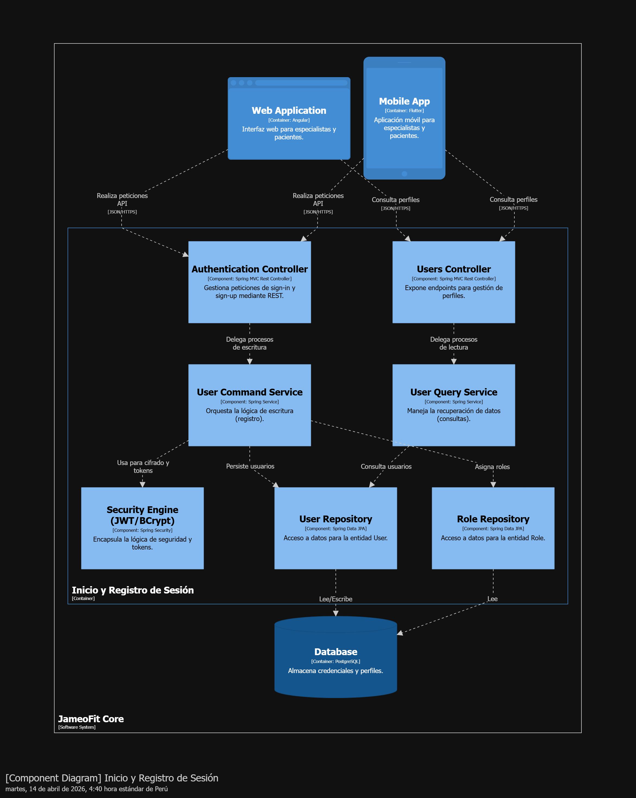

##### 4.2.1.6. Bounded Context Software Architecture Code Level Diagrams.

En esta sección se detallan las especificaciones técnicas de bajo nivel que rigen el funcionamiento del contexto de IAM. Se presentan los diagramas que describen la estructura de código y la organización de los datos persistentes, permitiendo una transición clara entre el diseño arquitectónico y la implementación física.

###### 4.2.1.6.1. Bounded Context Domain Layer Class Diagrams.

El Domain Layer Class Diagram detalla la estructura lógica y técnica del bounded context de Inicio y Registro de Sesión, siguiendo los patrones tácticos de Domain-Driven Design (DDD) y la segregación de responsabilidades mediante CQRS. En el núcleo del modelo, se identifica al aggregate User y a el entity Role, cuya relación asegura una gestión de permisos consistente mediante el uso del Value Object Roles.

Asimismo, el diagrama ilustra la separación entre las operaciones de escritura y lectura a través de Commands y Queries implementados como Records, los cuales son orquestados por sus respectivos servicios de dominio como UserCommandService, UserQueryService, entre otros. Esta organización garantiza un desacoplamiento efectivo, facilitando la mantenibilidad y escalabilidad del sistema de autenticación al separar la intención del negocio de la ejecución técnica.

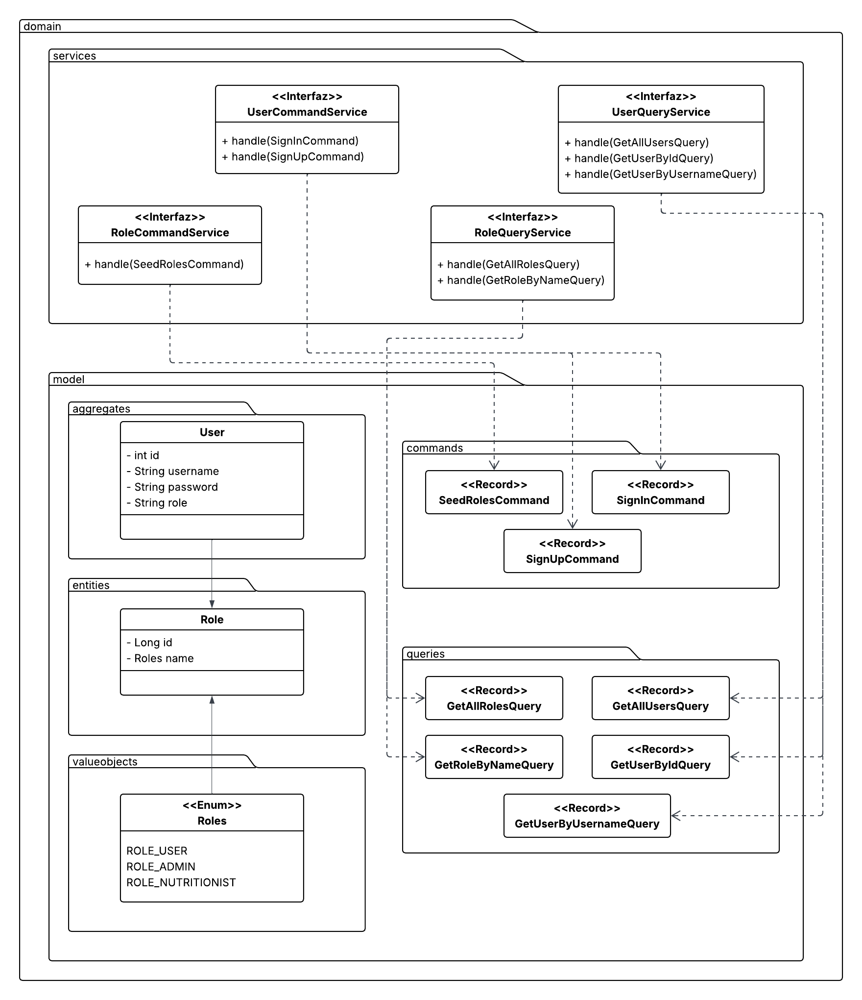

###### 4.2.1.6.2. Bounded Context Database Design Diagram.

El diagrama de base de datos del bounded context utiliza un modelo normalizado con una tabla maestra de usuarios y una de roles, vinculadas mediante la tabla intermedia user_roles para resolver la relación de muchos a muchos. Esta configuración asegura la integridad de los datos mediante llaves primarias y foráneas, permitiendo gestionar los permisos de acceso y la trazabilidad de las cuentas de manera organizada y segura.

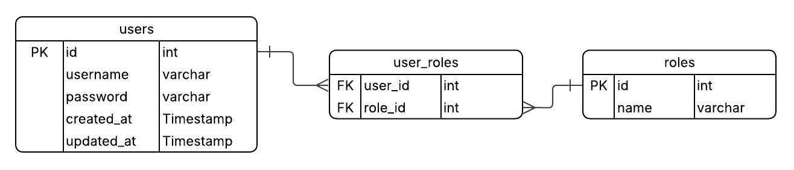

#### 4.2.2. Bounded Context: Perfil de Usuario

Este Bounded Context se especializa en la gestión integral de la información personal y biométrica de los usuarios. Su propósito principal es centralizar y proteger los datos que definen el estado físico, los hábitos de actividad y las metas de salud individuales. Al gestionar entidades como los niveles de actividad y los objetivos nutricionales, este contexto permite que la plataforma adapte su comportamiento a las necesidades específicas de cada persona. Además, actúa como el repositorio central para las restricciones alimentarias y el seguimiento de variables físicas, asegurando que toda la información del perfil sea consistente y esté disponible para las funcionalidades de personalización de la aplicación.

##### 4.2.2.1. Domain Layer.

En esta capa se define el núcleo de la aplicación relacionado con la información biométrica y las metas de salud del usuario. Se aplican patrones de Domain-Driven Design (DDD) para asegurar que las reglas de negocio (como el cálculo de necesidades calóricas o la gestión de restricciones alimentarias) estén protegidas y centralizadas en los agregados.

| Clase                     | Tipo        | Propósito                                                                 | Atributos / Métodos Principales                                                                 |
|--------------------------|------------------|---------------------------------------------------------------------------|-------------------------------------------------------------------------------------------------|
| UserProfile              | Aggregate Root   | Entidad principal que centraliza los datos biométricos y coordina la lógica de salud del usuario. | Atributos: userId, gender, height, weight, birthDate. Métodos: calculateCalorieNeeds(), updateProfile(), addAllergy(). |
| ActivityLevel            | Entity           | Define el nivel de actividad física del usuario, factor crítico para cálculos metabólicos. | Atributos: name, activityFactor. Métodos: calculateCalories().                                  |
| Objective                | Entity           | Representa la meta de salud (ej. bajar peso, ganar músculo) que guía los planes de alimentación. | Atributos: objectiveName, score. Métodos: calculateScore().                                     |
| Allergy                  | Entity           | Modela las restricciones alimentarias para evitar ingredientes peligrosos en los planes. | Atributos: name, relatedIngredients. Métodos: addIngredient().                                  |
| Ingredient               | Value Object     | Objeto inmutable que representa un componente específico de una alergia o alimento. | Atributos: name.                                                                               |
| UserProfileCommandService| Domain Service   | Interfaz que define las operaciones de cambio de estado en el perfil (Crear, Actualizar, Eliminar). | Métodos: handle(CreateUserProfileCommand), handle(UpdateUserProfileCommand).                   |

##### 4.2.2.2. Interface Layer.

Esta capa actúa como el punto de entrada para todas las solicitudes externas al contexto de Perfil de Usuario. Su responsabilidad es gestionar las solicitudes HTTP, validar los datos de entrada y transformar los modelos internos del dominio en formatos legibles para los clientes (JSON). Un aspecto destacado es el uso de Facades, que actúan como una capa de protección (ACL) para desacoplar la lógica del dominio de los controladores REST.

| Clase                                      | Tipo        | Propósito                                                                 | Atributos / Métodos Principales                                                                 |
|-------------------------------------------|------------------|---------------------------------------------------------------------------|-------------------------------------------------------------------------------------------------|
| UserProfileController                     | Controller       | Expone los endpoints REST para la gestión del ciclo de vida del perfil de usuario. | Métodos: listAll(), getById(), create(), update(), delete().                                   |
| UserProfilesContextFacade                 | ACL Facade       | Actúa como mediador entre la capa de interfaz y el dominio, simplificando el acceso a los servicios. | Métodos: fetchById(), fetchObjectiveByProfileId(), create(), update().                         |
| CreateUserProfileResource                 | DTO (Record)     | Define la estructura de datos necesaria para recibir la información de un nuevo perfil desde el cliente. | Atributos: userId, gender, height, weight, activityLevelId, objectiveId, allergyIds.           |
| UserProfileResource                       | DTO (Record)     | Estructura de salida que consolida la información del perfil procesada para el frontend. | Atributos: id, gender, height, weight, activityLevelName, objectiveName, allergyNames.         |
| UserProfileResourceFromEntityAssembler    | Assembler        | Contiene la lógica para transformar objetos de dominio (Entities/Aggregates) en recursos (DTOs). | Métodos: toResourceFromEntity(), toResources().                                                 |
| CreateUserProfileCommandFromResourceAssembler | Assembler    | Transforma los datos de entrada del controlador en comandos válidos para el dominio. | Métodos: toCommandFromResource().                                                              |

##### 4.2.2.3. Application Layer.

La capa de aplicación orquesta los casos de uso del Bounded Context de Perfil de Usuario, actuando como un mediador que dirige el flujo de datos entre la interfaz y el dominio. En esta sección se evidencia la implementación de Command y Query Handlers que coordinan la lógica de negocio, la persistencia y la validación cruzada con otros contextos sin comprometer la pureza del modelo de dominio.

| Clase                         | Tipo                  | Propósito                                                                 | Atributos / Métodos Principales                                                                 |
|------------------------------|---------------------------|---------------------------------------------------------------------------|-------------------------------------------------------------------------------------------------|
| UserProfileCommandServiceImpl| Command Handler           | Orquesta la creación, actualización y eliminación de perfiles, coordinando repositorios y servicios externos. | Métodos: handle(CreateUserProfileCommand), handle(UpdateUserProfileCommand).                   |
| UserProfileQueryServiceImpl  | Query Handler             | Gestiona la recuperación de información de perfiles de forma optimizada para consultas de lectura. | Métodos: handle(GetAllUserProfilesQuery), handle(GetUserProfileByIdQuery).                     |
| ExternalUserService          | Outbound Service (ACL)    | Servicio que permite verificar la existencia de identidades en el contexto de IAM antes de crear un perfil. | Métodos: userExists(Long userId).                                                              |
| CreateUserProfileCommand     | Command                   | Representa la intención inmutable del sistema de registrar un nuevo conjunto de datos biométricos. | Atributos: userId, gender, height, weight, activityLevelId, objectiveId.                      |
| GetUserProfileByIdQuery      | Query                     | Define los parámetros necesarios para localizar la información de un perfil específico. | Atributos: userProfileId.                                                                      |

##### 4.2.2.4. Infrastructure Layer.

Esta capa implementa la persistencia de datos mediante Spring Data JPA y el motor PostgreSQL. Contiene los repositorios que materializan las interfaces del dominio, permitiendo el almacenamiento y recuperación de perfiles, alergias y catálogos maestros. Gracias al uso de repositorios especializados, se garantiza que la lógica de acceso a datos sea eficiente y esté desacoplada de las reglas de negocio, facilitando el mantenimiento y la integridad de la información biométrica.

| Clase                     | Tipo           | Propósito                                                                 | Atributos / Métodos Principales                                                                 |
|--------------------------|--------------------|---------------------------------------------------------------------------|-------------------------------------------------------------------------------------------------|
| UserProfileRepository    | Repository (JPA)   | Implementación de persistencia para el agregado de perfiles, permitiendo búsquedas por usuario de IAM. | Métodos: findByUserId(), existsByUserId(), findTopByOrderByIdDesc().                           |
| AllergyRepository        | Repository (JPA)   | Gestiona el almacenamiento de alergias y permite consultas filtradas por ingredientes específicos. | Métodos: findByName(), findByRelatedIngredients_Name().                                         |
| ProfileRepository        | Repository (JPA)   | Repositorio para la entidad de perfil extendida con soporte para búsqueda por credenciales. | Métodos: findByEmail(), save(), findById().                                                     |
| ActivityLevelRepository  | Repository (JPA)   | Provee acceso al catálogo de niveles de actividad física configurados en el sistema. | Métodos: findAll(), findById(), save().                                                         |
| ObjectiveRepository      | Repository (JPA)   | Encargado de la persistencia de las metas y objetivos de salud definidos por la aplicación. | Métodos: findAll(), findById(), save().                                                         |

##### 4.2.2.5. Bounded Context Software Architecture Component Level Diagrams.

En este diagrama se detalla la organización interna de los componentes para el manejo de perfiles. El flujo comienza en los controladores de User Profile y Allergy, los cuales reciben las solicitudes de las aplicaciones y delegan la ejecución a la User Profiles Context Facade. Este sirve como un punto de control que coordina los servicios de Commands para las acciones de escritura y Queries para las consultas de datos. Un punto importante es la integración del External User Service, que actúa como una capa de protección (ACL) para validar que el usuario realmente exista en el contexto de seguridad antes de procesar su perfil. Finalmente, el acceso a la base de datos se gestiona mediante repositorios que aseguran la persistencia correcta de la información biométrica.

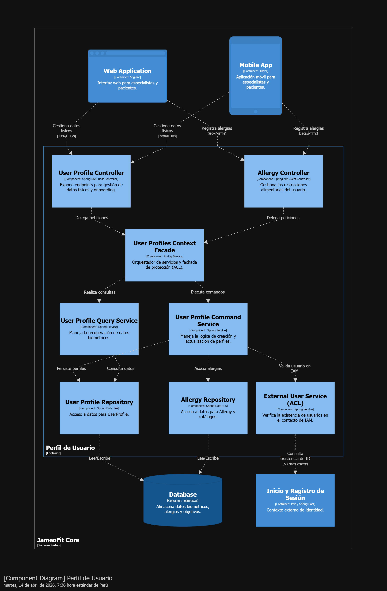

##### 4.2.2.6. Bounded Context Software Architecture Code Level Diagrams.

En esta sección se presentan los diagramas de bajo nivel que definen la implementación del contexto de Perfil de Usuario. El Diagrama de Clases muestra la estructura lógica de los agregados y entidades siguiendo el patrón DDD, mientras que el Diagrama de Base de Datos detalla el diseño de las tablas y sus relaciones en PostgreSQL. Ambos modelos aseguran que la información biométrica y las metas de salud se gestionen de forma íntegra y organizada.

###### 4.2.2.6.1. Bounded Context Domain Layer Class Diagrams.

El Domain Layer Class Diagram ilustra la estructura lógica del contexto de Perfil de Usuario, centrada en el Aggregate Root UserProfile. Este agregado encapsula la información biométrica esencial y coordina las reglas de negocio para el cálculo de salud. Se observa una relación de asociación con las entidades ActivityLevel y Objective, las cuales proveen los parámetros necesarios para la personalización de planes. Asimismo, se detalla la gestión de restricciones mediante la entidad Allergy y su relación con el Value Object Ingredient. El diagrama también refleja el uso de patrones de mensajería interna mediante Commands y Queries, los cuales aseguran que las operaciones de modificación y lectura sigan el principio de segregación de responsabilidades (CQRS), manteniendo el núcleo del dominio desacoplado de las implementaciones tecnológicas.

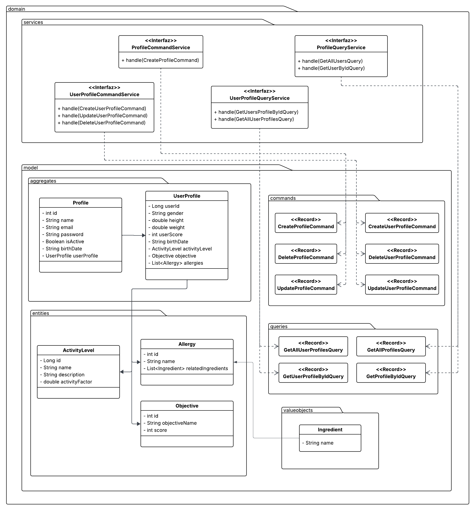

###### 4.2.2.6.2. Bounded Context Database Design Diagram.

El diseño de la base de datos para el contexto de Perfil de Usuario implementa una arquitectura de datos normalizada que separa la identidad de acceso de la información biométrica. El eje central es la tabla user_profiles, la cual funciona como el Aggregate Root que vincula las métricas físicas (estatura, peso, género) con los catálogos de activity_levels y objectives.

La seguridad alimentaria se gestiona mediante un modelo de muchos a muchos con user_profile_allergies, permitiendo un seguimiento riguroso de las restricciones del usuario. Además, se incluye un desglose nutricional detallado mediante la relación entre ingredients y macronutrient_values, asegurando que el sistema pueda calcular con precisión las necesidades energéticas basadas en los factores de actividad y objetivos registrados. Esta estructura garantiza la escalabilidad para futuras funcionalidades de planes nutricionales automatizados.

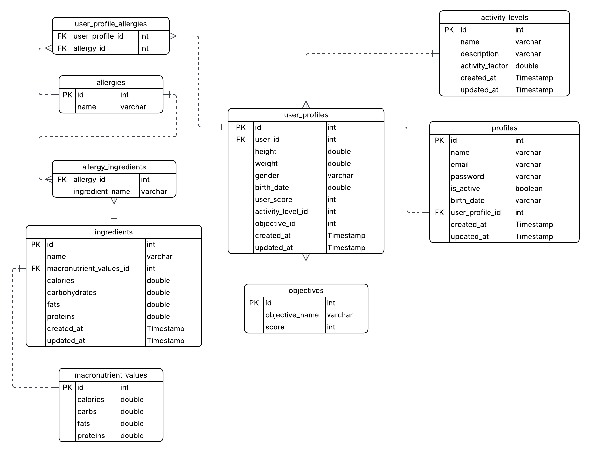

#### 4.2.3. Bounded Context: Gestión de Objetivos

Este Bounded Context actúa como el núcleo analítico y de seguimiento de metas dentro de JameoFit. Su propósito es definir los parámetros maestros de salud del usuario, como el peso objetivo, el ritmo de progreso y el tipo de dieta predominante. Con el nuevo enfoque tecnológico, este contexto evoluciona de ser un registro estático a un sistema dinámico que integra datos en tiempo real provenientes de hardware IoT (Botella Inteligente). El contexto procesa de manera automática el consumo de hidratación y lo contrasta con los objetivos nutricionales definidos por el nutricionista o el propio usuario, permitiendo una visibilidad inmediata del progreso y asegurando la adherencia al plan de salud.

##### 4.2.3.1. Domain Layer.

En la capa de dominio se encapsula la lógica de negocio y las reglas fundamentales para la administración de metas. Se ha diseñado siguiendo un patrón de DDD, donde el Agregado Goal centraliza la toma de decisiones. Para la integración con IoT, se han extendido los modelos para permitir que el hardware (ESP32 de la botella inteligente) pueda influir en las métricas de progreso sin intervención manual del usuario.

| Clase | Tipo | Propósito | Atributos / Métodos Principales |
|-------|------|-----------|---------------------|
| Goal | Aggregate Root | Entidad raíz que centraliza el objetivo de peso, ritmo y dieta del usuario. | userId, objective, targetWeightKg, pace, dietPreset, macrosPcts, updatedAt |
| UserId | Value Object | Identificador único del usuario, validando que sea un ID positivo. | value: int |
| ObjectiveType | Value Object (Enum) | Define la meta principal del usuario. | LOSE_WEIGHT, MAINTAIN_WEIGHT, GAIN_MUSCLE |
| PaceType | Value Object (Enum) | Define la velocidad esperada del cambio físico. | SLOW, MODERATE, FAST |
| DietPreset | Value Object (Enum) | Pre-configuraciones de tipos de dieta. | OMNIVORE, VEGAN, LOW_CARB, HIGH_PROTEIN, etc. |
| HydrationPulse | Value Object | Representa un pulso de agua detectado por el sensor de flujo. | amountMl: Double, timestamp: Date |
| MacroPolicyService | Domain Service | Calcula la distribución de macronutrientes basada en el DietPreset. | macrosFor(preset): int[] |
| IGoalRepository | Repository (Interface) | Define el contrato para persistir y recuperar los objetivos del usuario. | findByUserId(userId), save(goal) |
| UpdateGoalCaloriesCommand | Command | Encapsula la intención de modificar las calorías y peso objetivo. | userId, objective, targetWeightKg, pace |
| UpdateDietTypeCommand | Command | Encapsula la intención de cambiar el tipo de dieta y sus macros. | userId, preset |
| GetGoalByUserQuery | Query | Consulta para obtener el estado actual del objetivo del usuario. | userId |

##### 4.2.3.2. Interface Layer.

Esta capa actúa como el puente de comunicación entre los actores externos (usuarios a través de la aplicación y dispositivos hardware mediante protocolos de mensajería) y la lógica de negocio del dominio. En esta capa se exponen endpoints RESTful para la gestión administrativa de los objetivos y se implementan consumidores de eventos para la ingesta de datos en tiempo real provenientes del componente IoT (Botella Inteligente). Esta estructura asegura que el sistema sea accesible, escalable y capaz de procesar información tanto síncrona como asíncrona de manera eficiente.

| Clase | Tipo | Propósito | Atributos / Métodos Principales |
|-------|------|-----------|---------------------|
| GoalsController | Controller | Expone los endpoints HTTP para la gestión de objetivos y configuración de dietas. | updateGoalCalories, updateDietType, getByUser |
| GoalResource | DTO | Representa la estructura de datos enviada al cliente con el estado actual de las metas y macros. | userId, objective, targetWeightKg, pace, dietPreset, macrosPct |
| GoalCalorieConfigResource | DTO | Recurso para recibir actualizaciones de configuración física y ritmo de progreso. | objective, targetWeightKg, pace |
| DietTypeConfigResource | DTO | Recurso para recibir el cambio de tipo de dieta (Preset). | preset |
| IoTGoalEventConsumer | Consumer | Escucha los mensajes MQTT de la botella inteligente para actualizar el progreso. | onHydrationPulse(event) |
| GoalResourceFromEntityAssembler | Assembler | Transforma la entidad de dominio Goal en un recurso GoalResource. | toResourceFromEntity(entity) |
| UpdateGoalCaloriesCommandFromResourceAssembler | Assembler | Convierte un recurso de configuración en un comando de actualización de calorías. | toCommand(userId, resource) |
| UpdateDietTypeCommandFromResourceAssembler | Assembler | Convierte el recurso de dieta en un comando de cambio de tipo de dieta. | toCommand(userId, resource) |

##### 4.2.3.3. Application Layer.

La capa de aplicación actúa como la orquestadora de los casos de uso del sistema. Su función principal es coordinar la ejecución de las reglas de negocio presentes en el dominio, gestionando las transacciones y la comunicación con servicios externos o capas de infraestructura. En este contexto, la capa de aplicación traduce las intenciones del usuario (comandos) y los eventos del hardware IoT en cambios de estado persistentes, asegurando que el flujo de datos entre la botella inteligente y el perfil del usuario sea coherente y seguro.

| Clase | Tipo | Propósito | Atributos / Métodos Principales |
|-------|------|-----------|---------------------|
| GoalCommandServiceImpl | Command Service | Orquesta la creación y actualización de objetivos, coordinando con el repositorio y el servicio de políticas de macros. | handle(UpdateGoalCaloriesCommand), handle(UpdateDietTypeCommand) |
| GoalQueryServiceImpl | Query Service | Gestiona la recuperación de información de objetivos de forma optimizada. | handle(GetGoalByUserQuery) |
| ExternalProfilesService | ACL (Outbound) | Capa de Anticorrupción que valida la existencia de perfiles en otros contextos antes de asignar objetivos. | existsProfile(profileId) |
| FeignClientInterceptor | Infrastructure Config | Asegura la comunicación autenticada entre servicios para mantener la integridad de los datos. | apply(template) |
| HydrationIOTCommandHandler | Command Handler | Procesa los datos automáticos de la botella inteligente para actualizar el progreso diario. | handle(RecordHydrationCommand) |

##### 4.2.3.4. Infrastructure Layer.

Esta capa proporciona las herramientas técnicas y el soporte tecnológico necesario para materializar los modelos definidos en las capas superiores. En este contexto, la capa de infraestructura se encarga de la persistencia de los objetivos en una base de datos relacional mediante un ORM y de establecer los canales de comunicación de bajo nivel para el hardware. Para cumplir con el nuevo enfoque, se integra un cliente de mensajería que permite recibir los datos de la Botella Inteligente, asegurando que la infraestructura técnica soporte la alta frecuencia de datos que generan los sensores IoT.

| Clase | Tipo | Propósito | Atributos / Métodos Principales |
|-------|------|-----------|---------------------|
| GoalRepository | Repository Impl | Implementación basada en Spring Data JPA para la persistencia del agregado Goal. | findByUserId_Value(userId) |
| MqttClientConfig | Configuración | Configura la conexión técnica con el Broker MQTT para recibir datos de la botella. | mqttClient(), connectOptions() |
| JpaGoalStore | Persistence | Gestiona el mapeo físico entre los objetos de dominio y las tablas de la base de datos. | @Table(name = "goals") |
| MqttHydrationSubscriber | IoT Infrastructure | Suscriptor de bajo nivel que escucha el tópico del sensor de flujo del ESP32. | subscribe(topic), messageArrived() |

##### 4.2.3.5. Bounded Context Software Architecture Component Level Diagrams.

El diagrama ilustra la descomposición interna del contenedor, detallando cómo la arquitectura de capas interactúa para gestionar las metas de salud. En este nivel de abstracción, se destaca la integración del IoT Goal Event Consumer, el cual actúa como el punto de enlace asíncrono para recibir la telemetría proveniente de la botella inteligente vía MQTT. Se observa cómo los servicios de aplicación orquestan la lógica de negocio apoyándose en servicios de dominio especializados para el cálculo de macronutrientes y en una capa de anticorrupción (ACL) para validar la integridad de los datos de usuario, garantizando así un sistema robusto, escalable y capaz de procesar datos en tiempo real.

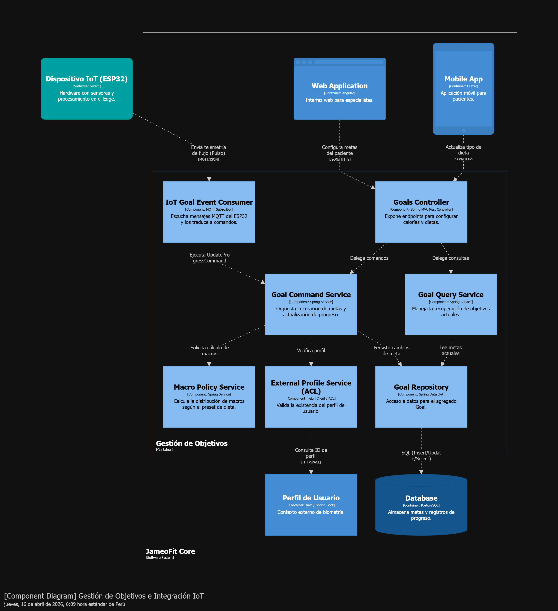

##### 4.2.3.6. Bounded Context Software Architecture Code Level Diagrams.

En esta sección se detalla la estructura interna y técnica del Bounded Context de Gestión de Objetivos. A través de diagramas de clases y de diseño de base de datos, se exponen los componentes tácticos del dominio, sus interacciones y la estrategia de persistencia, garantizando una implementación fiel a las reglas de negocio y a los requerimientos de integración tecnológica con dispositivos externos.

###### 4.2.3.6.1. Bounded Context Domain Layer Class Diagrams.

El Domain Layer Class Diagram ilustra la arquitectura técnica del contexto de Gestión de Objetivos, centrada en el Aggregate Root Goal. Este agregado actúa como la unidad de consistencia para los parámetros físicos y nutricionales del usuario, encapsulando atributos clave como el peso objetivo y el ritmo de progreso. El diagrama refleja una relación de composición con el Value Object UserId y asociaciones con enumeraciones críticas como ObjectiveType y DietPreset, las cuales definen el comportamiento del dominio.

Se destaca la inclusión del MacroPolicyService como un Domain Service que provee la lógica de cálculo para la distribución de macronutrientes, asegurando que el estado del agregado se mantenga alineado con las políticas nutricionales vigentes. Asimismo, el diseño incorpora el patrón de comandos y consultas para soportar tanto la interacción humana como la automatización mediante el comando RecordHydrationCommand, facilitando la ingesta de datos en tiempo real provenientes de la Botella Inteligente (IoT). Esta estructura garantiza que el núcleo del negocio sea robusto, testeable y capaz de evolucionar de manera independiente a la infraestructura.

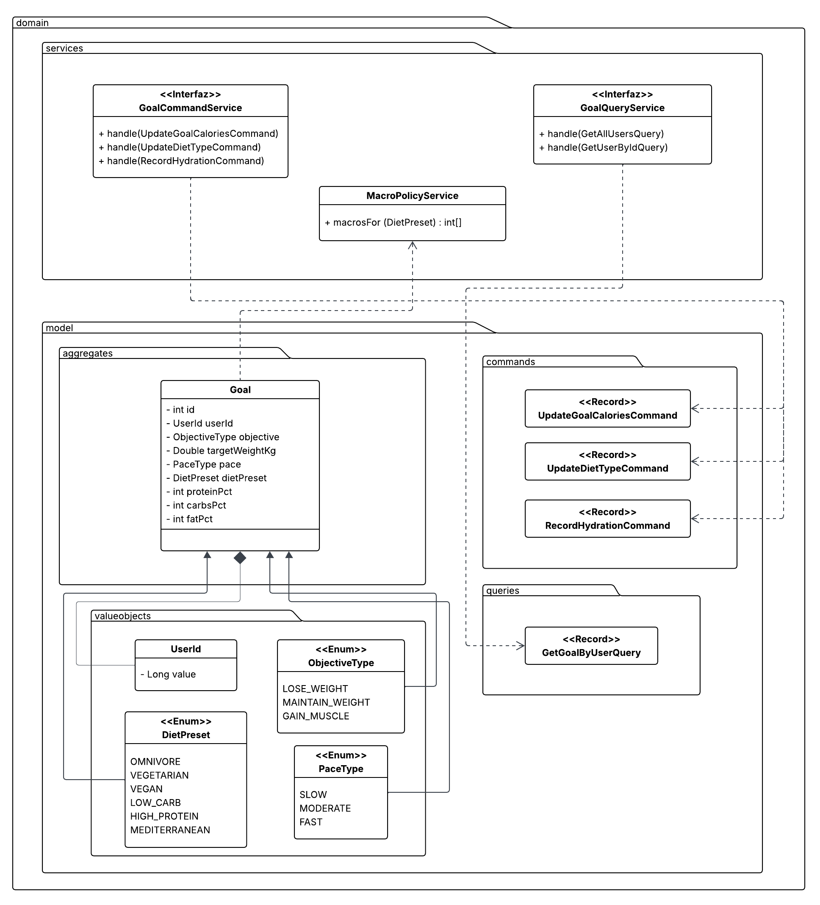

###### 4.2.3.6.2. Bounded Context Database Design Diagram.

El diseño de la base de datos para el contexto de Gestión de Objetivos sigue un modelo relacional optimizado para garantizar la integridad y trazabilidad del progreso del usuario. La estructura se apoya en la tabla principal goals, la cual centraliza la configuración nutricional, objetivos de peso y distribución de macronutrientes, utilizando una restricción de clave única en user_id para asegurar la correspondencia con el perfil del usuario.

Para integrar de manera eficiente el enfoque IoT, el modelo incorpora la tabla hydration_logs, vinculada mediante una relación de uno a muchos. Esta tabla permite registrar de forma granular cada evento de ingesta detectado por los sensores de la botella inteligente, almacenando el volumen específico y la marca temporal exacta. Esta separación permite mantener el estado actual del objetivo desacoplado del historial de eventos, facilitando el cálculo de métricas de progreso diario y el análisis de tendencias de hidratación sin comprometer el rendimiento del sistema.

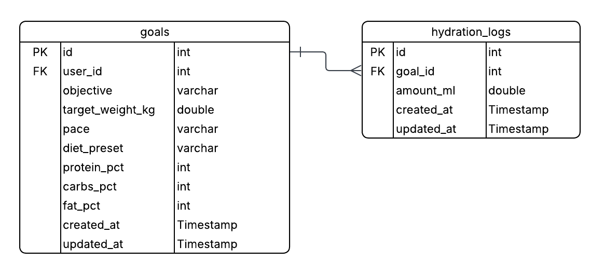

#### 4.2.4. Bounded Context: Rutina Alimentaria

##### 4.2.4.1. Domain Layer.

Es la capa de máxima jerarquía donde residen las reglas de negocio agnósticas a la tecnología. Con la incorporación de la IA, el dominio ahora no solo contiene datos, sino lógica de validación probabilística para determinar la veracidad de la ingesta.

| Clase | Tipo | Propósito | Atributos / Métodos Principales |
|-------|------|-----------|----------------------------------|
| `Tracking` | `Aggregate Root` | Entidad principal que garantiza la consistencia del progreso diario y la suma de macronutrientes. | `userId`, `date`, `status` / `calculateDailyProgress()`, `verifyThresholds()` |
| `MacronutrientValues` | `Value Object` | Representa la composición química inmutable de los alimentos. | `protein`, `fat`, `carbs`, `energy` / `add()`, `isZero()` |
| `TrackingMealPlanEntry` | `Entity` | Representa un registro de ingesta capturado. Incluye el flag de verificación por IA. | `foodName`, `recordedWeight`, `isAiVerified` / `updateNutritionalValues()` |
| `AIInferenceService` | `Domain Service` | Interfaz que define el contrato para la validación de telemetría mediante modelos de IA. | `verifyIngesta(telemetryData) : InferenceResult` |
| `NutritionalPolicy` | `Domain Service` | Contiene las reglas de negocio para determinar si una desviación en la dieta es "crítica" o "aceptable". | `evaluateDeviation(planned, actual)` |

##### 4.2.4.2. Interface Layer.

Actúa como la frontera del microservicio. En esta iteración, la capa se expande para soportar protocolos de mensajería ligera necesarios para la comunicación con sensores.

| Clase | Tipo | Propósito | Atributos / Métodos Principales |
|-------|------|-----------|----------------------------------|
| `TrackingController` | `REST Controller` | Expone la API para que las aplicaciones Mobile y Web consulten el estado nutricional. | `getDailyTrackingByUserId()`, `manualIngestaEntry()` |
| `TelemetryMqttConsumer` | `Message Consumer` | Punto de entrada asíncrono que escucha los "pulses" de los dispositivos ESP32. | `onMessageReceived(topic, payload)`, `parseSensorData()` |
| `TrackingResource` | `DTO` | Representación externa del agregado Tracking para consumo de las interfaces de usuario. | `totalCalories`, `progressPercentage`, `entries[]` |

##### 4.2.4.3. Application Layer.

Orquesta el flujo de información. Es la encargada de tomar el dato crudo del sensor, enviarlo al motor de IA y, según el resultado, actualizar el dominio o disparar eventos hacia otros contextos.

| Clase | Tipo | Propósito | Atributos / Métodos Principales |
|-------|------|-----------|----------------------------------|
| `ProcessTelemetryCommandHandler` | `Command Handler` | Coordina el flujo: Recibir telemetría -> Consultar IA -> Actualizar Tracking -> Persistir. | `handle(ProcessTelemetryCommand)` |
| `TrackingQueryService` | `Query Service` | Maneja la recuperación de datos optimizada para los dashboards del nutricionista y usuario. | `getTrackingStatusByUser(userId)` |
| `TrackingReadyEventHandler` | `Event Handler` | Reacciona ante la finalización de una meta diaria para notificar al usuario vía Firebase. | `on(TrackingCompletedEvent)` |

##### 4.2.4.4. Infrastructure Layer.

Provee las implementaciones técnicas de los contratos definidos en el dominio. Aquí es donde se gestiona la complejidad de la nube y la conectividad física.

| Clase | Tipo | Propósito | Atributos / Métodos Principales |
|-------|------|-----------|----------------------------------|
| `JpaTrackingRepository` | `Repository Impl` | Implementación de persistencia utilizando Spring Data JPA y PostgreSQL. | `save()`, `findByUserIdAndDate()` |
| `AwsIotCoreClient` | `Client` | Gestiona la conexión segura con el broker MQTT de AWS para recibir datos del ESP32. | `subscribeToTopic()`, `publishAck()` |
| `TensorFlowInferenceClient` | `AI Client` | Implementa la comunicación con el modelo de IA alojado en AWS SageMaker o un contenedor interno. | `invokeModel(payload)`, `mapToDomainInference()` |
| `StripeIntegrationService` | `Client` | Valida el estado de la suscripción del usuario para habilitar/deshabilitar la telemetría IoT. | `checkSubscriptionStatus(userId)` |

##### 4.2.4.5. Bounded Context Software Architecture Component Level Diagrams.

En este nivel de descomposición, se visualiza cómo el Bounded Context de Rutina Alimentaria organiza sus responsabilidades internas. Hemos aplicado el patrón CQRS para separar las mutaciones de estado (Comandos) de las consultas (Queries), optimizando así el rendimiento de la aplicación móvil. Asimismo, se destaca la ACL (Anti-Corruption Layer), representada por los clientes de integración (Feign), que aíslan nuestro modelo nutricional de los cambios en servicios externos como Profiles o Recipes.

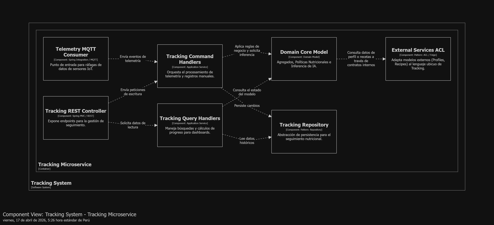

##### 4.2.4.6. Bounded Context Software Architecture Code Level Diagrams.

Esta sección presenta los diagramas de nivel de código del Bounded Context, los cuales permiten visualizar con mayor detalle la organización interna de sus clases, servicios, interfaces y relaciones. A diferencia de los diagramas de contenedores y componentes, que muestran la estructura general de la solución, este nivel se enfoca en cómo se materializa técnicamente el diseño dentro del código. Su construcción se apoya en los principios de Clean Architecture y en el diseño táctico de DDD, con el objetivo de mantener una separación clara entre dominio, aplicación, interfaces e infraestructura. De este modo, se busca que las reglas de negocio permanezcan desacopladas de decisiones técnicas específicas, que la comunicación entre capas se mantenga clara y consistente, y que el sistema pueda evolucionar sin comprometer la lógica central del contexto.

###### 4.2.4.6.1. Bounded Context Domain Layer Class Diagrams.

El diagrama de clases del dominio para Rutina Alimentaria representa la estructura conceptual y las relaciones internas que sostienen el comportamiento del bounded context, por lo que su propósito no es reflejar el diseño de la base de datos, sino modelar las reglas de negocio y la consistencia del sistema. En este nivel, el diseño se organiza alrededor del agregado Tracking, que actúa como entidad raíz y concentra la responsabilidad de mantener la coherencia del progreso diario y de los valores nutricionales registrados. A su alrededor se definen entidades y value objects que encapsulan el estado y la lógica propia del dominio, como el cálculo de macronutrientes y la validación de desviaciones alimentarias, evitando dispersar estas responsabilidades en capas externas. Asimismo, los servicios del dominio se expresan mediante contratos que describen capacidades necesarias para el negocio, permitiendo que las integraciones técnicas se adapten al modelo definido y preservando así la independencia y claridad del núcleo del sistema.

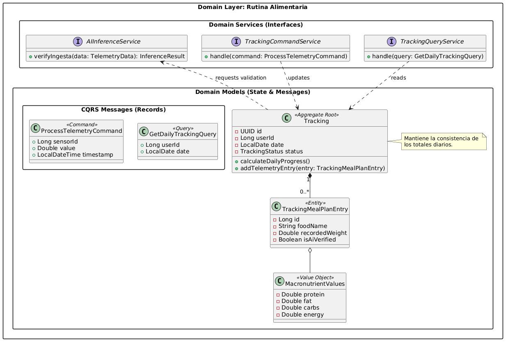

###### 4.2.4.6.2. Bounded Context Database Design Diagram.

La estrategia de modelado para la base de datos sigue un enfoque Relacional Orientado a Agregados. En lugar de normalizar excesivamente, el diseño se centra en la integridad del Agregado Raíz trackings. Las tablas están diseñadas para soportar el almacenamiento eficiente de series temporales (registros de telemetría IoT) vinculadas a la planificación nutricional del usuario.

La relación entre trackings y tracking_entries es de composición (1 a N), lo que permite que una consulta simple recupere todo el contexto diario de un usuario para la inferencia de la IA. Se han incluido columnas de auditoría técnica y banderas de verificación para soportar el flujo de excepciones escaladas al nutricionista.

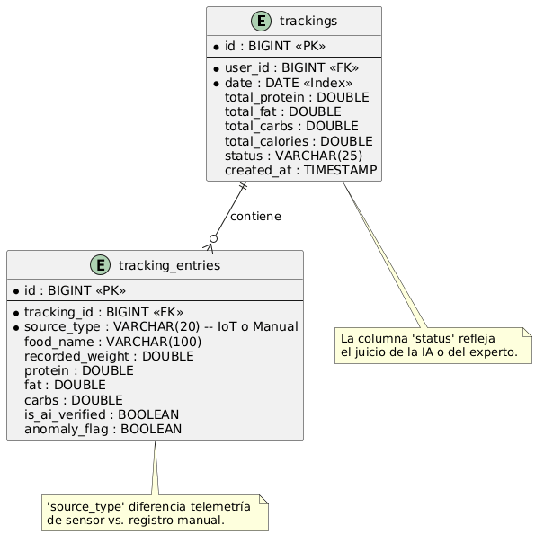

#### 4.2.5. Bounded Context: Nutricionista

##### 4.2.5.1. Domain Layer.

##### 4.2.5.2. Interface Layer.

##### 4.2.5.3. Application Layer.

##### 4.2.5.4. Infrastructure Layer.

##### 4.2.5.5. Bounded Context Software Architecture Component Level Diagrams.

##### 4.2.5.6. Bounded Context Software Architecture Code Level Diagrams.

###### 4.2.5.6.1. Bounded Context Domain Layer Class Diagrams.

###### 4.2.5.6.2. Bounded Context Database Design Diagram.

#### 4.2.6. Bounded Context: Gestión de Planes Alimenticios

Este Bounded Context es el responsable de definir la estructura, composición y vigencia de las prescripciones nutricionales. Su rol arquitectónico es el de un Repositorio de Conocimiento Normativo; suministra los planes que los nutricionistas diseñan para los pacientes. En la arquitectura distribuida, este contexto provee los rangos y metas nutricionales (macronutrientes y horarios) que alimentan al motor de inferencia de la IA para validar el cumplimiento de la dieta en tiempo real.

##### 4.2.6.1. Domain Layer.

La capa de dominio reúne las entidades, objetos de valor y reglas que permiten construir, clasificar y validar planes alimenticios dentro del sistema. En esta capa se concentra la lógica esencial para garantizar la integridad del plan y su coherencia con los objetivos nutricionales definidos.

| Clase | Tipo | Propósito | Atributos / Métodos Principales |
|-------|------|-----------|----------------------------------|
| `MealPlan` | `Aggregate Root` | Entidad raíz que garantiza la integridad del plan (template o asignado). | `userId`, `nutritionistId`, `status` / `calculateTotalMacros()`, `assignToUser()` |
| `MealPlanEntry` | `Entity` | Representa una comida específica dentro del plan vinculada a una receta. | `recipeId`, `scheduledTime`, `portionSize` / `getNutritionalProjection()` |
| `MealPlanMacros` | `Value Object` | Encapsula los totales nutricionales proyectados del plan para su comparación. | `calories`, `protein`, `carbs`, `fat` / `isWithinRange()` |
| `MealPlanType` | `Entity` | Clasifica el plan según su objetivo (ej. Volumen, Definición, Vegano). | `name`, `description` / `validateCompatibility()` |

##### 4.2.6.2. Interface Layer.

La capa de interfaz expone las operaciones necesarias para que nutricionistas y usuarios interactúen con los planes alimenticios desde los distintos canales del sistema. Aquí se ubican los controladores y recursos encargados de traducir solicitudes externas en operaciones comprensibles para la aplicación.

| Clase | Tipo | Propósito | Atributos / Métodos Principales |
|-------|------|-----------|----------------------------------|
| `MealPlanController` | `REST Controller` | Expone la API para que nutricionistas creen planes y usuarios los consulten. | `createMealPlan()`, `getMealPlanByUserId()` |
| `MealPlanEntriesController` | `REST Controller` | Gestiona las entradas individuales de alimentos dentro de un plan activo. | `addEntryToPlan()`, `updateEntryTime()` |
| `MealPlanResource` | `DTO` | Representación estructurada del plan para el consumo de las aplicaciones móviles. | `id`, `items[]`, `totalCalories` |

##### 4.2.6.3. Application Layer.

La capa de aplicación coordina los casos de uso relacionados con la creación, modificación, consulta y activación de planes alimenticios. Su responsabilidad es orquestar el flujo entre la interfaz, el dominio y las dependencias necesarias para ejecutar cada operación de forma consistente.

| Clase | Tipo | Propósito | Atributos / Métodos Principales |
|-------|------|-----------|----------------------------------|
| `MealPlanCommandService` | `Command Handler` | Orquesta la creación y modificación de planes, validando reglas de negocio. | `handle(CreateMealPlanCommand)` |
| `MealPlanQueryService` | `Query Service` | Recupera planes optimizados, incluyendo información cruzada de recetas. | `getDetailedMealPlan(planId)` |
| `MealPlanReadyEventHandler` | `Event Handler` | Dispara eventos cuando un plan es activado para sincronizar con el BC de Tracking. | `on(MealPlanAssignedEvent)` |

##### 4.2.6.4. Infrastructure Layer.

La capa de infraestructura implementa los mecanismos técnicos que permiten persistir planes, consultar información externa y validar dependencias con otros bounded contexts. En esta capa se encapsulan los detalles de integración para mantener desacoplada la lógica de negocio de las decisiones tecnológicas.

| Clase | Tipo | Propósito | Atributos / Métodos Principales |
|-------|------|-----------|----------------------------------|
| `JpaMealPlanRepository` | `Repository Impl` | Implementación de persistencia para los planes nutricionales en PostgreSQL. | `save()`, `findByUserProfileId()` |
| `ExternalRecipeACL` | `ACL Client` | Adapta los modelos del servicio de Recipes para obtener los macros de las recetas. | `getRecipeMacros(recipeId)` |
| `ProfileServiceClient` | `ACL Client` | Valida la existencia y estado del perfil del usuario antes de la asignación. | `validateProfileStatus(profileId)` |

##### 4.2.6.5. Bounded Context Software Architecture Component Level Diagrams.

Este diagrama resalta el flujo de prescripción nutricional. Se observa cómo el componente de dominio se apoya en una ACL para obtener datos de recetas sin acoplarse al modelo de persistencia del microservicio de Recipes.

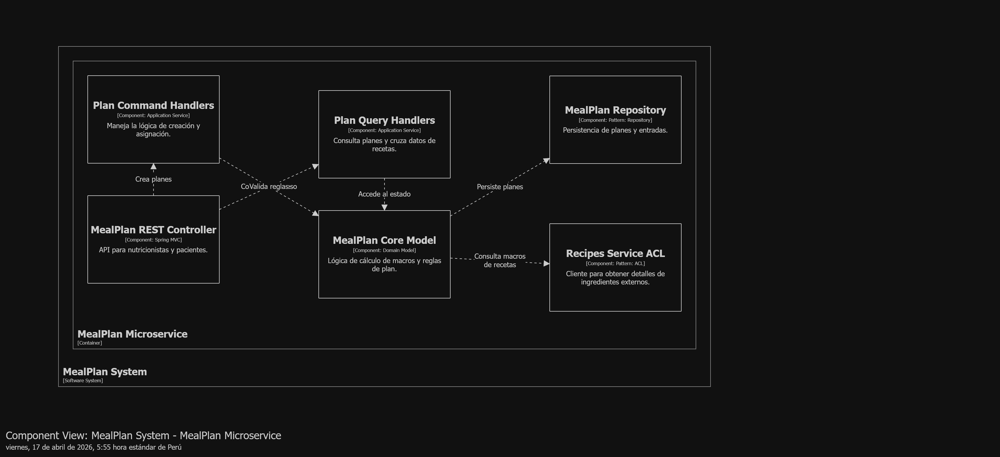

##### 4.2.6.6. Bounded Context Software Architecture Code Level Diagrams.

Esta sección presenta los diagramas de nivel de código del Bounded Context, los cuales permiten visualizar con mayor detalle la organización interna de sus clases, servicios, interfaces y relaciones. A diferencia de los diagramas de contenedores y componentes, que muestran la estructura general de la solución, este nivel se enfoca en cómo se materializa técnicamente el diseño dentro del código. Su construcción se apoya en los principios de Clean Architecture y en el diseño táctico de DDD, con el objetivo de mantener una separación clara entre dominio, aplicación, interfaces e infraestructura. De este modo, se busca que las reglas de negocio permanezcan desacopladas de decisiones técnicas específicas, que la comunicación entre capas se mantenga clara y consistente, y que el sistema pueda evolucionar sin comprometer la lógica central del contexto

###### 4.2.6.6.1. Bounded Context Domain Layer Class Diagrams.

El diagrama de clases del dominio para Gestión de Planes Alimenticios representa la estructura conceptual y las relaciones internas que sostienen el comportamiento del bounded context, por lo que su propósito no es reflejar el diseño de la base de datos, sino modelar las reglas de negocio y la consistencia del sistema. En este nivel, el diseño se organiza alrededor del agregado MealPlan, que actúa como entidad raíz y concentra la responsabilidad de definir el objetivo calórico y coordinar las ingestas programadas del día. A su alrededor se definen entidades como MealPlanEntry y value objects como MealPlanMacros que encapsulan el estado y la lógica propia del dominio, como el cálculo proyectado de nutrientes y la validación de compatibilidad de horarios, evitando dispersar estas responsabilidades en capas externas. Asimismo, los servicios del dominio se expresan mediante contratos que describen capacidades necesarias para el negocio, permitiendo que las integraciones técnicas (como el acceso a catálogos de recetas) se adapten al modelo definido y preservando así la independencia y claridad del núcleo del sistema.

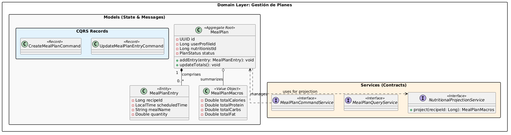

###### 4.2.6.6.2. Bounded Context Database Design Diagram.

La estrategia de modelado para el contexto de Planes Alimenticios se basa en un Esquema de Plantillas y Asignaciones. Se diseñó una estructura que permite desacoplar la receta (referenciada por ID) de la entrada del plan, permitiendo que el nutricionista ajuste porciones específicas para el paciente sin modificar la receta original. Se incluyen índices en user_profile_id para acelerar la recuperación del plan activo del usuario, esencial para la concurrencia que exige la validación IoT.

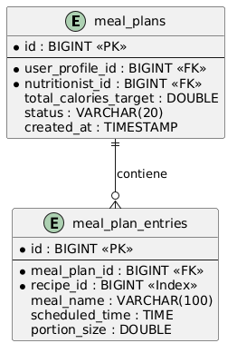

#### 4.2.7. Bounded Context: Comunicación y Seguimiento

Este Bounded Context actúa como el puente humano y técnico entre el paciente y el especialista. Su rol arquitectónico es el de un Facilitador de Interacción Síncrona y Asíncrona. En esta iteración, se integra con el flujo de telemetría para permitir que el nutricionista actúe como un monitor activo, accediendo a instantáneas de métricas nutricionales directamente desde la sesión de seguimiento. La arquitectura está diseñada para ser ligera en persistencia de negocio, pero robusta en la gestión de estados de conexión y flujo de datos masivos.

##### 4.2.7.1. Domain Layer.

La capa de dominio define las reglas que gobiernan la comunicación entre el usuario y el nutricionista, así como las condiciones de acceso y visibilidad de la información de seguimiento. En esta capa se modelan las conversaciones, los mensajes y las políticas que aseguran una interacción controlada, consistente y alineada con las restricciones del negocio.

| Clase | Tipo | Propósito | Atributos / Métodos Principales |
|-------|------|-----------|----------------------------------|
| `ChatRoom` | `Aggregate Root` | Unidad de consistencia que vincula a un usuario con su nutricionista asignado. | `roomId`, `participantIds`, `status` / `canAccessMetrics()`, `closeSession()` |
| `ChatMessage` | `Entity` | Representa un evento de comunicación individual (texto, alerta de sistema o métrica compartida). | `senderId`, `content`, `timestamp` / `markAsRead()` |
| `UserStatus` | `Value Object` | Representa el estado de disponibilidad del usuario en el canal. | `isOnline`, `lastSeen` / `updateStatus()` |
| `MonitoringSnapshot` | `Value Object` | Estructura inmutable que captura las métricas de seguimiento para visualización del experto. | `currentCalories`, `proteinDelta`, `hydrationLevel` |
| `CommunicationPolicy` | `Domain Service` | Define las reglas de privacidad y los permisos de acceso a métricas según el rol del participante. | `authorizeMetricView(nutritionistId, userId)` |

##### 4.2.7.2. Interface Layer.

La capa de interfaz expone los mecanismos mediante los cuales las aplicaciones cliente interactúan con el bounded context, combinando operaciones REST para la gestión de salas y recursos con comunicación bidireccional en tiempo real para el intercambio de mensajes. Esta capa traduce la interacción del usuario en operaciones coherentes para la aplicación.

| Clase | Tipo | Propósito | Atributos / Métodos Principales |
|-------|------|-----------|----------------------------------|
| `ChatController` | `REST Controller` | Expone endpoints para la creación de salas y recuperación de historial. | `getChatRoomsByUserId()`, `getMessagesByRoomId()` |
| `MessageSocketHandler` | `WebSocket Handler` | Gestiona la conexión persistente para el envío de mensajes en tiempo real. | `handleTextMessage()`, `broadcastToRoom()` |
| `MonitoringResource` | `DTO` | Representación de las métricas IoT formateadas para la interfaz de chat del nutricionista. | `userId`, `metricType`, `value`, `timestamp` |

##### 4.2.7.3. Application Layer.

La capa de aplicación coordina el flujo operativo de mensajes, validaciones de acceso y recuperación de métricas externas necesarias para el seguimiento clínico. Su objetivo es orquestar la interacción entre las solicitudes de las interfaces, las reglas del dominio y los servicios requeridos para cada caso de uso.

| Clase | Tipo | Propósito | Atributos / Métodos Principales |
|-------|------|-----------|----------------------------------|
| `SendMessageCommandHandler` | `Command Handler` | Procesa el envío de un mensaje, validando la existencia de la sala y notificando al receptor. | `handle(SendMessageCommand)` |
| `FetchUserMetricsQueryHandler` | `Query Service` | Orquesta la petición de métricas actuales al BC de Tracking para presentarlas al nutricionista. | `handle(GetUserMetricsQuery)` |
| `ChatAccessService` | `Application Service` | Valida que la relación entre paciente y nutri sea vigente antes de permitir la comunicación. | `validateAccess(userId, nutritionistId)` |

##### 4.2.7.4. Infrastructure Layer.

La capa de infraestructura implementa los mecanismos técnicos de persistencia e integración requeridos por el bounded context, priorizando el rendimiento en la gestión de mensajes y el desacoplamiento respecto a los servicios de telemetría y notificaciones. Aquí se concretan las dependencias tecnológicas necesarias para soportar la operación en tiempo real.

| Clase | Tipo | Propósito | Atributos / Métodos Principales |
|-------|------|-----------|----------------------------------|
| `MongoChatMessageRepository` | `Repository Impl` | Persistencia de mensajes en MongoDB para soportar alta escritura y consultas por documentos. | `save()`, `findByChatRoomIdOrderByTimestamp()` |
| `TrackingServiceACL` | `ACL Client` | Adaptador para consumir las métricas de Rutina Alimentaria sin acoplar modelos. | `getCurrentMetrics(userId)` |
| `FirebaseNotificationService` | `Client` | Envía notificaciones push cuando se recibe un mensaje y la aplicación está en segundo plano. | `sendPushNotification(recipientId, payload)` |

##### 4.2.7.5. Bounded Context Software Architecture Component Level Diagrams.

Este diagrama resalta el Canal de Observación. El microservicio de Chat no solo mueve mensajes, sino que utiliza una ACL para "espiar" el estado del seguimiento en el microservicio de Tracking, permitiendo que el nutricionista tome decisiones sin salir de la conversación.

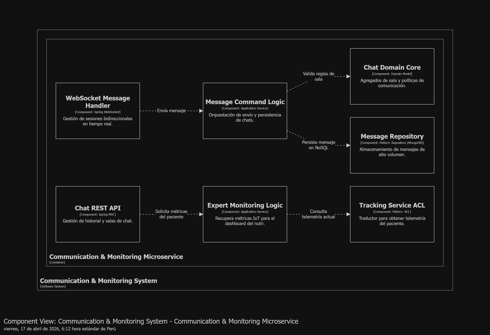

##### 4.2.7.6. Bounded Context Software Architecture Code Level Diagrams.

Esta sección presenta los diagramas de nivel de código del Bounded Context, los cuales permiten visualizar con mayor detalle la organización interna de sus clases, servicios, interfaces y relaciones. A diferencia de los diagramas de contenedores y componentes, que muestran la estructura general de la solución, este nivel se enfoca en cómo se materializa técnicamente el diseño dentro del código. Su construcción se apoya en los principios de Clean Architecture y en el diseño táctico de DDD, con el objetivo de mantener una separación clara entre dominio, aplicación, interfaces e infraestructura. De este modo, se busca que las reglas de negocio permanezcan desacopladas de decisiones técnicas específicas, que la comunicación entre capas se mantenga clara y consistente, y que el sistema pueda evolucionar sin comprometer la lógica central del contexto.

###### 4.2.7.6.1. Bounded Context Domain Layer Class Diagrams.

El diagrama de clases del dominio para Comunicación y Seguimiento representa la estructura conceptual y las relaciones internas que sostienen el comportamiento del bounded context, por lo que su propósito no es reflejar el diseño de la base de datos, sino modelar las reglas de negocio y la consistencia del sistema. En este nivel, el diseño se organiza alrededor del agregado ChatRoom, que actúa como entidad raíz y concentra la responsabilidad de garantizar que la sesión de comunicación sea válida y segura. A su alrededor se definen entidades como ChatMessage y value objects como MonitoringSnapshot que encapsulan el estado y la lógica propia del dominio, como la representación de métricas IoT compartidas y el historial de interacción, evitando dispersar estas responsabilidades en capas externas. Asimismo, los servicios del dominio se expresan mediante contratos que describen capacidades necesarias para el negocio (como la validación de acceso clínico), permitiendo que las integraciones técnicas se adapten al modelo definido y preservando así la independencia y claridad del núcleo del sistema.

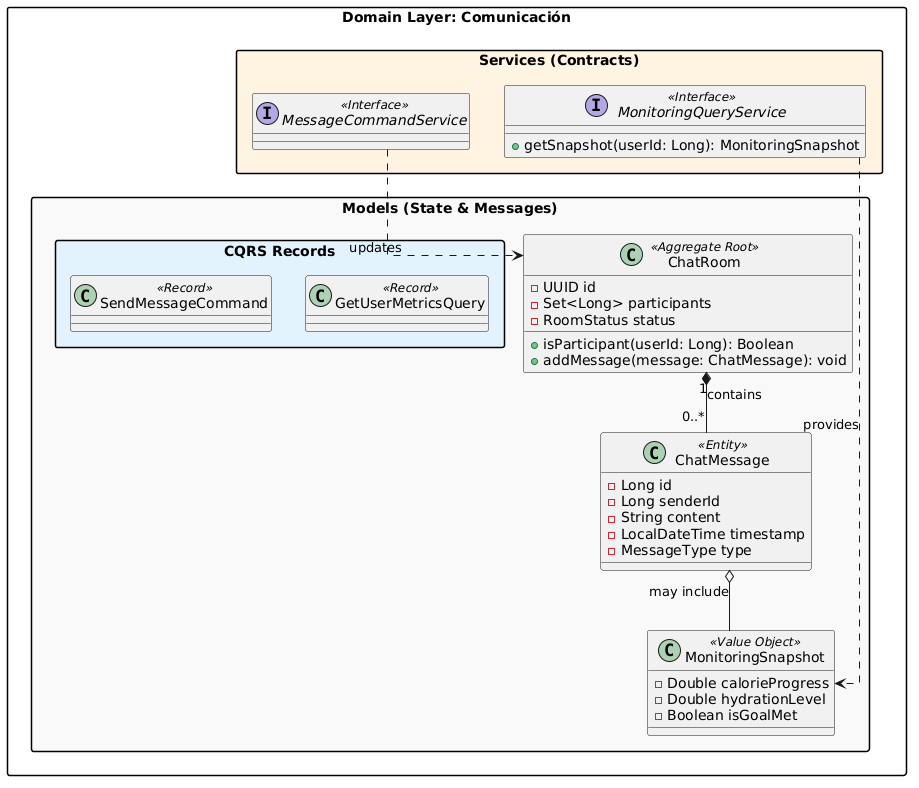

###### 4.2.7.6.2. Bounded Context Database Design Diagram.

La estrategia de modelado para el contexto de Comunicación utiliza un Enfoque de Almacenamiento Documental (NoSQL). Dado que los mensajes de chat son datos semi-estructurados con alta frecuencia de inserción, MongoDB es la opción óptima. Las colecciones se organizan alrededor del chat_room_id, permitiendo recuperaciones de historial extremadamente rápidas mediante índices compuestos por sala y tiempo. Las métricas no se duplican, sino que se referencian mediante instantáneas (Snapshots) incrustadas en mensajes de sistema cuando el nutricionista solicita un reporte en la conversación.

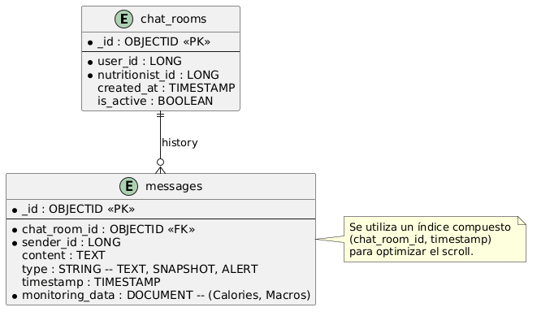

#### 4.2.8. Bounded Context: Pagos

Este Bounded Context es el facilitador financiero y de acceso del ecosistema. Su rol arquitectónico es el de un Gatekeeper de Capacidades. No solo gestiona el ciclo de vida de los pagos (suscripciones, facturas, reembolsos), sino que emite los eventos necesarios para que el resto del sistema habilite las funcionalidades avanzadas de IoT e IA. Se apoya en una integración profunda con Stripe para garantizar la escalabilidad global y la seguridad normativa.

##### 4.2.8.1. Domain Layer.

La capa de dominio reúne las entidades y políticas que permiten modelar la suscripción del usuario, la vigencia de su acceso y las reglas asociadas a los planes disponibles. En esta capa se concentra la lógica que garantiza la consistencia del ciclo de vida de una suscripción y la habilitación de capacidades según el nivel contratado.

| Clase | Tipo | Propósito | Atributos / Métodos Principales |
|-------|------|-----------|----------------------------------|
| `Subscription` | `Aggregate Root` | Gestiona el vínculo entre el usuario y su plan actual, controlando su vigencia. | `userId`, `stripeSubscriptionId`, `status` / `activate()`, `renew()`, `cancel()` |
| `PaymentPlan` | `Entity` | Define los niveles de servicio (Free, Pro, Expert) y sus costos asociados. | `name`, `price`, `featuresIncluded` / `isFeatureAllowed(featureId)` |
| `SubscriptionPeriod` | `Value Object` | Representa el intervalo de tiempo pagado y la fecha de expiración. | `startDate`, `endDate` / `isActive()`, `isExpiringSoon()` |
| `BillingPolicy` | `Domain Service` | Contiene las reglas para el cálculo de prorrateos y aplicación de impuestos según región. | `calculateFinalAmount(basePrice, taxRate)` |

##### 4.2.8.2. Interface Layer.

La capa de interfaz expone los mecanismos mediante los cuales el usuario puede suscribirse, consultar su plan actual y gestionar cambios sobre su servicio. Además, incorpora el punto de entrada para eventos asíncronos provenientes de Stripe, permitiendo sincronizar el estado local del sistema con el proveedor de pagos.

| Clase | Tipo | Propósito | Atributos / Métodos Principales |
|-------|------|-----------|----------------------------------|
| `SubscriptionController` | `REST Controller` | Expone la API para que los usuarios seleccionen y gestionen sus planes. | `subscribe()`, `getCurrentSubscription()`, `updatePlan()` |
| `StripeWebhookHandler` | `Message Consumer` | Punto crítico de entrada que recibe notificaciones asíncronas de Stripe (pagos exitosos, fallos). | `handleEvent(payload)`, `onPaymentSucceeded()`, `onSubscriptionDeleted()` |
| `PaymentIntentResource` | `DTO` | Objeto utilizado para iniciar el flujo seguro de pago en el frontend/mobile. | `clientSecret`, `publishableKey`, `amount` |

##### 4.2.8.3. Application Layer.

La capa de aplicación coordina los casos de uso relacionados con la activación, cancelación y consulta de suscripciones. Su función es orquestar la interacción entre las solicitudes externas, las reglas del dominio y las integraciones necesarias para mantener actualizado el estado de acceso del usuario dentro del ecosistema.

| Clase | Tipo | Propósito | Atributos / Métodos Principales |
|-------|------|-----------|----------------------------------|
| `ProcessPaymentCommandHandler` | `Command Handler` | Orquesta la creación del cliente en Stripe y la persistencia de la suscripción local. | `handle(SubscribeUserCommand)` |
| `CancelSubscriptionCommandHandler` | `Command Handler` | Gestiona la terminación de servicios y notifica al usuario. | `handle(CancelSubscriptionCommand)` |
| `SubscriptionStatusQueryService` | `Query Service` | Provee el estado de acceso rápido para que otros BC verifiquen permisos. | `isUserPremium(userId)` |

##### 4.2.8.4. Infrastructure Layer.

La capa de infraestructura implementa los mecanismos técnicos para persistir suscripciones, comunicarse con Stripe y proteger las credenciales sensibles asociadas al proceso de cobro. En esta capa se encapsulan las dependencias tecnológicas para mantener desacoplado el modelo de pagos respecto a los servicios externos.

| Clase | Tipo | Propósito | Atributos / Métodos Principales |
|-------|------|-----------|----------------------------------|
| `JpaSubscriptionRepository` | `Repository Impl` | Persistencia de los estados de suscripción en PostgreSQL. | `save()`, `findByUserId()` |
| `StripeServiceACL` | `ACL Client` | Adaptador que traduce el SDK de Stripe a nuestro modelo de dominio (`Subscription`). | `createStripeCustomer()`, `syncSubscriptionState()` |
| `VaultSecretsManager` | `Security Client` | Gestiona las API Keys y Webhook Secrets de forma segura (AWS Secrets Manager). | `getStripeSecretKey()` |

##### 4.2.8.5. Bounded Context Software Architecture Component Level Diagrams.

Este diagrama destaca la Capa de Anticorrupción (ACL) hacia Stripe y el manejo de Webhooks como mecanismo de sincronización de estado.

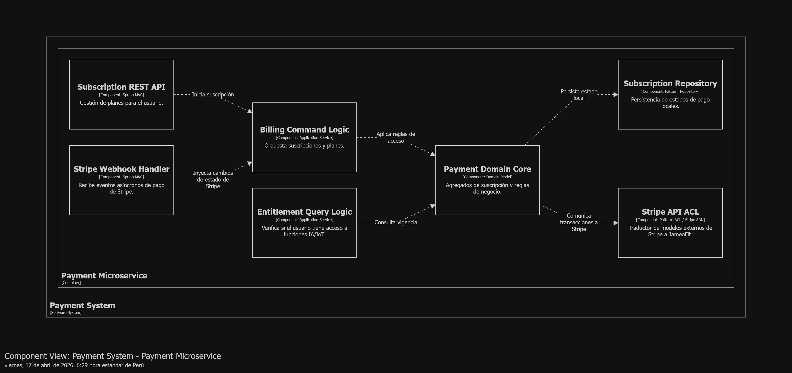

##### 4.2.8.6. Bounded Context Software Architecture Code Level Diagrams.

Esta sección presenta los diagramas de nivel de código del Bounded Context, los cuales permiten visualizar con mayor detalle la organización interna de sus clases, servicios, interfaces y relaciones. A diferencia de los diagramas de contenedores y componentes, que muestran la estructura general de la solución, este nivel se enfoca en cómo se materializa técnicamente el diseño dentro del código. Su construcción se apoya en los principios de Clean Architecture y en el diseño táctico de DDD, con el objetivo de mantener una separación clara entre dominio, aplicación, interfaces e infraestructura. De este modo, se busca que las reglas de negocio permanezcan desacopladas de decisiones técnicas específicas, que la comunicación entre capas se mantenga clara y consistente, y que el sistema pueda evolucionar sin comprometer la lógica central del contexto.

###### 4.2.8.6.1. Bounded Context Domain Layer Class Diagrams.

El diagrama de clases del dominio para Pagos representa la estructura conceptual y las relaciones internas que sostienen el comportamiento del bounded context, por lo que su propósito no es reflejar el diseño de la base de datos, sino modelar las reglas de negocio y la consistencia del sistema. En este nivel, el diseño se organiza alrededor del agregado Subscription, que actúa como entidad raíz y concentra la responsabilidad de sincronizar el estado comercial del usuario con el acceso técnico a la plataforma. A su alrededor se definen entidades como PaymentPlan y value objects como SubscriptionPeriod que encapsulan el estado y la lógica propia del dominio, como la validación de vigencia y la segregación de funcionalidades permitidas, evitando dispersar estas responsabilidades en capas externas. Asimismo, los servicios del dominio se expresan mediante contratos que describen capacidades necesarias para el negocio (como la sincronización con pasarelas), permitiendo que las integraciones técnicas (Stripe) se adapten al modelo definido y preservando así la independencia y claridad del núcleo del sistema.

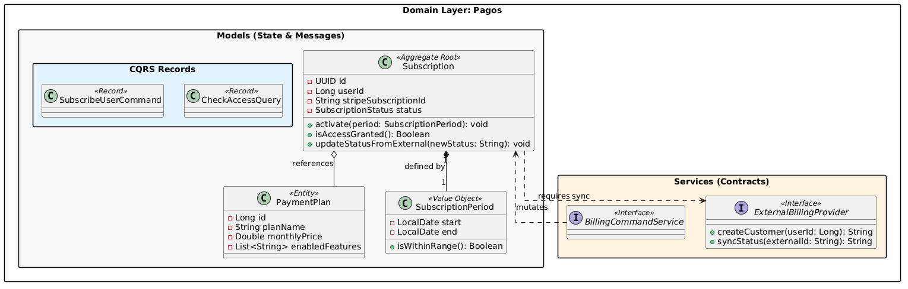

###### 4.2.8.6.2. Bounded Context Database Design Diagram.

La estrategia de modelado para el contexto de Pagos se centra en la Trazabilidad de Acceso. Se mantiene una réplica local ligera del estado de Stripe (stripe_subscription_id) para evitar latencias de red en cada validación de permisos de IA/IoT. Se implementan índices sobre user_id y status para optimizar los procesos de verificación de "Entitlement" que realizan otros microservicios antes de permitir el procesamiento de datos de los sensores.

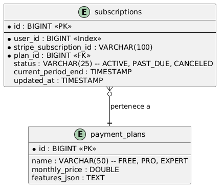

### 4.3 Referencias Bibliográficas

Organización Mundial de la Salud. (2025). Noncommunicable diseases.  
https://www.who.int/news-room/fact-sheets/detail/noncommunicable-diseases  

Arefeen, A., et al. (2025). MealMeter: Using multimodal sensing and machine learning for automatically estimating nutrition intake.  
https://arxiv.org/abs/2503.11683  

Gioia, S., et al. (2023). Mobile apps for dietary and food timing assessment.  
https://www.ncbi.nlm.nih.gov/pmc/articles/PMC10337248/ 

Instituto Nacional de Estadística e Informática (INEI). (2023).  
Las Tecnologías de Información y Comunicación en los Hogares: Oct-Nov-Dic 2023.  
https://www.gob.pe/institucion/inei/informes-publicaciones/5408920-las-tecnologias-de 
