

  <strong>UNIVERSIDAD PERUANA DE CIENCIAS APLICADAS</strong>

  

  Ingeniería de Software  
  2026-10  
  1ASI0572 Desarrollo de Soluciones IOT  
  NRC: 17756    
  Profesor: David Carlos Vera Olivera   
  "Informe de Trabajo Final"  
  Startup:  - Producto: 

 

<strong>Relación de integrantes:</strong>

<table align="center">
  <thead>
    <tr>
      <th>Integrante</th>
      <th>Código</th>
    </tr>
  </thead>
  <tbody>
    <tr>
      <td>Mathias Eduardo Bueno Perales</td>
      <td>U202313433</td>
    </tr>
    <tr>
      <td>Jhon Alexander Galvez Chambi</td>
      <td>U202323270</td>
    </tr>
    <tr>
      <td>Pablo Antonio Geronimo Quispe</td>
      <td>U202314304</td>
    </tr>
    <tr>
      <td>Ramiro Alexander Guzmán Chávez</td>
      <td>U202217062</td>
    </tr>
    <tr>
      <td>Omar Luquillas Asto</td>
      <td>U20211G641</td>
    </tr>
    <tr>
      <td>Fabrizio Alberto Paredes Santos</td>
      <td>U202310914</td>
    </tr>
    <tr>
      <td>Valentino Sandoval Paiva</td>
      <td>U20211A962</td>
    </tr>
  </tbody>
</table>

  

  <strong>Abril, 2026</strong>  
  <strong>URL del proyecto:</strong>
  <a href="https://github.com/G3-Soluciones-IOT">
    https://github.com/G3-Soluciones-IOT
  </a>

---

## Registro de Versiones del Informe

| Versión | Fecha      | Autor                         | Descripción                                                                  |
|---------|------------|-------------------------------|------------------------------------------------------------------------------|
| AV1     | 05/04/2026 | Jhon Alexander Galvez Chambi  | Desarrollo de la carátula, tabla de contenidos y estructura general del informe. |
| AV1     | 15/04/2026   |   Valentino Sandoval Paiva                            | Para esta entrega, lideré el diseño estratégico mediante EventStorming, el descubrimiento de contextos y la elaboración de los Bounded Context Canvases y el Context Mapping. Asimismo, definí la arquitectura de software a través de los diagramas de Landscape, Context, Container y Deployment, complementándolo con el análisis competitivo, las historias de usuario y el desarrollo integral de las capas del Bounded Context IAM.                                                                             |
| AV1     | /04/2025   |                               |                                                                              |
| AV1     | /04/2025   |                               |                                                                              |
| AV1     | /04/2025   |                               |                                                                              |

## Project Report Collaboration Insights

|  URL del repositorio del reporte  |
| :-----------------------------------: |
| [https://github.com/G3-Soluciones-IOT/docs.git](https://github.com/G3-Soluciones-IOT/docs.git) |

**TB1:**

**REPORT:** 

## Contenido

### Tabla de contenidos

- [Registro de Versiones del Informe](#registro-de-versiones-del-informe)
- [Project Report Collaboration Insights](#project-report-collaboration-insights)
- [Contenido](#contenido)
- [Tabla de contenidos](#tabla-de-contenidos)
- [Student Outcome](#student-outcome)
- [Capítulo I: Introducción](#capítulo-i-introducción)
  - [1.1. Startup Profile](#11-startup-profile)
    - [1.1.1. Descripción de la Startup](#111-descripción-de-la-startup)
    - [1.1.2. Perfiles de integrantes del equipo](#112-perfiles-de-integrantes-del-equipo)
  - [1.2. Solution Profile](#12-solution-profile)
    - [1.2.1 Antecedentes y problemática](#121-antecedentes-y-problemática)
    - [1.2.2 Lean UX Process.](#122-lean-ux-process)
        - [1.2.2.1. Lean UX Problem Statements.](#1221-lean-ux-problem-statements)
        - [1.2.2.2. Lean UX Assumptions.](#1222-lean-ux-assumptions)
        - [1.2.2.3. Lean UX Hypothesis Statements.](#1223-lean-ux-hypothesis-statements)
        - [1.2.2.4. Lean UX Canvas.](#1224-lean-ux-canvas)
  - [1.3. Segmentos objetivo.](#13-segmentos-objetivo)
- [Capítulo II: Requirements Elicitation & Analysis](#capítulo-ii-requirements-elicitation--analysis)
  - [2.1. Competidores.](#21-competidores)
    - [2.1.1. Análisis competitivo.](#211-análisis-competitivo)
    - [2.1.2. Estrategias y tácticas frente a competidores.](#212-estrategias-y-tácticas-frente-a-competidores)
  - [2.2. Entrevistas.](#22-entrevistas)
    - [2.2.1. Diseño de entrevistas.](#221-diseño-de-entrevistas)
    - [2.2.2. Registro de entrevistas.](#222-registro-de-entrevistas)
    - [2.2.3. Análisis de entrevistas.](#223-análisis-de-entrevistas)
  - [2.3. Needfinding.](#23-needfinding)
    - [2.3.1. User Personas.](#231-user-personas)
    - [2.3.2. User Task Matrix.](#232-user-task-matrix)
    - [2.3.3. User Journey Mapping.](#233-user-journey-mapping)
    - [2.3.4. Empathy Mapping.](#234-empathy-mapping)
  - [2.4. Big Picture EventStorming.](#24-big-picture-eventstorming)
  - [2.5. Ubiquitous Language.](#25-ubiquitous-language)
- [Capítulo III: Requirements Specification](#capítulo-iii-requirements-specification)
  - [3.1. User Stories.](#31-user-stories)
  - [3.2. Impact Mapping.](#32-impact-mapping)
  - [3.3. Product Backlog.](#33-product-backlog)
- [Capítulo IV: Solution Software Design](#capítulo-iv-solution-software-design)
  - [4.1. Strategic-Level Domain-Driven Design.](#41-strategic-level-domain-driven-design)
    - [4.1.1. Design-Level EventStorming.](#411-design-level-eventstorming)
        - [4.1.1.1 Candidate Context Discovery.](#4111-candidate-context-discovery)
        - [4.1.1.2 Domain Message Flows Modeling.](#4112-domain-message-flows-modeling)
        - [4.1.1.3 Bounded Context Canvases.](#4113-bounded-context-canvases)
    - [4.1.2. Context Mapping.](#412-context-mapping)
    - [4.1.3. Software Architecture.](#413-software-architecture)
        - [4.1.3.1. Software Architecture System Landscape Diagram.](#4131-software-architecture-system-landscape-diagram)
        - [4.1.3.2. Software Architecture Context Level Diagrams.](#4132-software-architecture-context-level-diagrams)
        - [4.1.3.3. Software Architecture Container Level Diagrams.](#4133-software-architecture-container-level-diagrams)
        - [4.1.3.4. Software Architecture Deployment Diagrams.](#4134-software-architecture-deployment-diagrams)
  - [4.2. Tactical-Level Domain-Driven Design](#42-tactical-level-domain-driven-design)
    - [4.2.1. Bounded Context: Inicio y Registro de Sesión](#421-bounded-context-inicio-y-registro-de-sesión)
        - [4.2.1.1. Domain Layer.](#4211-domain-layer)
        - [4.2.1.2. Interface Layer.](#4212-interface-layer)
        - [4.2.1.3. Application Layer.](#4213-application-layer)
        - [4.2.1.4. Infrastructure Layer.](#4214-infrastructure-layer)
        - [4.2.1.5. Bounded Context Software Architecture Component Level Diagrams.](#4215-bounded-context-software-architecture-component-level-diagrams)
        - [4.2.1.6. Bounded Context Software Architecture Code Level Diagrams.](#4216-bounded-context-software-architecture-code-level-diagrams)
            - [4.2.1.6.1. Bounded Context Domain Layer Class Diagrams.](#42161-bounded-context-domain-layer-class-diagrams)
            - [4.2.1.6.2. Bounded Context Database Design Diagram.](#42162-bounded-context-database-design-diagram)
    - [4.2.2. Bounded Context: Perfil de Usuario](#422-bounded-context-perfil-de-usuario)
        - [4.2.2.1. Domain Layer.](#4221-domain-layer)
        - [4.2.2.2. Interface Layer.](#4222-interface-layer)
        - [4.2.2.3. Application Layer.](#4223-application-layer)
        - [4.2.2.4. Infrastructure Layer.](#4224-infrastructure-layer)
        - [4.2.2.5. Bounded Context Software Architecture Component Level Diagrams.](#4225-bounded-context-software-architecture-component-level-diagrams)
        - [4.2.2.6. Bounded Context Software Architecture Code Level Diagrams.](#4226-bounded-context-software-architecture-code-level-diagrams)
            - [4.2.2.6.1. Bounded Context Domain Layer Class Diagrams.](#42261-bounded-context-domain-layer-class-diagrams)
            - [4.2.2.6.2. Bounded Context Database Design Diagram.](#42262-bounded-context-database-design-diagram)
    - [4.2.3. Bounded Context: Gestión de Objetivos](#423-bounded-context-gestión-de-objetivos)
        - [4.2.3.1. Domain Layer.](#4231-domain-layer)
        - [4.2.3.2. Interface Layer.](#4232-interface-layer)
        - [4.2.3.3. Application Layer.](#4233-application-layer)
        - [4.2.3.4. Infrastructure Layer.](#4234-infrastructure-layer)
        - [4.2.3.5. Bounded Context Software Architecture Component Level Diagrams.](#4235-bounded-context-software-architecture-component-level-diagrams)
        - [4.2.3.6. Bounded Context Software Architecture Code Level Diagrams.](#4236-bounded-context-software-architecture-code-level-diagrams)
            - [4.2.3.6.1. Bounded Context Domain Layer Class Diagrams.](#42361-bounded-context-domain-layer-class-diagrams)
            - [4.2.3.6.2. Bounded Context Database Design Diagram.](#42362-bounded-context-database-design-diagram)
    - [4.2.4. Bounded Context: Rutina Alimentaria](#424-bounded-context-rutina-alimentaria)
        - [4.2.4.1. Domain Layer.](#4241-domain-layer)
        - [4.2.4.2. Interface Layer.](#4242-interface-layer)
        - [4.2.4.3. Application Layer.](#4243-application-layer)
        - [4.2.4.4. Infrastructure Layer.](#4244-infrastructure-layer)
        - [4.2.4.5. Bounded Context Software Architecture Component Level Diagrams.](#4245-bounded-context-software-architecture-component-level-diagrams)
        - [4.2.4.6. Bounded Context Software Architecture Code Level Diagrams.](#4246-bounded-context-software-architecture-code-level-diagrams)
            - [4.2.4.6.1. Bounded Context Domain Layer Class Diagrams.](#42461-bounded-context-domain-layer-class-diagrams)
            - [4.2.4.6.2. Bounded Context Database Design Diagram.](#42462-bounded-context-database-design-diagram)
    - [4.2.5. Bounded Context: Nutricionista](#425-bounded-context-nutricionista)
        - [4.2.5.1. Domain Layer.](#4251-domain-layer)
        - [4.2.5.2. Interface Layer.](#4252-interface-layer)
        - [4.2.5.3. Application Layer.](#4253-application-layer)
        - [4.2.5.4. Infrastructure Layer.](#4254-infrastructure-layer)
        - [4.2.5.5. Bounded Context Software Architecture Component Level Diagrams.](#4255-bounded-context-software-architecture-component-level-diagrams)
        - [4.2.5.6. Bounded Context Software Architecture Code Level Diagrams.](#4256-bounded-context-software-architecture-code-level-diagrams)
            - [4.2.5.6.1. Bounded Context Domain Layer Class Diagrams.](#42561-bounded-context-domain-layer-class-diagrams)
            - [4.2.5.6.2. Bounded Context Database Design Diagram.](#42562-bounded-context-database-design-diagram)
    - [4.2.6. Bounded Context: Gestión de Planes Alimenticios](#426-bounded-context-gestión-de-planes-alimenticios)
        - [4.2.6.1. Domain Layer.](#4261-domain-layer)
        - [4.2.6.2. Interface Layer.](#4262-interface-layer)
        - [4.2.6.3. Application Layer.](#4263-application-layer)
        - [4.2.6.4. Infrastructure Layer.](#4264-infrastructure-layer)
        - [4.2.6.5. Bounded Context Software Architecture Component Level Diagrams.](#4265-bounded-context-software-architecture-component-level-diagrams)
        - [4.2.6.6. Bounded Context Software Architecture Code Level Diagrams.](#4266-bounded-context-software-architecture-code-level-diagrams)
            - [4.2.6.6.1. Bounded Context Domain Layer Class Diagrams.](#42661-bounded-context-domain-layer-class-diagrams)
            - [4.2.6.6.2. Bounded Context Database Design Diagram.](#42662-bounded-context-database-design-diagram)
    - [4.2.7. Bounded Context: Comunicación y Seguimiento](#427-bounded-context-comunicación-y-seguimiento)
        - [4.2.7.1. Domain Layer.](#4271-domain-layer)
        - [4.2.7.2. Interface Layer.](#4272-interface-layer)
        - [4.2.7.3. Application Layer.](#4273-application-layer)
        - [4.2.7.4. Infrastructure Layer.](#4274-infrastructure-layer)
        - [4.2.7.5. Bounded Context Software Architecture Component Level Diagrams.](#4275-bounded-context-software-architecture-component-level-diagrams)
        - [4.2.7.6. Bounded Context Software Architecture Code Level Diagrams.](#4276-bounded-context-software-architecture-code-level-diagrams)
            - [4.2.7.6.1. Bounded Context Domain Layer Class Diagrams.](#42761-bounded-context-domain-layer-class-diagrams)
            - [4.2.7.6.2. Bounded Context Database Design Diagram.](#42762-bounded-context-database-design-diagram)
    - [4.2.8. Bounded Context: Pagos](#428-bounded-context-pagos)
        - [4.2.8.1. Domain Layer.](#4281-domain-layer)
        - [4.2.8.2. Interface Layer.](#4282-interface-layer)
        - [4.2.8.3. Application Layer.](#4283-application-layer)
        - [4.2.8.4. Infrastructure Layer.](#4284-infrastructure-layer)
        - [4.2.8.5. Bounded Context Software Architecture Component Level Diagrams.](#4285-bounded-context-software-architecture-component-level-diagrams)
        - [4.2.8.6. Bounded Context Software Architecture Code Level Diagrams.](#4286-bounded-context-software-architecture-code-level-diagrams)
            - [4.2.8.6.1. Bounded Context Domain Layer Class Diagrams.](#42861-bounded-context-domain-layer-class-diagrams)
            - [4.2.8.6.2. Bounded Context Database Design Diagram.](#42862-bounded-context-database-design-diagram)

## Student Outcome

## Capítulo I: Introducción

### 1.1. Startup Profile

#### 1.1.1. Descripción de la Startup

JF Technologies es una startup de base tecnológica orientada al desarrollo de soluciones digitales innovadoras en el ámbito de la salud y el bienestar, con un enfoque en la integración de tecnologías emergentes y modelos escalables.

La empresa se posiciona como un actor en la intersección entre tecnología, data y salud, buscando transformar la manera en que las personas gestionan su información relacionada con hábitos y calidad de vida. Su enfoque estratégico se basa en el uso inteligente de datos para generar valor, mejorar la toma de decisiones y optimizar la experiencia del usuario.

La startup se proyecta como una organización capaz de diseñar, desarrollar y evolucionar productos digitales complejos, integrando equipos multidisciplinarios y aplicando metodologías modernas de ingeniería de software que permiten adaptarse a entornos dinámicos y altamente competitivos.

## Misión

Desarrollar soluciones tecnológicas innovadoras que integren datos y herramientas digitales para mejorar la gestión del bienestar, promoviendo experiencias eficientes, accesibles y centradas en el usuario mediante el uso de metodologías modernas de ingeniería y desarrollo ágil.

## Visión

Ser una startup referente en el desarrollo de productos digitales orientados a la salud y el bienestar, destacando por su capacidad de innovación, escalabilidad y aplicación de tecnologías emergentes para generar impacto sostenible en la calidad de vida de las personas.
#### 1.1.2. Perfiles de integrantes del equipo

| Foto | Miembros del equipo | Código de Estudiante | Descripción |
| :---: | :--- | :--- | :--- |
| | Mathias Bueno Perales  | u202313433 |Soy una persona optimista y responsable al cumplir mis labores para-con el grupo. Tengo experiencia respecto a proyectos previamente hechos en la rama de Ingenieria de Software y conocimientos en programacion como en HTML y CSS. Siempre procuro lo mejor para el equipo y ayudar en todo lo que este en mi alcance. |
| | Omar Luquillas Asto | U20211G641 | Soy Valentino Sandoval, tengo 20 años y soy estudiante de la carrera de Ingeniería de Software. Tengo conocimiento en lenguajes de programación como python y c++, y bases de datos como SQLServer y MongoDB. Desde pequeño me sentí atraído por la tecnología, por lo que me decidí a estudiar la carrera, además disfruto de jugar videojuegos con amigos en mi tiempo libre. |
| | Valentino Sandoval Paiva | U20211A962 |Soy Valentino Sandoval, tengo 22 años y soy estudiante de la carrera de Ingeniería de Software. Tengo conocimiento en lenguajes de programación como python y c++, y bases de datos como SQLServer y MongoDB. Desde pequeño me sentí atraído por la tecnología, por lo que me decidí a estudiar la carrera, además disfruto de jugar videojuegos con amigos en mi tiempo libre. |
| | Jhon Alexander Galvez Chambi | u202323270  |Soy una persona responsable y comprometida con la consecución de los mejores resultados en trabajo en equipo. Poseo experiencia en diversos lenguajes de programación, incluyendo Python, JavaScript y C++, así como en varios de los frameworks asociados a estos lenguajes. Además, tengo conocimientos en tecnologías emergentes como Cloud Computing e Internet de las Cosas (IoT), y estoy dispuesto a aportar mi experiencia en estas áreas para contribuir al éxito de los proyectos en los que participo. |
| | Fabrizio Alberto Paredes Santos | u202310914  |Profesional en formación con experiencia en desarrollo de aplicaciones web y móviles utilizando stacks modernos como Vue.js y .NET, Angular y Spring Boot, además de desarrollo móvil con Flutter y Kotlin. También he trabajado en la creación de páginas web con React, Next.js y Tailwind CSS, enfocadas en rendimiento y experiencia de usuario. Me caracterizo por ser proactivo, responsable y orientado a resultados, con capacidad para adaptarme a entornos dinámicos y contribuir eficazmente en equipos de desarrollo. |

### 1.2. Solution Profile

#### 1.2.1 Antecedentes y problemática

En los últimos años, los hábitos alimenticios inadecuados continúan siendo un factor determinante en el desarrollo de enfermedades no transmisibles, como la obesidad y la diabetes, las cuales representan una preocupación creciente en salud pública a nivel global (Organización Mundial de la Salud [OMS], 2025).

En respuesta a este contexto, el uso de aplicaciones digitales para el monitoreo nutricional ha crecido significativamente. Sin embargo, investigaciones recientes evidencian que muchas de estas herramientas aún dependen del registro manual de alimentos, lo que introduce limitaciones importantes en términos de precisión, usabilidad y sostenibilidad en el tiempo. Estudios actuales destacan que los métodos tradicionales de autoreporte son propensos a errores, sesgos y omisiones, afectando la confiabilidad de los datos recolectados (Arefeen et al., 2025).

Asimismo, se ha identificado que la experiencia de uso en aplicaciones de nutrición se ve afectada por la carga operativa que implica el registro constante de información, lo que reduce la adherencia del usuario y limita el impacto de estas soluciones en la mejora de hábitos alimenticios (Gioia et al., 2023).

En consecuencia, persiste la necesidad de replantear los enfoques actuales hacia modelos que permitan reducir la intervención manual del usuario, mejorar la calidad de los datos y facilitar un monitoreo nutricional más eficiente y sostenible.

Para comprender mejor el problema, se utiliza la técnica de las 5 W’s y 2 H’s:

What:  
El problema principal radica en la dificultad que tienen muchas personas para realizar un seguimiento preciso y constante de su ingesta nutricional. Las herramientas digitales actuales suelen depender del registro manual, lo que introduce errores y limita la precisión de los datos, además de generar fricción en la experiencia del usuario.

Who:  
La problemática afecta a dos segmentos principales. Por un lado, usuarios finales que buscan mejorar su alimentación, incluyendo personas interesadas en optimizar sus hábitos nutricionales, deportistas o individuos con rutinas laborales que requieren controlar su ingesta. Por otro lado, profesionales de la salud, como nutricionistas o entrenadores, que necesitan información confiable para realizar seguimiento y brindar recomendaciones a sus pacientes o clientes.

When:  
El problema se presenta de manera constante en la vida diaria, especialmente cada vez que el usuario consume alimentos y debe registrar dicha información. Su relevancia ha aumentado en los últimos años debido al mayor interés en el autocuidado y el uso de herramientas digitales para la gestión de la salud.

Where:  
La problemática ocurre en múltiples entornos cotidianos, como el hogar, el trabajo o espacios de consumo alimenticio, lo que evidencia que se trata de una necesidad transversal e independiente del contexto físico.

Why:  
La causa principal es la dependencia de procesos manuales y estimaciones subjetivas, sumada a la falta de herramientas automatizadas que faciliten el registro de información nutricional. Esto genera baja adherencia, errores en los datos y una experiencia poco sostenible en el tiempo.

How:  
El problema se manifiesta a través de registros incompletos, inconsistentes o abandonados, así como en la generación de datos poco confiables que dificultan el análisis y la toma de decisiones informadas sobre la alimentación.

How Much:  
El impacto de esta problemática es significativo. Estudios recientes evidencian que los métodos de autoreporte en nutrición presentan limitaciones importantes en términos de precisión y confiabilidad, afectando la calidad de los datos utilizados para el monitoreo y análisis (Arefeen et al., 2025). Asimismo, se ha identificado que la carga operativa en aplicaciones de salud influye directamente en la disminución de la adherencia del usuario a largo plazo (Gioia et al., 2023). A nivel global, las enfermedades asociadas a hábitos alimenticios inadecuados continúan siendo una de las principales causas de mortalidad (Organización Mundial de la Salud [OMS], 2025).

#### 1.2.2 Lean UX Process.
El Lean UX Process es un enfoque ágil centrado en el usuario que permite validar de manera iterativa las decisiones de diseño mediante la formulación de hipótesis y la experimentación continua. Este enfoque se basa en el ciclo construir–medir–aprender, permitiendo al equipo reducir la incertidumbre y asegurar que la solución propuesta responda a necesidades reales del usuario.
##### 1.2.2.1. Lean UX Problem Statements.
**Domain**  
Gestión del monitoreo nutricional y seguimiento de la ingesta alimentaria en contextos personales y profesionales de salud.

**Customer Segments**  
- Usuarios orientados a la mejora de su alimentación  
- Profesionales de la salud (nutricionistas, entrenadores)

**Problem / Pain Points**  
Se ha identificado que los usuarios presentan dificultades para registrar y monitorear su ingesta nutricional de manera precisa y constante, lo que genera:

- Baja precisión en los datos registrados  
- Abandono del uso de aplicaciones de nutrición  
- Falta de visibilidad clara sobre hábitos alimenticios  
- Dificultad para tomar decisiones informadas  
- Limitada capacidad de seguimiento por parte de profesionales de la salud  

**Gap**  
Existe una brecha entre la necesidad de contar con información nutricional precisa, continua y confiable, y la disponibilidad de herramientas digitales que reduzcan la carga manual del usuario y mejoren la calidad de los datos recolectados.

**Vision / Strategy**  
Desarrollar una solución digital que permita automatizar y optimizar el monitoreo de la ingesta nutricional, reduciendo la intervención manual del usuario y mejorando la precisión de los datos, facilitando la toma de decisiones y promoviendo hábitos alimenticios sostenibles tanto en usuarios finales como en profesionales de la salud.

**Initial Segment**  
Usuarios urbanos en Perú interesados en mejorar su alimentación y que utilizan dispositivos móviles como principal medio de acceso digital.

**Problem Statement**  
¿Cómo podríamos facilitar el monitoreo preciso y constante de la ingesta nutricional de los usuarios, al mismo tiempo que brindamos información confiable a los profesionales de la salud, reduciendo la carga manual y mejorando la calidad de los datos para apoyar la toma de decisiones?

##### 1.2.2.2. Lean UX Assumptions.
Las siguientes suposiciones han sido definidas en base al entendimiento preliminar del problema y serán validadas mediante el proceso iterativo del Lean UX.

**Business Assumptions**

- Se asume que existe una creciente demanda por soluciones digitales orientadas al monitoreo de la salud y la nutrición.  
- Se asume que los usuarios perciben valor en herramientas que reduzcan el esfuerzo requerido para registrar su alimentación.  
- Se asume que la automatización del registro nutricional puede mejorar la retención de usuarios.  
- Se asume que los profesionales de la salud requieren herramientas más precisas para el seguimiento de sus pacientes.  
- Se asume que los profesionales están dispuestos a adoptar herramientas digitales que mejoren la calidad del seguimiento nutricional.  
- Se asume que el mercado peruano presenta oportunidades para soluciones digitales en el ámbito de la salud y bienestar.  
- Se asume que una solución basada en datos puede generar valor tanto para usuarios finales como para profesionales.  

**User Assumptions**

- Se asume que los usuarios experimentan frustración al tener que registrar manualmente su alimentación.  
- Se asume que los usuarios valoran la facilidad de uso y la rapidez en el registro de información.  
- Se asume que los usuarios están dispuestos a adoptar herramientas digitales si estas son intuitivas.  
- Se asume que los usuarios desean mejorar sus hábitos alimenticios pero carecen de herramientas eficientes.  
- Se asume que los profesionales de la salud necesitan datos confiables para brindar recomendaciones adecuadas.  
- Se asume que los profesionales valoran herramientas que optimicen su tiempo y mejoren el seguimiento de pacientes.  
- Se asume que los usuarios prefieren soluciones que reduzcan el esfuerzo requerido para el monitoreo nutricional.  

##### 1.2.2.3. Lean UX Hypothesis Statements.
Creemos que los usuarios orientados a la mejora de su alimentación podrán realizar un seguimiento más constante y preciso de su ingesta nutricional si se reduce la necesidad de registro manual, lo que mejorará su adherencia al uso de la herramienta.

Sabremos que esto es cierto cuando al menos el 70% de los usuarios registre su alimentación de manera continua durante una semana.

Creemos que los usuarios podrán tomar mejores decisiones sobre su alimentación si cuentan con información clara, precisa y accesible, lo que permitirá mejorar sus hábitos alimenticios.

Sabremos que esto es cierto cuando más del 60% de los usuarios indique que comprende mejor su alimentación y realiza cambios en sus hábitos.

Creemos que los profesionales de la salud podrán mejorar la calidad de sus recomendaciones si cuentan con datos más precisos y actualizados sobre la ingesta nutricional de sus pacientes, lo que permitirá un seguimiento más efectivo.

Sabremos que esto es cierto cuando al menos el 70% de los profesionales indique que la herramienta mejora su capacidad de análisis y toma de decisiones.

Creemos que los usuarios adoptarán la solución si esta ofrece una experiencia simple, rápida y accesible desde dispositivos móviles, lo que permitirá su uso continuo.

Sabremos que esto es cierto cuando la tasa de retención supere el 60% después de la primera semana.
##### 1.2.2.4. Lean UX Canvas.

    

Link: https://canva.link/55j2m2akga2iwr8
### 1.3. Segmentos objetivo.

Los siguientes segmentos han sido definidos a partir del análisis del dominio del problema y del contexto actual en el Perú, considerando tendencias en el uso de tecnologías digitales, hábitos de salud y necesidades de monitoreo nutricional. La selección de estos segmentos busca maximizar el impacto de la solución, abordando tanto la demanda de los usuarios finales como las necesidades de los profesionales del sector salud.

### Segmento objetivo 1: Usuarios orientados a la mejora de su alimentación

| Aspectos demográficos | Aspectos geográficos | Aspectos psicográficos |
|----------------------|--------------------|------------------------|
| Sexo: Masculino y Femenino | Nacionalidad: Peruana | Motivaciones: Mejorar hábitos alimenticios, controlar peso, optimizar rendimiento físico y realizar seguimiento de su ingesta nutricional como apoyo en el manejo de condiciones de salud. |
| Edades: 18 – 55 años | Ubicación: Principalmente zonas urbanas (Lima Metropolitana, Arequipa, Trujillo) | Estilo de vida: Activo, semi-activo, sedentario, con interés en el bienestar personal |
| Nivel socioeconómico: A, B y C | Acceso a tecnología: Alto acceso a smartphones e internet móvil | Preocupaciones: Falta de control preciso sobre su alimentación y dificultad para mantener hábitos constantes |
| Ocupación: Estudiantes, profesionales, trabajadores dependientes e independientes | | Adaptación a la tecnología: Alta, familiarizados con aplicaciones móviles |
| Ingresos: Variables, con predominancia de ingresos estables en zonas urbanas | | Interés por la personalización: Alto interés en soluciones que se adapten a sus objetivos de salud |

**Sustento:**  
En el Perú, el acceso a tecnologías digitales ha crecido de manera significativa en los últimos años. Según el Instituto Nacional de Estadística e Informática (INEI, 2023), más del 70% de la población utiliza internet, siendo el teléfono móvil el principal medio de acceso. Este contexto favorece la adopción de aplicaciones móviles orientadas a la salud, especialmente en población joven y adulta en zonas urbanas.

### Segmento objetivo 2: Profesionales de la salud (nutrición y bienestar)

| Aspectos demográficos | Aspectos geográficos | Aspectos psicográficos |
|----------------------|--------------------|------------------------|
| Sexo: Masculino y Femenino | Nacionalidad: Peruana | Motivaciones: Mejorar la calidad de atención y seguimiento de sus pacientes |
| Edades: 25 – 60 años | Ubicación: Zonas urbanas con presencia de clínicas y consultorios (Lima, Arequipa, Trujillo) | Estilo de vida: Profesional orientado al servicio y bienestar de terceros |
| Nivel socioeconómico: B y C | Acceso a tecnología: Alto acceso a herramientas digitales e internet | Preocupaciones: Falta de datos confiables y herramientas eficientes para el monitoreo de pacientes |
| Ocupación: Nutricionistas, médicos generales, entrenadores, profesionales de salud | | Adaptación a la tecnología: Media-alta, con interés en herramientas que optimicen su trabajo |
| Educación: Formación técnica o universitaria en salud o bienestar | | Interés por la personalización: Alto interés en soluciones que permitan seguimiento individualizado |

**Sustento:**  
El sector salud en el Perú viene experimentando un proceso de digitalización progresiva, impulsado por la necesidad de mejorar la eficiencia en la atención y el seguimiento de pacientes. En este contexto, los profesionales de la salud muestran una creciente apertura hacia el uso de herramientas tecnológicas que les permitan optimizar su práctica, especialmente en entornos urbanos con mayor acceso a infraestructura digital (INEI, 2023; OMS, 2025).

## Capítulo II: Requirements Elicitation & Analysis

### 2.1. Competidores.

# Competitive analysis landscape

**¿Cuál es el análisis de las ventajas y desventajas de las empresas que compiten con nosotros? ¿Cómo nos comparamos en términos de fortalezas y debilidades respecto a ellos? ¿Se vislumbran oportunidades para destacarnos de la competencia y de qué manera podríamos sacar provecho de ellas?**  
_El propósito de este análisis competitivo es evaluar las ventajas y desventajas de la startup y nuestro producto en comparación con los competidores, con el fin de crear estrategias y diseños que nos permitan competir de manera efectiva en el mercado.

#### 2.1.1. Análisis competitivo.

|                           |  |  |  |  |
|---------------------------|------------|--------------|--------------|--------------|
| **Perfil**                |    JF Technologies        |     Fitia         |   MyFitnessPal           |       Nutrium       |
| Overview                  |  Startup tecnológica que automatiza el monitoreo nutricional mediante IA y modelos de datos, reduciendo la carga operativa para usuarios y profesionales de la salud.        | App peruana de nutrición líder en LATAM. Utiliza algoritmos para crear planes de alimentación personalizados y facilitar el conteo de calorías.          | La plataforma global más grande de registro de alimentos y ejercicio, basada en una base de datos masiva de productos. |    Software de nutrición centrado en el profesional, que conecta a nutricionistas con pacientes para seguimiento clínico.       |
| Ventaja competitiva   ¿Qué valor ofrece a los clientes? | **Automatización del registro:** Enfoque en reducir la fricción manual mediante tecnologías emergentes (IA/Visión), mejorando la fidelidad de los datos. | **Localización extrema:** Base de datos de productos peruanos/LATAM y recetas locales altamente optimizadas. | **Efecto de red:** Base de datos de alimentos alimentada por usuarios más grande del mundo y comunidad global.  | **Gestión clínica:** Herramientas de análisis antropométrico y planes de alimentación médicos de alta precisión.  |
| **Perfil de Marketing**   |            |              |              |              |
| Mercado objetivo          | - Usuarios urbanos en Perú (18-35 años) pro-tecnología.   - Nutricionistas que buscan datos precisos y automáticos.     |  Personas en LATAM que buscan bajar de peso o ganar masa muscular de forma autónoma.         |  Usuarios globales enfocados en el conteo de calorías y control de peso general.        | Clínicas de nutrición, consultorios privados y sus pacientes que requieren dieta estricta. |
| Estrategias de marketing  |   - Alianzas con centros de salud y gimnasios.   - Marketing de contenido sobre "bienestar sin esfuerzo" y eficiencia.        |   - Fuerte presencia en redes sociales (TikTok/IG) con influencers fitness.   - Modelo Freemium agresivo.        |   - SEO global masivo.   - Integración nativa con dispositivos wearables (Apple Health, Garmin, etc.).      |    - Marketing B2B dirigido a congresos de nutrición y salud.   - Certificaciones profesionales.         |
| **Perfil de Producto**    |            |              |              |              |
| Productos & Servicios     | Registro automático de ingesta, dashboard para profesionales, alertas de hábitos, integración de datos biométricos.          |   Planes de comidas, lista de compras, contador de macros, seguimiento de peso.          |    Diario de alimentos, contador de pasos, comunidad, planes de entrenamiento premium.         |  Software de gestión de consultas, app para el paciente con chat directo y recordatorios de comidas.          |
| Precios & Costos          |  - Plan Usuario: Freemium / Premium (estimado S/. 45/mes).   - Plan Pro: Suscripción por volumen de pacientes.       |  - Gratuito con anuncios.   - Premium: aprox. S/. 20 - S/. 30 al mes.            | - Gratuito limitado.   - Premium: USD 19.99/mes (aprox. S/. 75).            |   Planes para profesionales desde USD 30/mes hasta USD 100/mes según el número de pacientes.      |
| Canales de distribución   (Web y/o Móvil) | App móvil (iOS/Android) y Dashboard Web para profesionales de la salud. | Principalmente App Móvil (iOS/Android). | App Móvil, Web y dispositivos integrados (Smartwatches). | Plataforma Web para el profesional y App Móvil para el paciente. |
| **Análisis SWOT**         |            |              |              |              |
| Fortalezas                | - Soluciona la fricción del registro manual.   - Enfoque dual (B2C y B2B).   - Datos de alta confiabilidad.       | - Producto local nacido en Perú.   - UX/UI muy intuitiva y motivadora.   - Gran penetración en el mercado hispano.       |  - Reconocimiento de marca mundial.   - Base de datos imbatible (más de 14 millones de alimentos).      | - Alta fidelidad clínica.   - Mejora la retención de pacientes para el profesional.        |
| Debilidades               | - Costo tecnológico de implementar automatización (IA).   - Marca aún no posicionada frente a gigantes.       |  - Depende todavía de mucho registro manual por parte del usuario.   - Enfoque limitado al fitness, menos clínico.      | - Interfaz saturada de anuncios en versión gratuita.   - Muchos datos de alimentos son erróneos (cargados por usuarios).       | - Curva de aprendizaje alta para el profesional.   - Menos enfoque en la "experiencia diaria" del usuario común.        |
| Oportunidades             |  - Integración con Vision AI para reconocimiento de platos mediante fotos.   - Alianzas con seguros de salud (EPS).      |  - Expansión a mercados fuera de habla hispana.   - Incorporación de venta de suplementos.      |   - Uso de IA generativa para coaching nutricional personalizado.     |  - Telemedicina integrada y monitoreo de biomarcadores en tiempo real.       |
| Amenazas                  |   - Fitia dominando el mercado local antes de que JF escale.   - Resistencia al cambio de profesionales tradicionales.     |   - Apps globales mejorando su base de datos local   - Competidores con mayor automatización (como JF).     | - Regulación de privacidad de datos de salud cada vez más estricta.   - Fatiga del usuario por registro manual.       |  - Aplicaciones gratuitas que empiezan a incluir herramientas para profesionales.     |

#### 2.1.2. Estrategias y tácticas frente a competidores.

### 2.2. Entrevistas.

#### 2.2.1. Diseño de entrevistas.

#### 2.2.2. Registro de entrevistas.

#### 2.2.3. Análisis de entrevistas.

### 2.3. Needfinding.

#### 2.3.1. User Personas.

#### 2.3.2. User Task Matrix.

#### 2.3.3. User Journey Mapping.

#### 2.3.4. Empathy Mapping.

### 2.4. Big Picture EventStorming.

### 2.5. Ubiquitous Language.

## Capítulo III: Requirements Specification

### 3.1. User Stories.
En esta sección se detallan las **User Stories** identificadas para la aplicación JameoFit. Cada historia representa una necesidad o funcionalidad desde la perspectiva del usuario o profesional de la salud, y está estructurada para facilitar su desarrollo ágil en sprints.  

Las User Stories se organizan de la siguiente manera:

- **Epic / Story ID:** Identificador único de la historia de usuario.  
- **Título:** Breve descripción de la funcionalidad o necesidad.  
- **Descripción:** Explicación detallada del objetivo desde la perspectiva del usuario.  
- **Criterios de Aceptación:** Escenarios que permiten validar que la funcionalidad cumple con los requerimientos.  
- **Relacionado con (Epic ID):** Referencia a la épica a la que pertenece la historia, agrupando funcionalidades similares.

Estas historias fueron priorizadas considerando la **importancia para el usuario**, la **complejidad técnica**, y la **contribución al valor del producto**, siguiendo un enfoque ágil basado en Lean UX. La información permitirá al equipo de desarrollo implementar las funcionalidades de manera iterativa y validarlas con usuarios reales.

| Epic / Story ID | Título | Descripción | Criterios de Aceptación | Relacionado con (Epic ID) |
|-----------------|--------|-------------|------------------------|---------------------------|
| US-01 | Registro de Usuario | Como visitante, quiero registrarme en la aplicación para empezar a gestionar mis necesidades alimenticias. | Escenario 01: Dado que soy un nuevo usuario y accedo por primera vez a la aplicación, cuando completo mi información inicial en el registro, entonces la app debe mostrarme sugerencias alimenticias adaptadas a mis datos.   Escenario 02: Dado que omití algunos datos en el registro, cuando ingreso luego a mi perfil y los completo, entonces la app debe ajustar automáticamente las sugerencias alimenticias. | EP-01 |
| US-02 | Recuperación de Contraseña | Como usuario, quiero recuperar mi contraseña en caso de olvidarla. | Escenario 01: Dado que olvidé mi contraseña, cuando solicito la recuperación, entonces la app debe enviarme un correo con las instrucciones para restablecerla.   Escenario 02: Dado que no recibí el correo de recuperación, cuando solicito reenviarlo, entonces la app debe permitir reenviar el enlace correspondiente. | EP-01 |
| US-03 | Personalización de Perfil | Como usuario registrado, quiero completar y editar mis preferencias alimenticias para recibir planes adecuados. | Escenario 01: Dado que ingreso mis alergias o restricciones, cuando guardo los cambios, entonces la app debe excluir esos alimentos del plan alimenticio.   Escenario 02: Dado que modifico mi objetivo de salud, cuando actualizo el perfil, entonces la app debe adaptar automáticamente mi plan alimenticio. | EP-01 |
| US-04 | Plan Alimenticio Personalizado | Como usuario, quiero recibir un plan alimenticio personalizado basado en mis datos para tener una guía clara. | Escenario 01: Dado que he completado todos los campos de mi perfil, cuando solicito un plan alimenticio, entonces la app debe generar uno personalizado según mis necesidades.   Escenario 02: Dado que ya tengo un plan activo, cuando cambio mi nivel de actividad física, entonces la app debe generar una nueva propuesta de plan. | EP-02 |
| US-05 | Edición de Plan Alimenticio | Como usuario, quiero modificar o sustituir comidas del plan sugerido para adaptarlo a mis gustos. | Escenario 01: Dado que no me agrada una comida del plan, cuando selecciono la opción "sustituir", entonces la app debe mostrar alternativas saludables equivalentes.   Escenario 02: Dado que agrego nuevas restricciones alimenticias, cuando las registro en mi perfil, entonces la app debe actualizar automáticamente el plan. | EP-02 |
| US-06 | Registro Diario de Alimentos | Como usuario, quiero registrar lo que como diariamente para llevar un control de mi progreso. | Escenario 01: Dado que estoy en el día actual, cuando ingreso mis comidas, entonces la app debe guardar y analizar los datos registrados.   Escenario 02: Dado que olvidé registrar una comida, cuando ingreso al día anterior, entonces la app debe permitirme editar los registros pasados. | EP-03 |
| US-07 | Recordatorios de Comidas | Como usuario, quiero recibir recordatorios para registrar mis comidas. | Escenario 01: Dado que soy un usuario activo, cuando configuro los recordatorios, entonces la app debe enviarme notificaciones en los horarios seleccionados.   Escenario 02: Dado que ignoro varios recordatorios, cuando accedo a la aplicación, entonces la app debe mostrar una advertencia para completar los registros faltantes. | EP-03 |
| US-08 | Visualización del Progreso | Como usuario, quiero visualizar mi progreso nutricional para mantener mis hábitos positivos. | Escenario 01: Dado que he registrado mis comidas, cuando accedo a la sección de progreso, entonces la app debe mostrar mis estadísticas de alimentación y progreso.   Escenario 02: Dado que hubo días sin registro, cuando visualizo mi progreso, entonces la app debe indicar en qué días no se ingresaron datos. | EP-03 |
| US-09 | Feedback Diario | Como usuario, quiero recibir comentarios sobre mi alimentación diaria para saber si estoy cumpliendo mis metas. | Escenario 01: Dado que registré todas mis comidas del día, cuando llega el final de la jornada, entonces la app debe mostrarme un resumen nutricional con retroalimentación.   Escenario 02: Dado que superé mi meta calórica, cuando reviso el feedback diario, entonces la app debe darme recomendaciones para equilibrar mi consumo al día siguiente. | EP-03 |
| US-10 | Registro de Logros | Como usuario, quiero ver mis avances y logros alcanzados para mantenerme motivado. | Escenario 01: Dado que cumplo un objetivo semanal, cuando ingreso a mi perfil, entonces la app debe mostrar una insignia o notificación de logro.   Escenario 02: Dado que reviso mis estadísticas mensuales, cuando hubo progreso, entonces la app debe resaltar mis avances con mensajes motivacionales. | EP-04 |
| US-11 | Alertas de Objetivos no Alcanzados | Como usuario, quiero recibir alertas para cuando no cumpla los objetivos diarios. | Escenario 01: Dado que tengo un dispositivo compatible, cuando lo vinculo mediante la app, entonces esta debe sincronizar mis datos de forma segura.   Escenario 02: Dado que desvinculo un dispositivo, cuando confirmo la acción, entonces la app debe dejar de recibir datos automáticamente. | EP-03 |
| US-12 | Panel de Pacientes | Como nutricionista, quiero ver un panel con el estado de mis pacientes para optimizar mi seguimiento. | Escenario 01: Dado que la app ha registrado mi nivel de actividad física, cuando ingreso a mi panel, entonces debe mostrar sugerencias de comidas adaptadas.   Escenario 02: Dado que mi nivel de actividad varía, cuando la app detecta cambios significativos, entonces debe alertarme sobre ajustes recomendados. | EP-05 |
| US-13 | Envío de Sugerencias | Como nutricionista, quiero enviar recomendaciones directamente a los usuarios para orientarlos. | Escenario 01: Dado que tengo una suscripción activa, cuando accedo al chat con el usuario, entonces la app debe permitir enviar y recibir mensajes en tiempo real.   Escenario 02: Dado que tengo una duda urgente y el usuario no está disponible, entonces la app debe permitir dejar un mensaje para respuesta posterior. | EP-05 |
| US-14 | Personalización de Metas | Como usuario, quiero definir metas específicas. | Escenario 01: Dado que accedo a la sección de citas, cuando selecciono fecha y hora disponibles, entonces la app debe confirmar la reserva.   Escenario 02: Dado que no puedo asistir a una cita, cuando cancelo con anticipación, entonces la app debe notificar al nutricionista y liberar el horario. | EP-02 |
| US-15 | Visualización de Logros | Como usuario, quiero ver una sección con los logros para ver cuáles he completado. | Escenario 01: Dado que establezco una meta nueva, cuando la guardo, entonces la app debe registrarla y mostrar mi progreso asociado.   Escenario 02: Dado que alcanzo una meta establecida, cuando esto ocurre, entonces la app debe notificarme con una felicitación y permitir definir una nueva. | EP-04 |
| US-16 | Notificaciones de Actividad | Como usuario, quiero recibir notificaciones sobre actualizaciones relevantes de la app. | Escenario 01: Dado que selecciono una app externa compatible, cuando autorizo la conexión, entonces NutriSmart debe importar los datos relevantes.   Escenario 02: Dado que revoco el acceso, cuando retiro el permiso, entonces NutriSmart debe dejar de sincronizar y eliminar los datos vinculados. | EP-05 |
| US-17 | Soporte en Tiempo Real | Como usuario, quiero chatear en tiempo real con el soporte técnico para resolver dudas. | Escenario 01: Dado que la app detecta que superé el límite diario, cuando registro una nueva comida, entonces debe mostrar una advertencia de exceso calórico.   Escenario 02: Dado que superé el límite semanal, cuando accedo a mi progreso, entonces la app debe ofrecer sugerencias para equilibrar mi dieta. | EP-05 |
| US-18 | Conocer la propuesta de valor | Como visitante, quiero entender rápidamente qué hace la app y cómo me beneficia. | Escenario 01: Dado que finaliza la semana, cuando abro la app, entonces esta debe mostrar un resumen con estadísticas y sugerencias. | EP-06 |
| US-19 | Acceder al registro o inicio de sesión | Como visitante, quiero poder iniciar sesión o registrarme desde la barra superior para empezar a usar la app. | Escenario 01: Dado que ingreso a la configuración de notificaciones, cuando desactivo una categoría, entonces la app debe dejar de enviarme alertas de ese tipo.   Escenario 02: Dado que cambio mis preferencias, cuando guardo la configuración, entonces la app debe aplicarlas de inmediato. | EP-06 |
| US-20 | Navegar entre secciones desde la barra | Como visitante, quiero usar la barra superior para moverme a distintas secciones de la landing para explorar el contenido rápidamente. | Escenario 01: Dado que accedo a la sección de comunidad, cuando publico un mensaje, entonces este debe mostrarse en el muro general. | EP-06 |
| US-21 | Ver resumen de beneficios | Como visitante, quiero ver los beneficios que ofrece la app para entender cómo me puede ayudar. | Escenario 01: Dado que experimento un error técnico, cuando ingreso a la sección de soporte, entonces la app debe mostrar opciones de contacto (chat, correo o formulario). | EP-06 |
| US-22 | Navegar por los beneficios principales | Como visitante, quiero navegar fácilmente por la sección de beneficios para conocer todas las ventajas. | Escenario 01: Dado que tengo una suscripción activa, cuando accedo a mi perfil, entonces la app debe mostrar los detalles y la fecha de vencimiento. | EP-06 |
| US-23 | Visualizar testimonios | Como visitante, quiero leer testimonios de usuarios para confiar en la app. | Escenario 01: Dado que selecciono un plan de pago, cuando ingreso mis datos de tarjeta, entonces la app debe procesar la transacción de manera cifrada. | EP-06 |
| US-24 | Navegar desde el footer | Como visitante, quiero que los enlaces del pie de página funcionen correctamente para poder acceder a información adicional sobre la app. | Escenario 01: Dado que accedo a la sección de historial, cuando selecciono un período específico, entonces la app debe mostrar las transacciones realizadas. | EP-06 |
| US-25 | Acceder desde distintos dispositivos | Como visitante, quiero que la landing page se vea bien en cualquier dispositivo para poder explorarla cómodamente. | Escenario 01: Dado que registro información sensible, cuando la guardo, entonces la app debe almacenarla de manera cifrada.   Escenario 02: Dado que reviso la política de privacidad, cuando accedo al enlace correspondiente, entonces la app debe mostrar el documento actualizado con los términos vigentes. | EP-06 |
| US-26 | Ver recetas preestablecidas | Como usuario, quiero ver algunas recetas ya creadas para guardar las que me interesen. | Escenario 01: Dado que la app detecta inactividad, cuando transcurre el tiempo configurado, entonces debe cerrar la sesión automáticamente.   Escenario 02: Dado que se cerró mi sesión, cuando intento acceder a funciones protegidas, entonces la app debe pedirme nuevamente iniciar sesión. | EP-07 |
| US-27 | Hacer tracking del plan | Como usuario, quiero saber si la app sigue lo que yo hago con respecto al plan. | Escenario 01: Dado que no tengo conexión, cuando abro la app, entonces debe permitirme visualizar mi plan y los datos guardados localmente.   Escenario 02: Dado que vuelvo a tener conexión, cuando la app se sincroniza, entonces debe actualizar mis registros con los cambios locales. | EP-07 |
| US-28 | Ver recomendaciones | Como usuario, quiero que la app me muestre recomendaciones para seguirlas en distintos momentos del día. | Escenario 01: Dado que finalizo una semana de uso, cuando aparece la encuesta de evaluación, entonces puedo calificar mi experiencia y dejar comentarios.   Escenario 02: Dado que envío mi evaluación, cuando se registra, entonces la app debe mostrar resultados de manera resumida. | EP-07 |
| US-32 | Gestión de Contenido Educativo | Como nutricionista, quiero organizar mis artículos por categorías y temáticas para que los usuarios encuentren fácilmente el contenido relevante. | Escenario 01: Dado que inicio sesión en otro dispositivo, cuando sincronizo mi cuenta, entonces la app debe mostrar los mismos datos y progreso.   Escenario 02: Dado que cierro sesión en uno de mis dispositivos, cuando lo hago, entonces la app debe garantizar que no se pierdan los registros sincronizados. | EP-09 |
| US-33 | Chat Directo con Usuarios | Como nutricionista, quiero chatear directamente con los usuarios para brindar asesoramiento personalizado y seguimiento continuo. | Escenario 01: Dado que accedo a la sección de recetas, cuando aplico filtros de búsqueda, entonces la app debe mostrar solo las recetas compatibles con mis preferencias.   Escenario 02: Dado que agrego nuevos filtros, cuando los guardo, entonces la app debe actualizar automáticamente las sugerencias de recetas. | EP-10 |
| US-34 | Gestión de Consultas | Como nutricionista, quiero organizar mis consultas y conversaciones para mantener un seguimiento eficiente de cada usuario. | Escenario 01: Dado que configuro un objetivo diario de consumo de agua, cuando registro mis vasos bebidos, entonces la app debe mostrar el progreso del día.   Escenario 02: Dado que no he registrado agua en varias horas, cuando se cumple el intervalo configurado, entonces la app debe enviarme una notificación recordatoria. | EP-10 |
| US-35 | Configuración de Suscripciones | Como nutricionista, quiero configurar suscripciones a mi contenido para generar ingresos recurrentes y fidelizar usuarios. | Escenario 01: Dado que registro mis comidas, cuando accedo al análisis nutricional, entonces la app debe mostrar los valores de calorías, proteínas, carbohidratos y grasas.   Escenario 02: Dado que modifico un registro, cuando actualizo la comida, entonces el análisis debe recalcularse automáticamente. | EP-11 |
| US-36 | Panel de Suscriptores | Como nutricionista, quiero ver un panel con mis suscriptores para conocer mi audiencia y engagement. | Escenario 01: Dado que alcanzo un logro importante, cuando selecciono “Compartir”, entonces la app debe generar una publicación con mis resultados.   Escenario 02: Dado que no deseo compartir públicamente, cuando selecciono “Solo para mí”, entonces la app debe guardar el logro sin publicarlo. | EP-11 |
| US-37 | Notificaciones de Actividad Profesional | Como nutricionista, quiero recibir notificaciones sobre actividad en mi perfil para responder oportunamente a consultas y engagement. | Escenario 01: Dado que ingreso a la configuración de idioma, cuando selecciono una nueva opción, entonces la app debe actualizar todo el contenido al idioma elegido.   Escenario 02: Dado que cierro y reabro la app, cuando lo hago, entonces esta debe conservar el idioma configurado previamente. | EP-08 |
| US-38 | Herramientas de Seguimiento de Pacientes | Como nutricionista, quiero herramientas especializadas para monitorear el progreso de usuarios que siguen mis recomendaciones para brindar un acompañamiento más efectivo. | Escenario 01: Dado que accedo a la sección de calendario, cuando selecciono un día, entonces la app debe mostrar el resumen de comidas y progreso de esa fecha.   Escenario 02: Dado que deseo ver el historial mensual, cuando cambio la vista, entonces la app debe mostrar un resumen de mis hábitos alimenticios del mes. | EP-10 |
| US-39 | Biblioteca de Recursos Profesionales | Como nutricionista, quiero acceder a una biblioteca de recursos científicos actualizados para mantenerme al día y mejorar la calidad de mi contenido. | Escenario 01: Dado que accedo a la sección de consejos, cuando selecciono un tema, entonces la app debe mostrar artículos o tips relacionados.   Escenario 02: Dado que completo la lectura de un artículo, cuando lo marco como leído, entonces la app debe recomendarme contenido complementario. | EP-09 |
| US-40 | Estadísticas y Analytics | Como nutricionista, quiero ver estadísticas detalladas de mi actividad en la plataforma para optimizar mi estrategia de contenido y consultas. | Escenario 01: Dado que cumplo una meta nutricional, cuando la app la registra como completada, entonces debe mostrar un mensaje de felicitación y un resumen del logro.   Escenario 02: Dado que deseo definir un nuevo objetivo, cuando lo selecciono, entonces la app debe sugerirme metas progresivas relacionadas. | EP-11 |

---

## Épicas

- **Épica 01: Registro y Gestión de Cuenta**  
  Todo lo relacionado al acceso, recuperación, y gestión del perfil del usuario.  
  Historias relacionadas: US-01, US-02, US-03

- **Épica 02: Personalización y Generación de Planes**  
  Creación y adaptación de planes alimenticios personalizados según datos y preferencias del usuario.  
  Historias relacionadas: US-04, US-05, US-14, US-15

- **Épica 03: Registro y Seguimiento**  
  Funcionalidades de seguimiento diario, visualización de progreso, recordatorios y feedback.  
  Historias relacionadas: US-06, US-07, US-08, US-09, US-11

- **Épica 04: Comunidad y Motivación**  
  Todo lo que permite interacción social, motivación por logros, y participación en comunidad.  
  Historias relacionadas: US-10, US-16

- **Épica 05: Soporte y Experiencia del Usuario**  
  Funcionalidades para soporte técnico, notificaciones, y herramientas del profesional para seguimiento de usuarios.  
  Historias relacionadas: US-12, US-13, US-17, US-18

- **Épica 06: Landing Page**  
  Funcionalidades para la visualización de la landing page, navegación a través de ella e información.  
  Historias relacionadas: US-19, US-20, US-21, US-22, US-23, US-24, US-25, US-26

- **Épica 07: Visualización Detallada**  
  Funcionalidades para ver diversas secciones fundamentales respecto a nuestro core de negocio.  
  Historias relacionadas: US-27, US-28

- **Épica 08: Registro y Gestión Profesional**  
  Gestión del perfil profesional, credenciales y configuración de la cuenta de nutricionista.  
  Historias relacionadas: US-30, US-31, US-37

- **Épica 09: Creación y Gestión de Contenido Educativo**  
  Publicación, organización y gestión de artículos, consejos y contenido educativo.  
  Historias relacionadas: US-32, US-39, US-40

- **Épica 10: Comunicación y Seguimiento de Usuarios**  
  Chat directo, seguimiento de usuarios y herramientas de monitoreo personalizado.  
  Historias relacionadas: US-33, US-34, US-38

- **Épica 11: Monetización y Analytics**  
  Gestión de suscripciones, métricas de performance y análisis de audiencia.  
  Historias relacionadas: US-35, US-36

### 3.2. Impact Mapping.

### 3.3. Product Backlog.

## Capítulo IV: Solution Software Design

### 4.1. Strategic-Level Domain-Driven Design.

#### 4.1.1. Design-Level EventStorming.

En esta sección se documenta el proceso de EventStorming realizado en la herramienta Miro, con el objetivo de construir una primera aproximación al modelado general del dominio del problema. Esta técnica colaborativa permitió al equipo identificar los eventos clave, actores, comandos y agregados del sistema, sirviendo como base para definir bounded contexts y facilitar el diseño de la arquitectura.

La sesión tuvo una duración aproximada de 2 horas y permitió agrupar los eventos en cinco grandes bloques funcionales: Inicio y Registro de sesión, Perfil del usuario, Gestión de objetivos, Preferencias de alimentación y Rutina alimentaria.

Adicionalmente, se incorporaron eventos provenientes de dispositivos IoT, como el registro automático de porciones de alimentos y el consumo de agua en tiempo real. Estos eventos permiten enriquecer el modelo del dominio al integrar fuentes de datos externas, facilitando un seguimiento más preciso y automatizado del progreso del usuario dentro del sistema.

##### 4.1.1.1 Candidate Context Discovery.

#### **Unstructured Exploration**

Iniciamos con una sesión de lluvia de ideas en la cual identificamos todos los eventos
relevantes que podrían ocurrir dentro del sistema, sin ningún orden establecido. Este paso
permitió tener una visión amplia del dominio y entender todas las posibles interacciones del
usuario con el sistema.

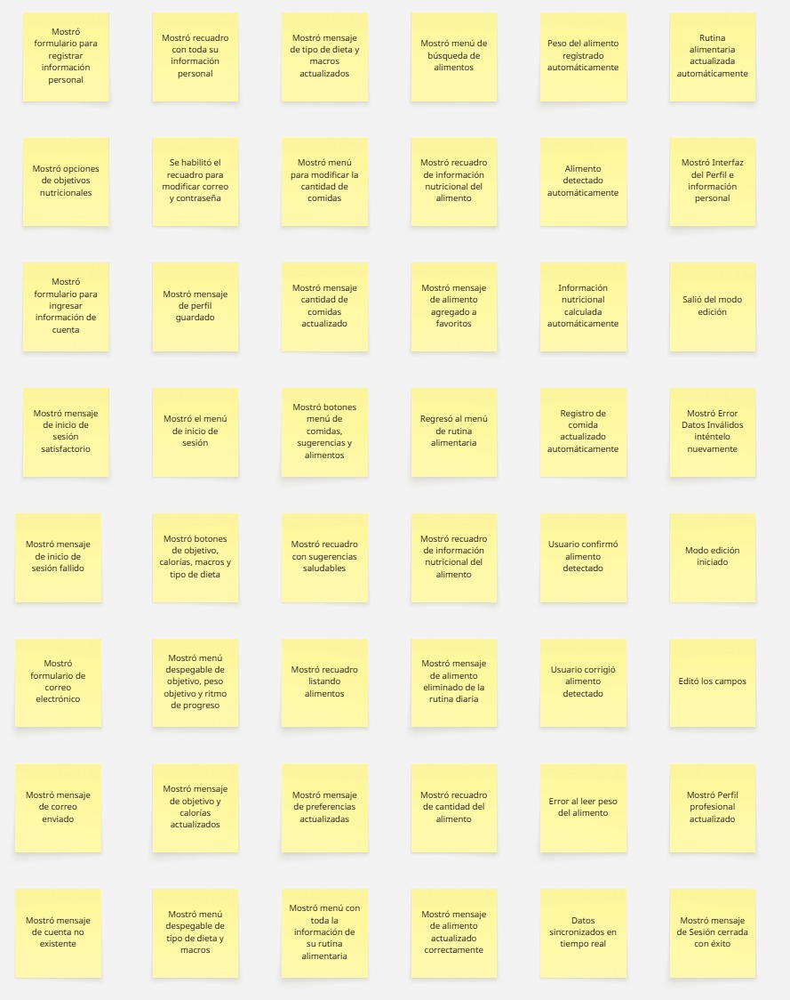

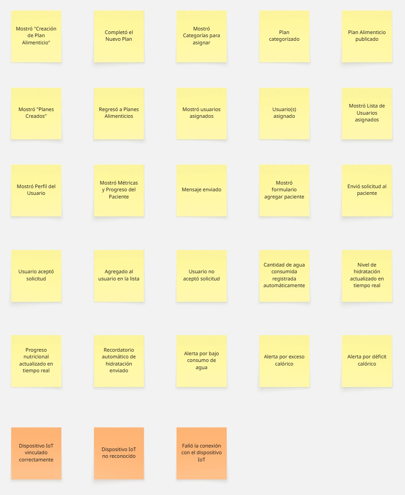

#### **Timeline Construction**

Una vez identificados todos los eventos, los organizamos en una línea de tiempo que
representa el flujo cronológico de interacción del usuario. Esto permitió entender el orden
natural de los procesos y cómo se relacionan entre sí.

---

1. Bounded Context: Inicio y Registro de Sesión 

Este flujo de eventos permite a los usuarios registrarse completando un formulario con sus
datos personales y preferencias nutricionales, o iniciar sesión si ya tienen cuenta. También
contempla el manejo de intentos fallidos de inicio de sesión y ofrece una opción para
recuperar el acceso mediante el envío de un correo si la cuenta no existe.

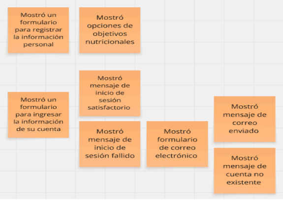

---

2. Bounded Context: Perfil de Usuario

Este flujo de eventos permite al usuario visualizar toda su información personal y, si lo desea,
habilitar la edición de datos sensibles como correo y contraseña. Para ello, primero debe
verificar su identidad a través del inicio de sesión. Al guardar los cambios, el sistema muestra
un mensaje de confirmación que asegura que la actualización fue exitosa y segura.

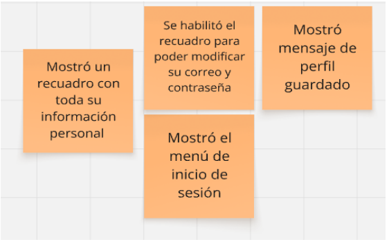

---

3. Bounded Context: Gestión de Objetivos

Este flujo de eventos está diseñado para permitir al usuario establecer y actualizar sus
objetivos de salud. El usuario puede acceder a opciones para modificar su objetivo, peso,
calorías, macros y tipo de dieta mediante menús desplegables. Estas acciones generan
mensajes de confirmación que validan los cambios realizados, lo que asegura que las
preferencias y metas del usuario se actualicen de manera secuencial y lógica, con un sistema
de retroalimentación claro.

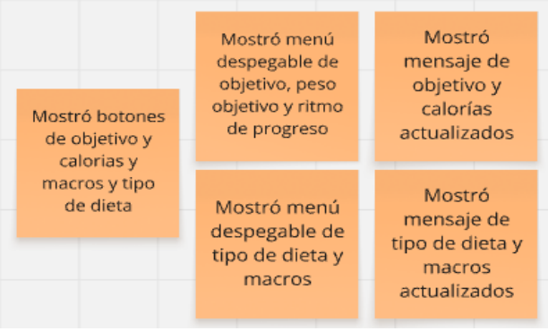

---

4. Bounded Context: Rutina Alimentaria

Este flujo de eventos describe cómo el sistema gestiona la rutina alimentaria del usuario de manera completamente automática mediante dispositivos IoT, como la balanza y el bebedero inteligente. A partir de la captura de datos en tiempo real, el sistema registra el peso del alimento consumido y detecta automáticamente el tipo de alimento.

Con esta información, se procesa y calcula la información nutricional correspondiente, incluyendo calorías y macronutrientes, permitiendo actualizar la rutina alimentaria del usuario de forma continua y precisa. El flujo contempla la sincronización en tiempo real y la generación de confirmaciones sobre los datos registrados, así como la gestión de posibles errores en la lectura o recepción de información, ofreciendo opciones de corrección cuando sea necesario.

Finalmente, el usuario puede visualizar su rutina alimentaria actualizada junto con los datos registrados automáticamente, asegurando un seguimiento eficiente y sin intervención manual.

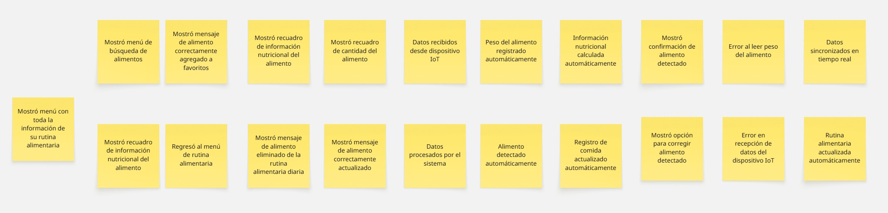

---

5. Bounded Context: IA Nutricional

Este flujo de eventos detalla el proceso de análisis inteligente de datos, donde la información nutricional cargada por el especialista es procesada por una IA para generar resúmenes automáticos y visualizaciones enriquecidas mediante gráficos avanzados. El sistema facilita la comunicación directa al enviar reportes detallados al paciente y mantener un historial de análisis actualizado, cerrando el ciclo con un reentrenamiento continuo del modelo basado en la nueva información recopilada para optimizar la precisión de futuras evaluaciones.

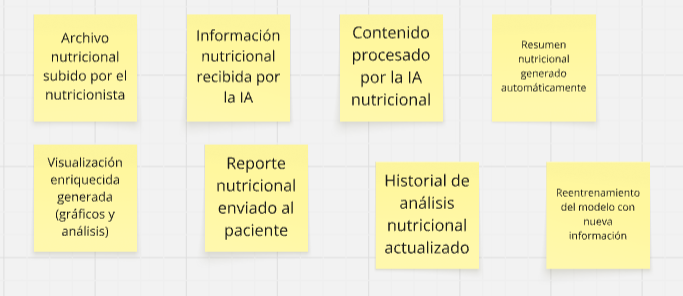

---

6. Bounded Context: Gestión de Planes Alimenticios 

Este flujo de eventos está diseñado para guiar al profesional de nutrición en la creación,
categorización, asignación y publicación de planes alimenticios, de manera ordenada y
eficiente.

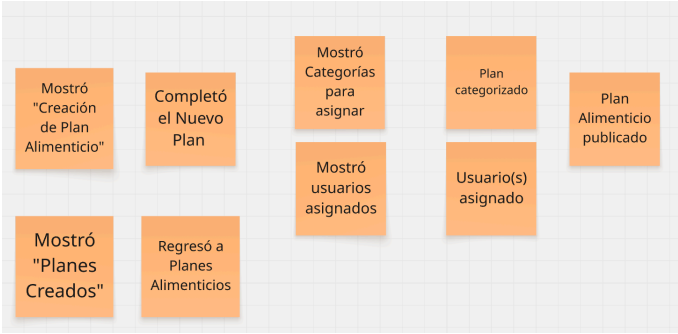

---

7. Bounded Context: Comunicación y Seguimiento

Este flujo de eventos está diseñado para facilitar al nutricionista la visualización, incorporación y seguimiento de pacientes, asegurando una experiencia clara, ordenada y centrada en la interacción profesional. Cada paso permite mantener una comunicación efectiva y un control preciso del progreso nutricional.

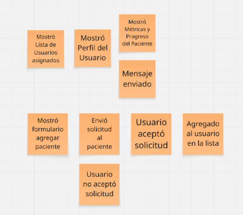

---

8. Bounded Context: Pagos

Este flujo de eventos describe el proceso integral de gestión de suscripciones y pagos, permitiendo a los usuarios seleccionar planes, procesar transacciones de manera segura y recibir confirmaciones automáticas sobre la activación o renovación de su servicio. El sistema integra un control detallado de estados que abarca desde la validación exitosa del pago hasta la gestión de errores y solicitudes de cancelación, garantizando que el usuario mantenga siempre visibilidad sobre su historial financiero y el estado actual de su membresía dentro de la plataforma.

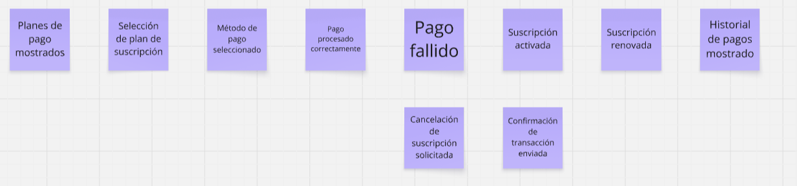

#### **Pivotal Points**

1

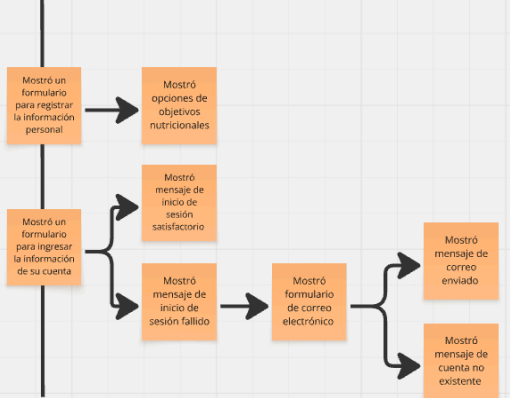

2

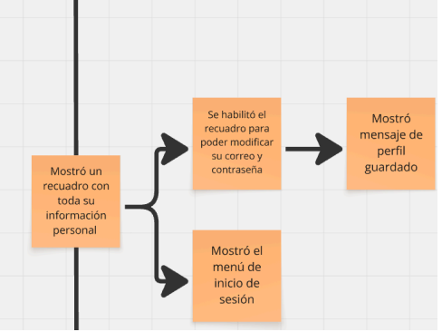

3

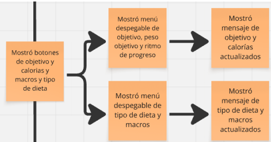

4

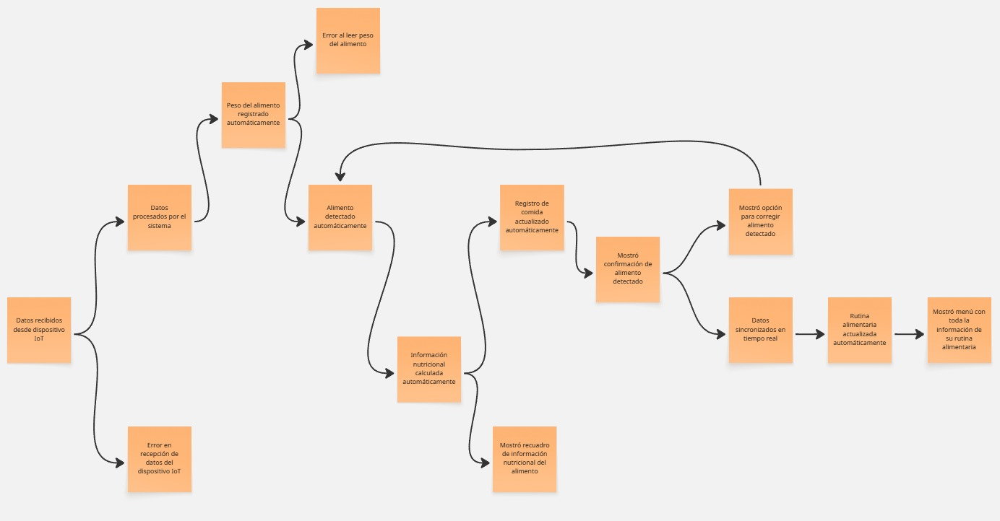

5

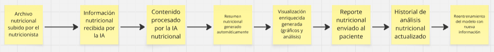

6

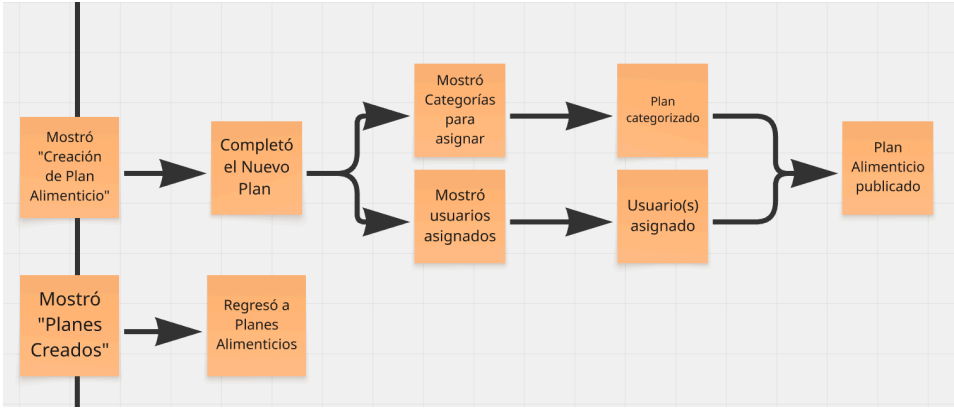

7

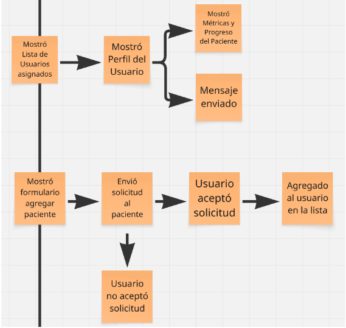

8

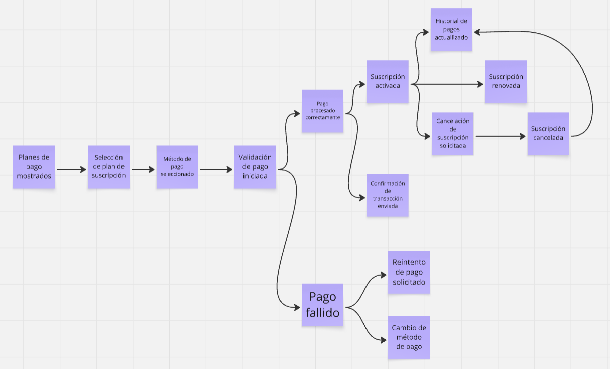

#### **Commands**

En esta etapa se establecen los comandos que representan las acciones que los usuarios
pueden realizar dentro del sistema. Estos comandos son esenciales para provocar eventos y
alterar el estado del sistema, y deben estar coherentemente relacionados con los eventos
definidos previamente. A continuación, se presentan los comandos relevantes para nuestro
dominio.

---
1. Bounded Context: Inicio y Registro de Sesión

El diagrama muestra un sistema que guía al usuario en tres procesos: registro de cuenta con
definición de objetivos nutricionales, inicio de sesión con verificación de credenciales y
opción de recuperación ante fallos, y recuperación de contraseña mediante el envío de un
correo para restablecerla.

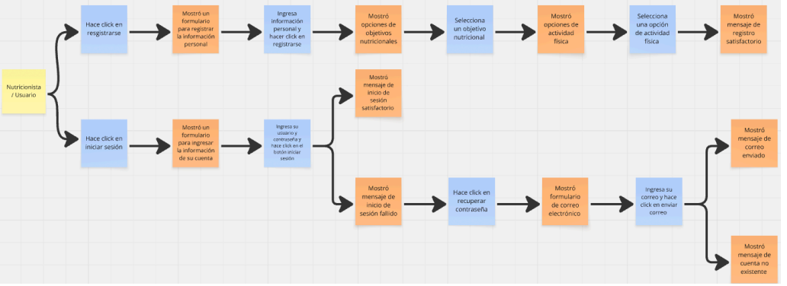

---

2. Bounded Context: Perfil de Usuario

El diagrama muestra el flujo donde el usuario, al acceder a su ícono, puede editar su perfil
—visualizando y modificando correo y contraseña con confirmación de cambios— o cerrar
sesión, siendo redirigido al menú de inicio de sesión.

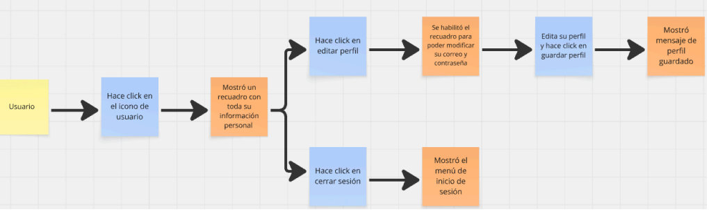

---

3. Bounded Context: Gestión de Objetivos 

El diagrama muestra cómo el usuario, desde su menú de objetivos, puede configurar su peso
y calorías o ajustar su tipo de dieta y macros, recibiendo en ambos casos una confirmación al
guardar los cambios.

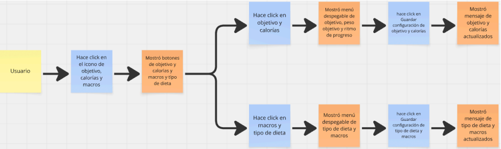

---

4. Bounded Context: Rutina Alimentaria 

El diagrama muestra cómo el sistema registra automáticamente los alimentos consumidos por el usuario mediante la interacción con un dispositivo IoT, el cual captura datos como el peso del alimento y los envía para su procesamiento. A partir de esta información, el sistema identifica el tipo de alimento y genera eventos como alimento detectado y peso registrado.

El flujo contempla el cálculo automático de la información nutricional, incluyendo calorías y macronutrientes, lo que permite actualizar la rutina alimentaria del usuario en tiempo real. Finalmente, estos datos son mostrados en la aplicación, brindando al usuario una visualización clara y actualizada de su consumo alimenticio.

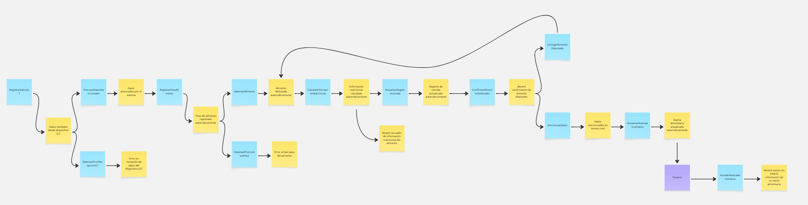

---

5. Bounded Context: IA Nutricional 

Este diagrama de flujo detalla el proceso mediante el cual un nutricionista gestiona el análisis de datos de sus pacientes, comenzando con la selección del usuario y la carga de su archivo nutricional para ser procesado por una IA especializada. El sistema guía al profesional a través de la solicitud de análisis y visualización de resultados, permitiendo generar resúmenes automáticos y gráficos enriquecidos que facilitan la interpretación de las métricas. Finalmente, el flujo concluye con el envío del reporte nutricional directamente al paciente y la actualización automática del historial de análisis, asegurando un seguimiento clínico organizado, eficiente y basado en datos precisos.

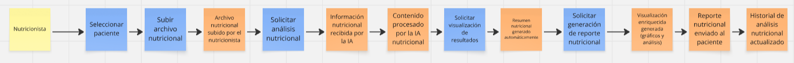

---

6. Bounded Context: Gestión de Planes Alimenticios 

El diagrama muestra cómo el nutricionista, desde su panel de gestión, puede crear nuevos
planes alimenticios, organizarlos por categorías, asignarlos a usuarios y publicarlos, todo
dentro de un flujo claro y estructurado. El proceso incluye opciones para cancelar o regresar
en cualquier momento, y se refuerza con actualizaciones y confirmaciones inmediatas que
aseguran una experiencia profesional eficiente.

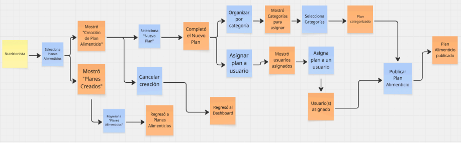

---

7. Bounded Context: Comunicación y Seguimiento

El diagrama muestra cómo el nutricionista puede gestionar su relación con los pacientes, accediendo a información clave, comunicándose directamente y agregando nuevos usuarios a su lista. El flujo contempla tanto la interacción con pacientes ya asignados como el proceso de incorporación de nuevos, con confirmaciones inmediatas que refuerzan la experiencia profesional.

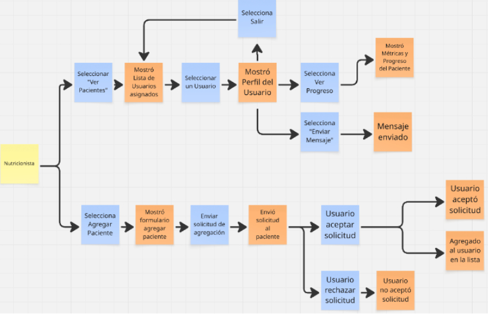

---

8. Bounded Context: Pagos

Este diagrama detalla el flujo de suscripción y gestión de pagos, el cual comienza cuando el usuario explora los planes disponibles y selecciona un método de pago para iniciar la validación de la transacción. El sistema gestiona de manera lógica dos vertientes: el éxito del pago, que deriva en la activación o renovación de la membresía y el envío de confirmaciones; y el escenario de pago fallido, que ofrece al usuario opciones inmediatas para reintentar la operación o cambiar el método de pago. Finalmente, el proceso asegura la integridad de la cuenta al actualizar el historial de pagos y permitir la gestión del ciclo de vida de la suscripción, incluyendo la solicitud de cancelación cuando sea necesario.

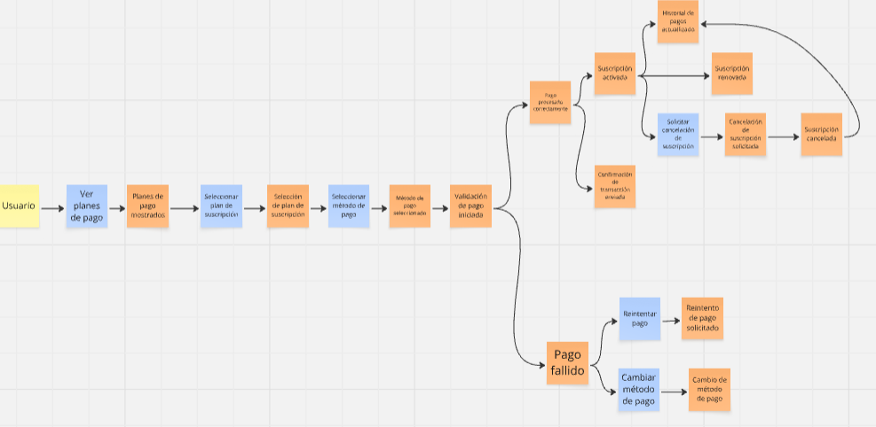

#### **Bounded Contexts**

Finalmente, agrupamos los eventos dentro de bounded contexts coherentes para definir
límites claros entre módulos y facilitar su desarrollo independiente. Esto permitirá que cada
contexto evolucione de forma desacoplada y con responsabilidades bien definidas.

#### **Bounded Context: Inicio y Registro de sesión**

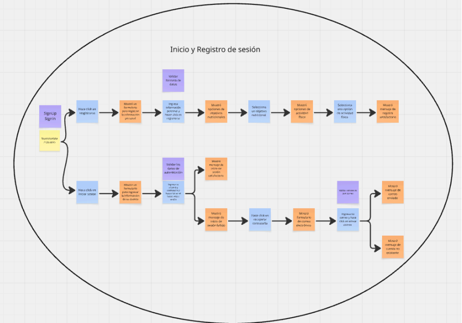

#### **Bounded Context: Perfil del Usuario**

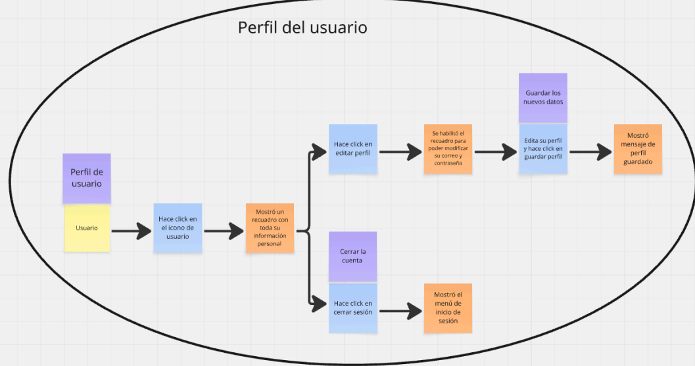

#### **Bounded Context: Gestión de Objetivos**

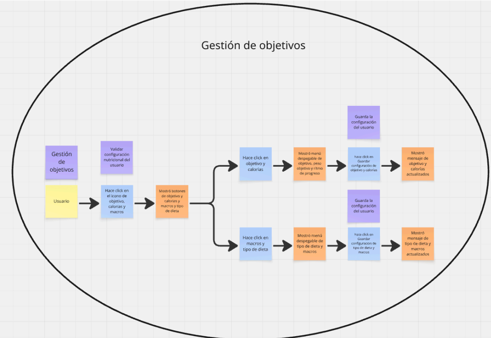

#### **Bounded Context: Rutina Alimentaria**

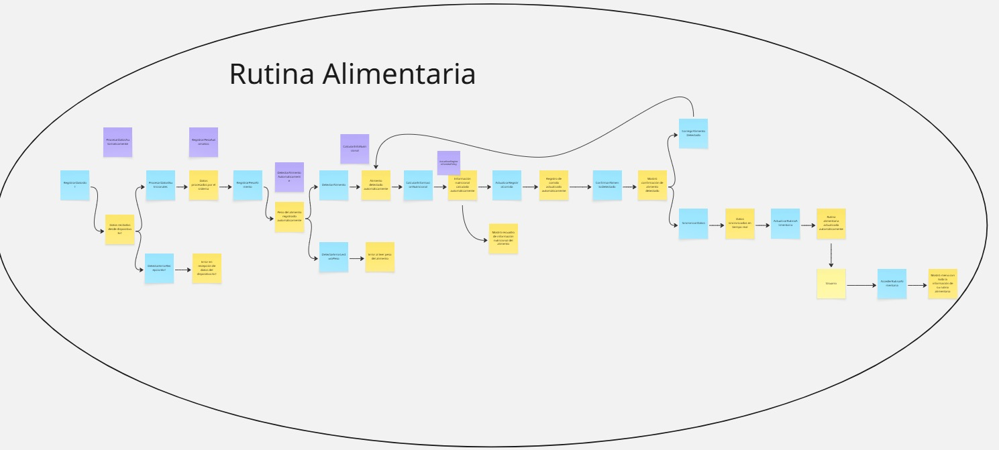

#### **Bounded Context: IA Nutricional**

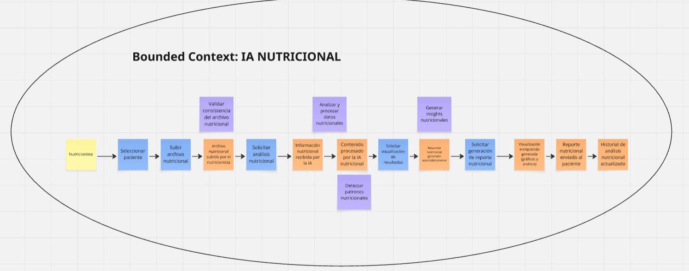

#### **Bounded Context: Gestión de Planes Alimenticios**

#### **Bounded Context: Comunicación y Seguimiento**

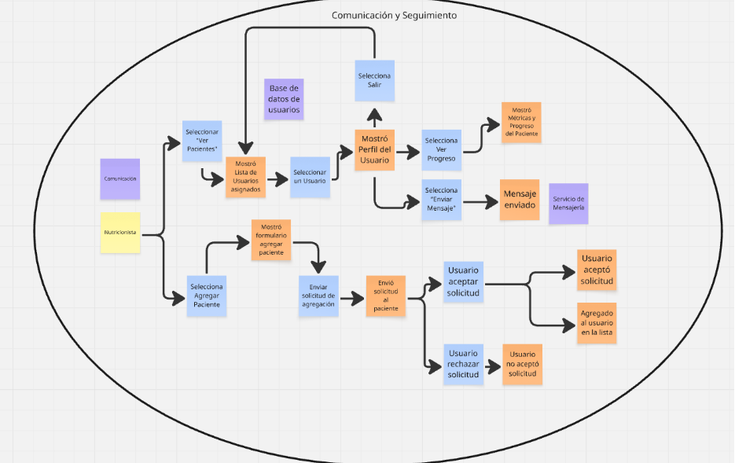

#### **Bounded Context: Pagos**

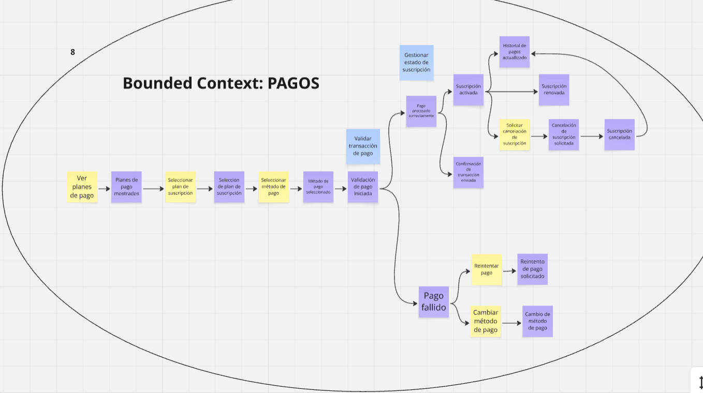

##### 4.1.1.2 Domain Message Flows Modeling.

El Modelado de Flujos de Mensajes de Dominio es una técnica fundamental para el análisis y diseño de sistemas complejos, ya que permite visualizar la transferencia de información y la orquestación entre componentes mediante el intercambio de mensajes. Este enfoque se centra en especificar las interacciones entre los diversos actores y componentes del sistema, facilitando la comprensión de sus dependencias y relaciones dinámicas.

La implementación de esta metodología proporciona una visión clara de las vías de comunicación, lo que resulta crucial para identificar cuellos de botella o posibles fallos en el diseño de manera temprana. A continuación, se presentan los diagramas de flujo de mensajes que ilustran cómo los Bounded Contexts cooperan entre sí para resolver los diferentes escenarios de negocio planteados en nuestra arquitectura.

### **Registro e inicio de sesión**

Este es un escenario donde el usuario desea registrarse o iniciar sesión en el sistema para acceder a su perfil nutricional.

El usuario envía el comando Registrar Cuenta o Iniciar Sesión al bounded context Inicio y Registro de Sesión, proporcionando datos como correo electrónico, contraseña, usuario, objetivo nutricional y nivel de actividad física.

Al confirmarse la operación, se emiten los eventos Cuenta Registrada o Sesión Iniciada, los cuales son recibidos por el bounded context Perfil del Usuario, donde se gestiona la información del usuario.

Finalmente, el sistema muestra el perfil del usuario en la aplicación móvil, permitiendo el acceso a sus funcionalidades personalizadas.

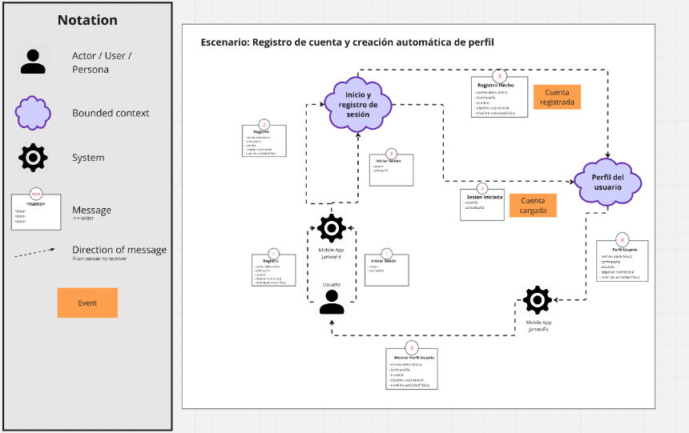

### **Registro automático de alimentos (IoT)**

Este es un escenario donde el sistema registra automáticamente el consumo alimentario del usuario mediante el uso de un dispositivo IoT.

El dispositivo IoT envía el comando Registrar Datos IoT al bounded context Rutina Alimentaria Inteligente, donde se procesan datos como el peso del alimento y se detecta automáticamente el tipo de alimento consumido.

Como resultado, se generan eventos como Alimento Detectado y Peso Registrado, los cuales permiten calcular la información nutricional del alimento consumido.

Finalmente, se emite el evento Rutina Alimentaria Actualizada, actualizando automáticamente el registro diario del usuario en el sistema.

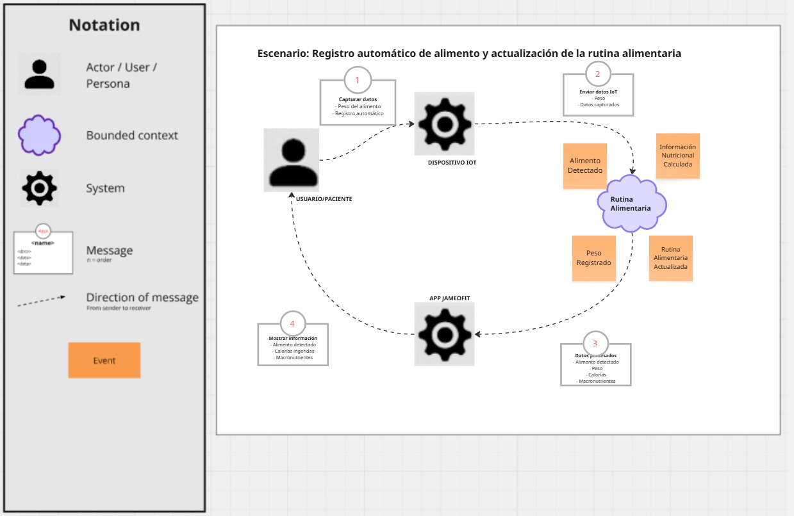

### **Análisis inteligente y seguimiento proactivo**

Este es un escenario donde el sistema utiliza inteligencia artificial para procesar la información nutricional del usuario, monitorear su evolución y generar alertas automáticas.

El Bounded Context Rutina Alimentaria envía los datos de consumo diario, como las métricas de ingesta y macronutrientes, al Bounded Context IA Nutricional. A partir de esta información, el motor de IA evalúa el progreso del usuario comparándolo con sus metas y genera hechos inmutables como Progreso Nutricional Actualizado, Alerta de Exceso Calórico, Alerta de Déficit Calórico o Nivel de Hidratación Actualizado.

Estos eventos son recibidos por el Bounded Context Comunicación y Seguimiento, el cual organiza la información para la supervisión del nutricionista. Finalmente, las alertas y resúmenes son enviados al usuario mediante notificaciones en la App JameoFit, permitiendo un seguimiento continuo, preventivo y altamente personalizado de su estado nutricional.

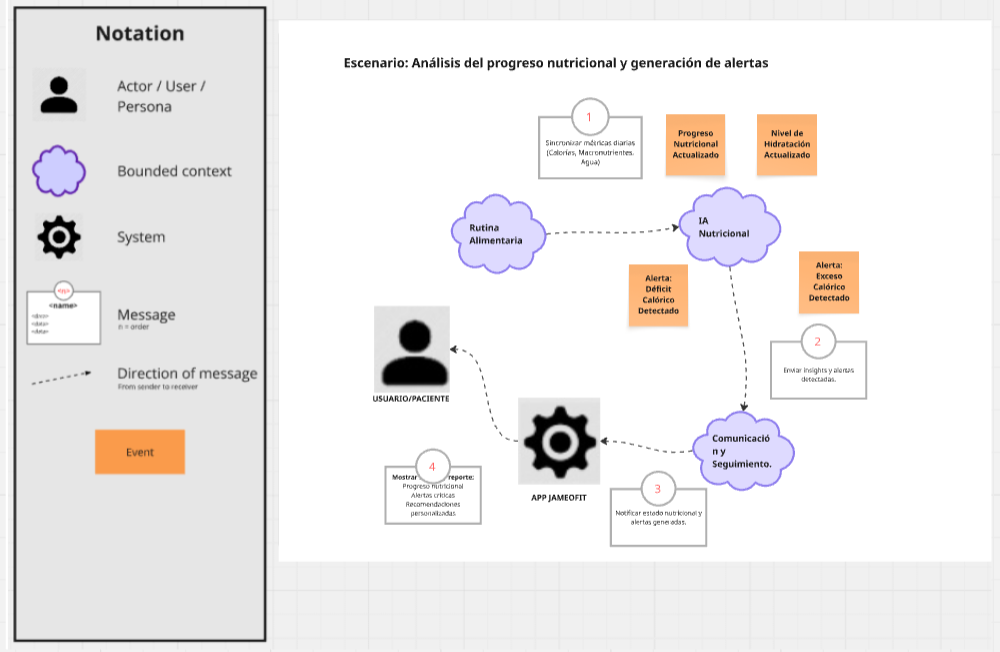

##### 4.1.1.3 Bounded Context Canvases.

El Bounded Context Canvas es un recurso gráfico dentro del enfoque Domain-Driven Design
(DDD) que facilita la definición, comprensión y comunicación precisa de los límites,
funciones y componentes esenciales de un Bounded Context. Su uso permite al equipo
mantener una visión común del dominio, reconociendo entidades, eventos, comandos y
conexiones con otros contextos. Asimismo, gracias a las convenciones que establece,
posibilita construir un diseño modular y coherente del sistema.

##  **Bounded Context –  INICIO Y REGISTRO DE SESION**

### **Description**

En este bounded context se gestionan los procesos de creación de cuentas de usuario,
validación de credenciales durante el inicio de sesión y recuperación de contraseñas mediante
correo electrónico.

### **Strategic Classification**

Su clasificación estratégica se divide en:

**● Generic:**  
Este bounded context es genérico porque, aunque no aporta directamente a
la nutrición, es esencial como capa base de acceso a todos los demás contextos.

**● Engagement:**  
Su modelo de negocio está enfocado en garantizar la continuidad y
acceso fluido del usuario al sistema.

**● Genesis:**  
Se considera genesis porque representa el punto inicial sobre el cual se
construyen y habilitan los demás contextos.

### **Domain Role**

Asume el rol de execution context, validando credenciales y gestionando el registro, y de
gateway context, al controlar el acceso al ecosistema de la aplicación.

### **Inbound Communication**

● El usuario puede registrar una cuenta, iniciar sesión o recuperar contraseña.

**Outbound Communication**

● Una CuentaRegistrada habilita la creación del perfil del usuario.

● Un UsuarioAutenticado habilita el acceso a otros bounded contexts como Perfil del
Usuario o Rutina Alimentaria.

### **Capability Analysis**

● Registro de cuenta: permite almacenar la identidad del usuario en el sistema.

● Validación de credenciales: garantiza la seguridad y continuidad del acceso.

● Recuperación de contraseña: facilita que el usuario recupere su sesión en caso de
pérdida de acceso.

● Integración con Perfil del Usuario: permite encadenar el registro de cuenta con la
configuración inicial del perfil.

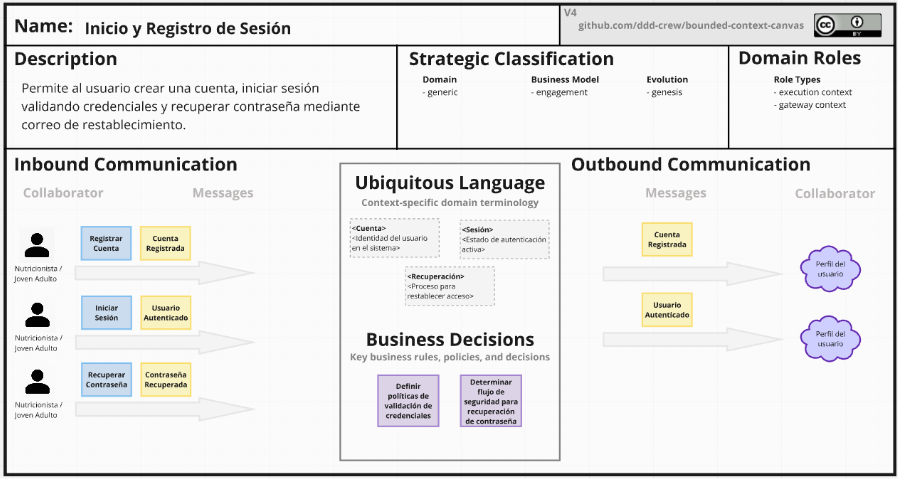

##  **Bounded Context –  PERFIL DE USUARIO**

### **Description**

En este bounded context se gestiona la información personal del usuario, como correo
electrónico y contraseña, y se administra la acción de cerrar sesión.

### **Strategic Classification**

Su clasificación estratégica se divide en:

**● Supporting:**  
Es un contexto de soporte que facilita la personalización y continuidad
de la experiencia.

**● Engagement:**
Favorece la interacción al permitir al usuario editar sus datos básicos.

**● Product:** 
Se considera un producto establecido que da valor al ecosistema al mantener
la información actualizada.

### **Domain Role**

Asume el rol de execution context, pues ejecuta la gestión directa del perfil y los procesos de
cierre de sesión.

**Inbound Communication**

● El usuario puede editar su perfil.

● El usuario puede cerrar sesión.

### **Outbound Communication**

● PerfilActualizado → enviado al bounded context de comunicación y seguimiento del
nutricionista (u otros contextos interesados en datos del usuario).

**Capability Analysis**

● Edición de datos básicos: correo y contraseña.

● Validación de cambios críticos (ej. correos únicos).

● Cierre de sesión con redirección al login.

● Sincronización con otros bounded contexts que dependan del perfil actualizado del
usuario.

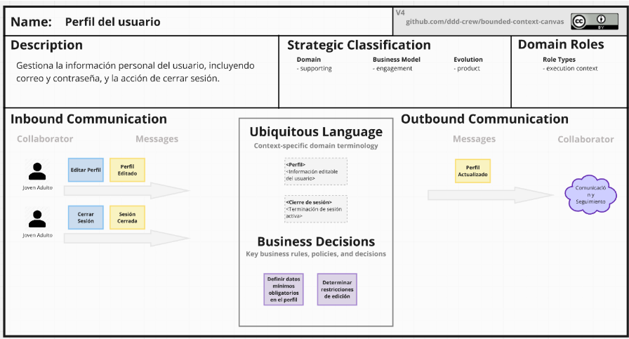

## **Bounded Context -  GESTION DE OBJETIVOS**

### **Description**
Este *bounded context* permite configurar y administrar las **metas nutricionales** del usuario, incluyendo el peso objetivo, las calorías y la velocidad de progreso, asegurando su persistencia y confirmación dentro del sistema.

### **Strategic Classification**
La clasificación estratégica de este contexto se divide en tres pilares fundamentales:

● **Core:** Es un contexto central, ya que define el eje de personalización nutricional del usuario.
● **Engagement:** Fomenta la adherencia del usuario al permitirle establecer y seguir objetivos claros.
*● **Custom Built:** Su evolución es a medida, debido a que cada usuario configura objetivos distintos que requieren una lógica personalizada.

### **Domain Role**
Asume el rol de **Execution Context**, ya que es el encargado de administrar y procesar directamente los datos de los objetivos nutricionales.

### **Communication Flow**

#### **Inbound Communication**
● **Usuario:** El usuario puede configurar parámetros críticos como peso, calorías y macronutrientes.

#### **Outbound Communication**
● **ObjetivosActualizados:** Eventos enviados hacia el contexto de **Rutina Alimentaria** para ajustar dinámicamente las sugerencias y los cálculos de ingesta.

### **Capability Analysis**
● **Configuración inicial:** Establecimiento de metas nutricionales tras el registro del usuario.
● **Ajuste dinámico:** Actualización de metas cuando ocurren cambios en el perfil del usuario.
● **Reglas de cálculo:** Implementación de lógica para determinar calorías y macros de forma personalizada.
● **Sincronización:** Asegurar la consistencia de los cambios mediante la comunicación con el contexto de Rutina Alimentaria.

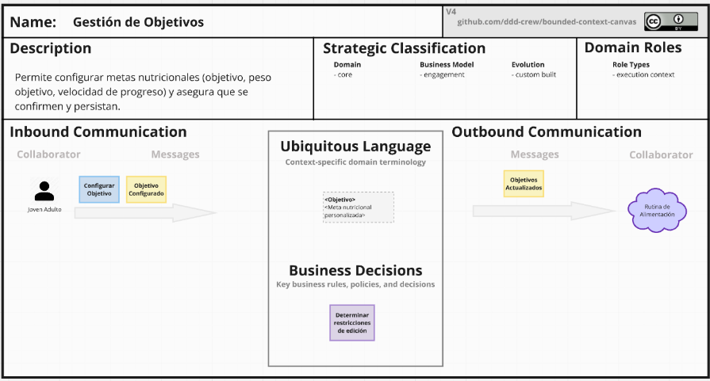

##  **Bounded Context – Rutina Alimentaria**

### **Description**

Este bounded context permite gestionar de forma automatizada la rutina alimentaria del usuario mediante la integración con dispositivos IoT, registrando alimentos, detectando su tipo, calculando información nutricional y actualizando la rutina en tiempo real sin intervención manual.  

### **Strategic Classification**

Su clasificación estratégica se divide en:  
● **Core:** Es central porque automatiza el registro y control de la alimentación mediante datos reales.  
● **Engagement:** Fomenta la interacción continua del usuario a través de retroalimentación automática y visualización en tiempo real.  
● **Custom Built:** Es evolutivo y adaptable según los hábitos del usuario y los datos capturados por dispositivos IoT.  

### **Domain Role**

Asume el rol de **execution context**, al ejecutar automáticamente el registro de alimentos, y de **analysis context**, al procesar datos y calcular información nutricional en tiempo real.

### **Inbound Communication**

● El sistema recibe datos desde dispositivos IoT.  
● El sistema procesa datos nutricionales automáticamente.  
● El sistema detecta alimentos de forma automática.  
● El sistema registra el peso del alimento automáticamente.  
● El usuario puede corregir alimentos detectados.  
● El sistema gestiona errores en la recepción de datos IoT.  

### **Outbound Communication**

● DatosProcesados, AlimentoDetectado, PesoRegistrado → enviados al contexto de monitoreo nutricional.  
● InformacionNutricionalCalculada → enviada para análisis y visualización.  
● RutinaAlimentariaActualizada → enviada a la aplicación para visualización del usuario.  
● ErroresIoTDetectados → enviados a sistemas de monitoreo y soporte.  

### **Capability Analysis**

● Registro automático de alimentos mediante dispositivos IoT.  
● Detección inteligente de alimentos y cálculo nutricional en tiempo real.  
● Sincronización de datos en tiempo real con la aplicación.  
● Manejo de errores en la captura de datos físicos.  
● Reducción de intervención manual del usuario.  

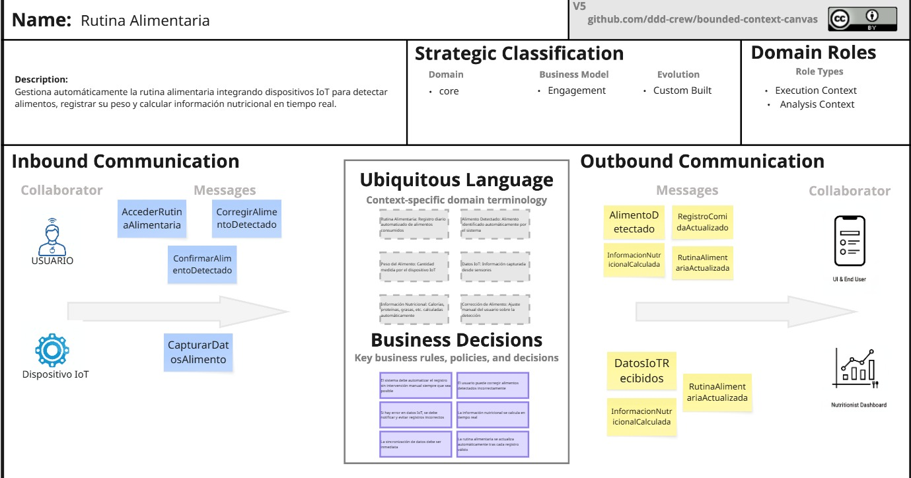

## **Bounded Context – IA Nutricional**

### **Description**
Este Bounded Context representa el motor de inteligencia del sistema, especializado en el procesamiento y análisis avanzado de datos nutricionales. Su función principal es transformar archivos y métricas crudas en información estructurada, resúmenes automáticos y visualizaciones analíticas. Además, gestiona el ciclo de vida del modelo de aprendizaje, permitiendo su reentrenamiento para mejorar la precisión de las recomendaciones y diagnósticos preventivos.

### **Strategic Classification**
Su clasificación estratégica se divide en:  
● **Core:** Es la ventaja competitiva tecnológica, ya que automatiza el análisis denso que un nutricionista realizaría manualmente.  
● **Custom Built:** Desarrollado a medida para adaptarse a los algoritmos específicos de nutrición y salud del sistema.

### **Domain Role**
Asume el rol de **Analysis Context**, al interpretar datos complejos para generar *insights*, y de **Service Context**, al proveer servicios de procesamiento inteligente a otros módulos del ecosistema.

### **Inbound Communication**
● **Recepción de Archivos:** Obtiene los documentos nutricionales cargados por el profesional para su lectura.  
● **Solicitud de Análisis:** Comando disparado por el nutricionista para iniciar el procesamiento de la IA.  
● **Ingesta de Métricas:** Recibe datos de hidratación y consumo calórico para su evaluación en tiempo real.  
● **Retroalimentación de Datos:** Entrada de nueva información validada para el proceso de reentrenamiento del modelo.

### **Outbound Communication**
● **ContenidoProcesado:** Evento que indica que la IA ha terminado de extraer la información relevante.  
● **ResumenGenerado:** Notifica la disponibilidad de una síntesis textual sobre el estado del paciente.  
● **AnalisisVisualListo:** Envía los datos estructurados necesarios para renderizar gráficos y tablas.  
● **ModeloActualizado:** Informa que el sistema ha completado un ciclo de reentrenamiento con nuevos datos.

### **Capability Analysis**
● **Procesamiento de Datos no Estructurados:** Capacidad de extraer información clínica desde diversos formatos de archivos.  
● **Generación de Insights Automáticos:** Creación de resúmenes diagnósticos basados en patrones detectados.  
● **Modelado Predictivo:** Identificación de tendencias en el peso o salud del paciente a largo plazo.  
● **Aprendizaje Continuo (Reentrenamiento):** Mejora constante del algoritmo basada en la acumulación de nuevos casos y datos históricos.  
● **Soporte Analítico de Decisiones:** Provee la base técnica para que el nutricionista valide sus planes alimenticios.

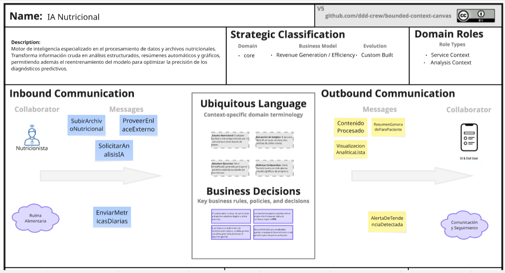

##  **Bounded Context – Comunicación y seguimiento**

### **Description**

Bounded Context centralizado en la gestión operativa de la relación médico-paciente. Permite al nutricionista administrar su cartera de clientes, supervisar perfiles individuales y mantener un canal de comunicación directo y organizado. Su objetivo es facilitar el flujo de información administrativa y clínica, asegurando que la incorporación de nuevos pacientes y el seguimiento de los actuales sea fluido y profesional.

### **Strategic Classification**

Su clasificación estratégica se divide en:  
● **Core:** Es fundamental para la operación del negocio, ya que gestiona el activo más importante: la relación y los datos del paciente.  
● **Engagement:** Fortalece la retención mediante la comunicación directa y el feedback constante entre el profesional y el usuario.

### **Domain Role**

Asume el rol de Management Context, al organizar la jerarquía y asignación de pacientes, y de Communication Context, al servir como el puente de mensajes y solicitudes entre los actores del sistema.

### **Inbound Communication**

● Gestión de Cartera: El nutricionista visualiza y filtra su lista de pacientes asignados.

● Consulta de Expediente: Acceso a perfiles, métricas históricas y datos de contacto.

● Gestión de Solicitudes: Envío de invitaciones para vincular a nuevos pacientes al sistema.

● Interacción Directa: Envío de mensajes, recomendaciones manuales y recordatorios.

● Respuesta del Paciente: Aceptación o rechazo de vinculación al nutricionista.

### **Outbound Communication**

● PacienteVinculado: Notifica al sistema de gestión que un nuevo usuario ha sido aceptado con éxito.

● MensajeEntregado: Confirma que la comunicación ha llegado al dispositivo del paciente.

● SolicitudDeSeguimientoEnviada: Notifica al sistema de notificaciones para disparar un correo o alerta al cliente.

● PerfilActualizado: Informa sobre cambios realizados en la información base del paciente.

### **Capability Analysis**

● Administración de Pacientes: Control total sobre la lista de usuarios y su estado (activo/inactivo).

● Gestión de Solicitudes de Vinculación: Flujo de trabajo para expandir la base de clientes de forma organizada.

● Centralización de Información Clínica: Visualización consolidada de métricas y perfiles de usuario.

● Comunicación Bidireccional: Canal seguro para el intercambio de información y resolución de dudas.

● Soporte a la Toma de Decisiones: Acceso rápido a la historia del paciente para ajustar el tratamiento de forma manual.

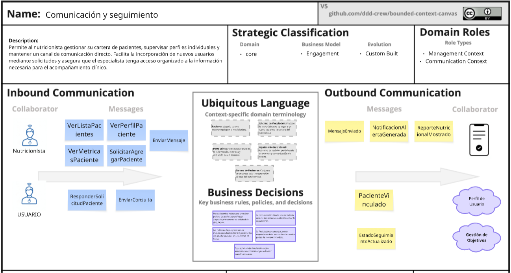

#### 4.1.2. Context Mapping.

El *Context Mapping* es una técnica fundamental dentro del enfoque **Domain-Driven Design (DDD)** que permite identificar, analizar y representar las relaciones e interacciones entre los distintos *bounded contexts* del sistema. A través de este proceso, se logra visualizar cómo fluye la información, qué contextos dependen de otros y qué tipo de relación existe entre ellos, facilitando así el diseño de una arquitectura clara, modular y escalable.

En el caso de nuestro sistema de **gestión nutricional inteligente**, el Context Mapping permite comprender cómo los distintos dominios —desde la autenticación hasta el monitoreo nutricional— colaboran para ofrecer una experiencia integrada tanto para usuarios como para nutricionistas. Esta representación también ayuda a identificar responsabilidades, dependencias y posibles puntos de mejora en la comunicación entre contextos.

Se identificaron los siguientes *bounded contexts* en el sistema:

Aquí tienes la actualización completa de tus **Bounded Contexts** y sus **Relaciones**, ajustada a la lógica actual donde la IA procesa información y la Comunicación se centra en la gestión profesional.

---

## **Bounded Contexts Identificados**

1.  **Inicio y Registro de Sesión (IAM):** Gestiona la autenticación, el registro de diferentes roles (paciente/nutricionista) y la seguridad de acceso a la plataforma.
2.  **Perfil de Usuario:** Administra la información personal, datos demográficos y la configuración de cuenta de los usuarios.
3.  **Gestión de Objetivos:** Permite definir metas nutricionales específicas (peso, macronutrientes, calorías) que sirven como base para el análisis.
4.  **Rutina Alimentaria:** Registra el consumo diario de alimentos y agua, funcionando como la fuente de datos en tiempo real sobre el comportamiento del usuario.
5.  **IA Nutricional:** Motor de procesamiento que analiza archivos, links y métricas de rutina para generar resúmenes automáticos y visualizaciones enriquecidas.
6.  **Gestión de Planes Alimenticios:** Permite a los nutricionistas diseñar y asignar estructuras de alimentación personalizadas a sus pacientes.
7.  **Comunicación y Seguimiento:** Gestiona la relación profesional, permitiendo la vinculación de pacientes, el envío de mensajes y la supervisión del estado clínico.
8.  **Pagos:** Administra las suscripciones a los planes de la plataforma, procesando transacciones y gestionando el acceso a funciones premium.

---

## **Relaciones entre Bounded Contexts**

| Destino (Downstream) | Origen (Upstream) | Tipo de Relación | Comentario |
| :--- | :--- | :--- | :--- |
| **Perfil de Usuario** | **Inicio y Registro** | Customer/Supplier | IAM provee la identidad necesaria para crear y gestionar el perfil. |
| **IA Nutricional** | **Rutina Alimentaria** | Customer/Supplier | La IA consume los logs diarios de consumo para generar análisis de tendencias. |
| **IA Nutricional** | **Gestión de Objetivos** | Customer/Supplier | Utiliza las metas definidas como referencia para evaluar si el progreso es positivo. |
| **Comunicación y Seguimiento** | **IA Nutricional** | Customer/Supplier | Recibe los resúmenes e insights generados por la IA para que el nutricionista los valide. |
| **Comunicación y Seguimiento** | **Perfil de Usuario** | Customer/Supplier | Obtiene los datos básicos de los pacientes para organizar la cartera del nutricionista. |
| **Gestión de Planes** | **Gestión de Objetivos** | Customer/Supplier | Los planes se diseñan en función de los objetivos nutricionales del paciente. |
| **Rutina Alimentaria** | **Gestión de Planes** | Customer/Supplier | La rutina diaria del usuario se guía por el plan alimenticio asignado. |
| **Comunicación y Seguimiento** | **Gestión de Objetivos** | Partnership | Colaboran para ajustar metas manualmente según la evolución del paciente. |
| **Pagos** | **Inicio y Registro** | Customer/Supplier | El acceso a los servicios de pago depende de una sesión de usuario válida. |
| **Todos los Contextos** | **Inicio y Registro** | Shared Kernel | La autenticación es un núcleo compartido que garantiza la seguridad en todo el sistema. |
| **IA Nutricional** | **Fuentes Externas (Links/PDF)** | Anticorruption Layer | La IA usa una capa de traducción para procesar datos externos sin ensuciar el modelo interno. |

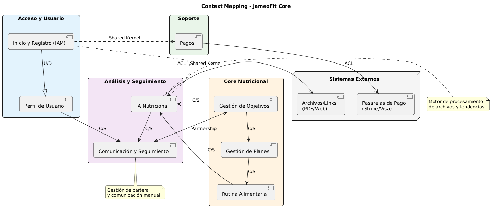

#### 4.1.3. Software Architecture.

En esta sección se presenta la arquitectura de software del sistema JameoFit, una solución integral orientada al seguimiento nutricional inteligente mediante el uso de tecnologías como IoT, procesamiento de datos en tiempo real e integración con servicios externos.

Para su representación, se utiliza el modelo C4 (Context, Container, Component y Code), el cual permite describir la arquitectura del sistema en diferentes niveles de abstracción, facilitando la comprensión tanto técnica como funcional. A través de estos diagramas, se muestra cómo los distintos actores interactúan con el sistema, cómo se organizan los contenedores principales y cómo se estructuran los componentes internos.

Asimismo, esta arquitectura refleja la evolución del sistema hacia un enfoque moderno basado en eventos, integración con dispositivos físicos y procesamiento automatizado de información nutricional, permitiendo ofrecer una experiencia más precisa, escalable y centrada en el usuario.

El objetivo de esta sección es proporcionar una visión clara de cómo el sistema está diseñado, cómo fluye la información entre sus partes y cómo se soportan los requerimientos funcionales y no funcionales del proyecto.

##### 4.1.3.1. Software Architecture System Landscape Diagram.

Este diagrama muestra que JameoFit opera en un ecosistema donde interactúan distintos actores como el Usuario/Paciente, el Nutricionista, el Owner/Admin y el IT Support, quienes utilizan el sistema para el seguimiento, supervisión y gestión de la plataforma.

El sistema principal, JameoFit Core, centraliza la lógica de negocio y procesa datos provenientes de dispositivos IoT, permitiendo automatizar el registro y análisis nutricional.

Además, se integra con servicios externos como Stripe API para pagos, un Servicio de Notificaciones para alertas en tiempo real y Bases de Datos Nutricionales para validar la información alimentaria.

Este diagrama refleja cómo el sistema combina interacción de usuarios, dispositivos físicos y servicios externos para brindar una solución eficiente y automatizada.

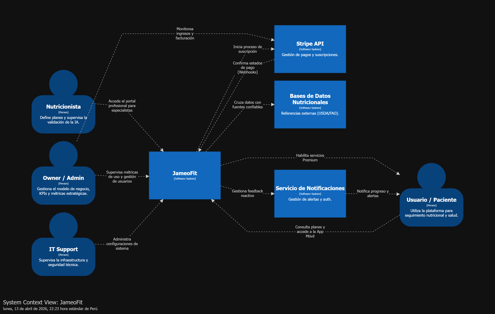

##### 4.1.3.2. Software Architecture Context Level Diagrams.

Este diagrama muestra que JameoFit interactúa con distintos actores como el Usuario/Paciente, quien utiliza la aplicación y dispositivos IoT para el seguimiento nutricional; el Nutricionista, quien supervisa y valida la información; el Owner/Admin, encargado de la gestión del negocio; y el IT Support, responsable del mantenimiento técnico.

El sistema también se integra con un Dispositivo IoT (sensores) que permite capturar datos en tiempo real sobre el consumo del usuario, automatizando el registro alimentario.

Asimismo, se conecta con servicios externos como Stripe API para la gestión de pagos, el Servicio de Notificaciones para el envío de alertas en tiempo real y las Bases de Datos Nutricionales para validar la información alimentaria.

Este diagrama proporciona una visión general del sistema, mostrando cómo JameoFit se integra con actores, dispositivos físicos y servicios externos.

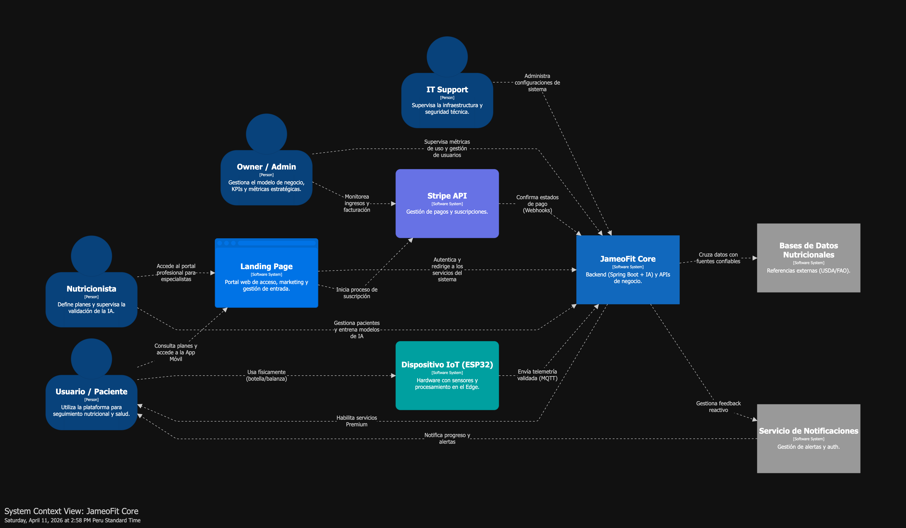

##### 4.1.3.2. Software Architecture Container Level Diagrams.

El Diagrama de Contenedores de JameoFit App muestra la descomposición del sistema en sus principales contenedores de software, así como la interacción entre estos, los actores del sistema y los servicios externos.

En este nivel, se identifican:

● Landing Page: Portal web que permite el acceso al sistema, registro, autenticación y gestión de suscripciones por parte de los usuarios y nutricionistas.

● Mobile Application: Aplicación móvil que permite al usuario visualizar su rutina alimentaria, métricas nutricionales y recibir notificaciones en tiempo real.

● JameoFit Core: Backend central desarrollado en Spring Boot que procesa la lógica de negocio, gestiona APIs, integra procesamiento inteligente (IA) y orquesta la comunicación entre los diferentes componentes del sistema.

● Database: Almacena información de usuarios, pacientes, métricas nutricionales, rutinas alimentarias y planes.

● Módulos internos del backend:  
○ Módulo de Seguimiento: Procesa métricas nutricionales y datos en tiempo real.  
○ Módulo de Planes y Dietas: Gestiona la creación y asignación de planes personalizados.  
○ Módulo de Usuarios: Administra autenticación, perfiles y roles.  
○ Módulo de Logros: Gestiona metas, progreso e incentivos del usuario.  

● Sistemas externos:  
○ Dispositivo IoT: Captura datos físicos del usuario y los envía al sistema en tiempo real.  
○ Stripe API: Gestiona pagos, suscripciones y facturación.  
○ Servicio de Notificaciones: Envía alertas y recordatorios en tiempo real.  
○ Bases de Datos Nutricionales: Proveen información externa para validar y enriquecer los datos alimentarios.  

Este diagrama proporciona una visión técnica detallada del sistema, mostrando cómo los diferentes contenedores, dispositivos y servicios externos colaboran para cumplir los objetivos funcionales y no funcionales de la aplicación, destacando la integración con IoT y el procesamiento automatizado de información.

##### 4.1.3.3. Software Architecture Deployment Diagrams.

Los Deployment Diagrams (diagramas de despliegue) forman parte de la arquitectura de
software y son esenciales para representar cómo los componentes del sistema se distribuyen
físicamente en el entorno de ejecución. Estos diagramas muestran la disposición de hardware
(nodos) y la manera en que los artefactos de software se instalan en ellos, permitiendo
visualizar la infraestructura que soporta la aplicación. Su propósito principal es ilustrar la
relación entre el software y el hardware, detallando aspectos como servidores, dispositivos de
red, bases de datos, y cómo interactúan entre sí.

### 4.2. Tactical-Level Domain-Driven Design

#### 4.2.1. Bounded Context: Inicio y Registro de Sesión

##### 4.2.1.1. Domain Layer.

##### 4.2.1.2. Interface Layer.

##### 4.2.1.3. Application Layer.

##### 4.2.1.4. Infrastructure Layer.

##### 4.2.1.5. Bounded Context Software Architecture Component Level Diagrams.

##### 4.2.1.6. Bounded Context Software Architecture Code Level Diagrams.

###### 4.2.1.6.1. Bounded Context Domain Layer Class Diagrams.

###### 4.2.1.6.2. Bounded Context Database Design Diagram.

#### 4.2.2. Bounded Context: Perfil de Usuario

##### 4.2.2.1. Domain Layer.

##### 4.2.2.2. Interface Layer.

##### 4.2.2.3. Application Layer.

##### 4.2.2.4. Infrastructure Layer.

##### 4.2.2.5. Bounded Context Software Architecture Component Level Diagrams.

##### 4.2.2.6. Bounded Context Software Architecture Code Level Diagrams.

###### 4.2.2.6.1. Bounded Context Domain Layer Class Diagrams.

###### 4.2.2.6.2. Bounded Context Database Design Diagram.

#### 4.2.3. Bounded Context: Gestión de Objetivos

##### 4.2.3.1. Domain Layer.

##### 4.2.3.2. Interface Layer.

##### 4.2.3.3. Application Layer.

##### 4.2.3.4. Infrastructure Layer.

##### 4.2.3.5. Bounded Context Software Architecture Component Level Diagrams.

##### 4.2.3.6. Bounded Context Software Architecture Code Level Diagrams.

###### 4.2.3.6.1. Bounded Context Domain Layer Class Diagrams.

###### 4.2.3.6.2. Bounded Context Database Design Diagram.

#### 4.2.4. Bounded Context: Rutina Alimentaria

##### 4.2.4.1. Domain Layer.

##### 4.2.4.2. Interface Layer.

##### 4.2.4.3. Application Layer.

##### 4.2.4.4. Infrastructure Layer.

##### 4.2.4.5. Bounded Context Software Architecture Component Level Diagrams.

##### 4.2.4.6. Bounded Context Software Architecture Code Level Diagrams.

###### 4.2.4.6.1. Bounded Context Domain Layer Class Diagrams.

###### 4.2.4.6.2. Bounded Context Database Design Diagram.

#### 4.2.5. Bounded Context: Nutricionista

##### 4.2.5.1. Domain Layer.

##### 4.2.5.2. Interface Layer.

##### 4.2.5.3. Application Layer.

##### 4.2.5.4. Infrastructure Layer.

##### 4.2.5.5. Bounded Context Software Architecture Component Level Diagrams.

##### 4.2.5.6. Bounded Context Software Architecture Code Level Diagrams.

###### 4.2.5.6.1. Bounded Context Domain Layer Class Diagrams.

###### 4.2.5.6.2. Bounded Context Database Design Diagram.

#### 4.2.6. Bounded Context: Gestión de Planes Alimenticios

##### 4.2.6.1. Domain Layer.

##### 4.2.6.2. Interface Layer.

##### 4.2.6.3. Application Layer.

##### 4.2.6.4. Infrastructure Layer.

##### 4.2.6.5. Bounded Context Software Architecture Component Level Diagrams.

##### 4.2.6.6. Bounded Context Software Architecture Code Level Diagrams.

###### 4.2.6.6.1. Bounded Context Domain Layer Class Diagrams.

###### 4.2.6.6.2. Bounded Context Database Design Diagram.

#### 4.2.7. Bounded Context: Comunicación y Seguimiento

##### 4.2.7.1. Domain Layer.

##### 4.2.7.2. Interface Layer.

##### 4.2.7.3. Application Layer.

##### 4.2.7.4. Infrastructure Layer.

##### 4.2.7.5. Bounded Context Software Architecture Component Level Diagrams.

##### 4.2.7.6. Bounded Context Software Architecture Code Level Diagrams.

###### 4.2.7.6.1. Bounded Context Domain Layer Class Diagrams.

###### 4.2.7.6.2. Bounded Context Database Design Diagram.

#### 4.2.8. Bounded Context: Pagos

##### 4.2.8.1. Domain Layer.

##### 4.2.8.2. Interface Layer.

##### 4.2.8.3. Application Layer.

##### 4.2.8.4. Infrastructure Layer.

##### 4.2.8.5. Bounded Context Software Architecture Component Level Diagrams.

##### 4.2.8.6. Bounded Context Software Architecture Code Level Diagrams.

###### 4.2.8.6.1. Bounded Context Domain Layer Class Diagrams.

###### 4.2.8.6.2. Bounded Context Database Design Diagram.

### 4.3 Referencias Bibliográficas

Organización Mundial de la Salud. (2025). Noncommunicable diseases.  
https://www.who.int/news-room/fact-sheets/detail/noncommunicable-diseases  

Arefeen, A., et al. (2025). MealMeter: Using multimodal sensing and machine learning for automatically estimating nutrition intake.  
https://arxiv.org/abs/2503.11683  

Gioia, S., et al. (2023). Mobile apps for dietary and food timing assessment.  
https://www.ncbi.nlm.nih.gov/pmc/articles/PMC10337248/ 

Instituto Nacional de Estadística e Informática (INEI). (2023).  
Las Tecnologías de Información y Comunicación en los Hogares: Oct-Nov-Dic 2023.  
https://www.gob.pe/institucion/inei/informes-publicaciones/5408920-las-tecnologias-de 
